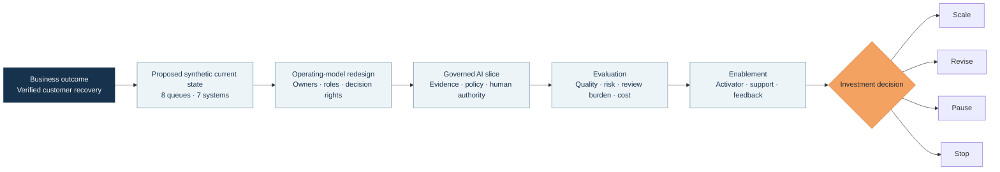
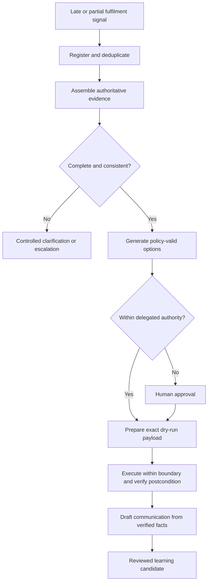
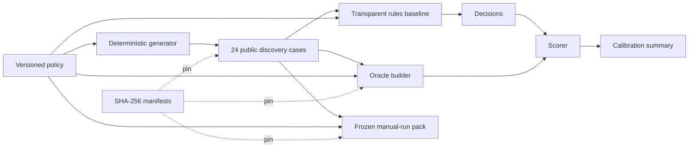

<div align="center">

# Commerce AI Transformation Lab

### From delayed fulfilment to verified customer recovery

**An evidence-led AI transformation case that connects business outcomes, workflow redesign, operating-model decisions, governed AI, evaluation, enablement, and an explicit investment decision.**

[](https://github.com/rrodenas3/commerce-ai-transformation-lab/actions/workflows/public-safety.yml)


[Executive brief](#executive-brief) · [Transformation system](#the-transformation-system) · [Evidence](#current-evidence) · [Capability proof](#capabilities-demonstrated) · [Roadmap](#stage-gated-roadmap) · [Run locally](#run-the-evidence)

</div>

> [!IMPORTANT]
> This is a public, synthetic transformation laboratory. It demonstrates transformation method, decision quality, governance design, and executable evidence. It does not claim production deployment, organisational adoption, AI performance, customer impact, or realised financial value.

## Executive brief

| | |
| --- | --- |
| **Mandate** | Redesign a fragmented commerce exception workflow around verified customer recovery, not faster message generation. |
| **Business problem** | Delayed and partial orders require evidence and decisions across commerce, fulfilment, carrier, inventory, CRM, finance, and policy systems. Repeated handoffs and unverified actions can delay recovery and weaken customer trust. |
| **North-star outcome** | Increase the proportion of eligible exceptions that reach a correct, policy-compliant, independently verified recovery within the target time. |
| **Lighthouse workflow** | Delayed or partial fulfilment, from the first reliable signal to verified recovery and evidence-bound customer communication. |
| **Operating principle** | People retain authority over financial, customer-facing, irreversible, high-risk, and policy-changing decisions. |
| **Current gate** | Stage 1 foundation: the synthetic operating context, policy, case system, oracle, transparent baseline, evidence controls, and creator-run pack are in place. |
| **Final decision** | Scale, revise, pause, or stop based on outcome quality, risk, review burden, adoption friction, reliability, and operating cost. |

The lab is deliberately built as a transformation programme rather than an autonomous-agent showcase. Code and agents are useful only when they improve a governed workflow and generate evidence strong enough to support an investment decision.

## Why this case matters

Commerce exceptions expose the real difficulty of enterprise AI transformation. The challenge is not producing fluent text. It is coordinating evidence, authority, action, verification, and learning across a value stream.

This case therefore connects six layers that are often treated separately:

1. **Business value:** one outcome and a defensible decision denominator.
2. **Workflow:** queues, handoffs, failure hypotheses, and authoritative sources.
3. **Operating model:** ownership, decision rights, support, escalation, and feedback.
4. **Governed AI:** bounded assistance, controlled abstention, approval, and stop conditions.
5. **Evaluation:** manual, deterministic, and future AI-assisted comparison.
6. **Enablement:** first-use evidence, local Activators, review burden, and adoption friction.

## The transformation system



The governing question is:

> Can an AI-assisted workflow improve verified recovery without weakening human authority over consequential decisions?

## Current evidence

| Evidence | Observed result | Executive interpretation |
| --- | ---: | --- |
| Synthetic discovery cases | **24** across 8 families | Broad boundary coverage for design and contract calibration, not a real incident distribution. |
| Oracle-eligible recovery cases | **19** | A frozen denominator separates recovery cases from controls and no-new-action cases. |
| Transparent rules coverage | **14/24, 58.3%** | Rules make a non-abstaining recommendation only where the policy is sufficiently determinate. |
| Controlled abstention | **10/24, 41.7%** | Conflicting, stale, risky, ambiguous, or unresolved-action cases stop safely. |
| Critical control violations | **0** | Observed on the author-designed public calibration set only. |
| Unsupported customer-message facts | **0** | Output is restricted to evidence the frozen oracle permits. |
| Consequential actions executed | **0** | No adapter execution is claimed at this maturity. |
| Verified customer recoveries | **0** | Recommendation quality is not confused with an achieved outcome. |
| Automated verification | **[Executable verification](.github/workflows/public-safety.yml)** | Case generation, policy boundaries, scoring, artifact integrity, and public-safety controls are executable. |

The rules and co-designed oracle aligned across all 24 discovery cases. That result is an **internal contract calibration**, not model accuracy, independent validation, or business value. The decision-useful signal is the disclosed coverage and abstention trade-off.

## Capabilities demonstrated

| Capability | Evidence in this repository |
| --- | --- |
| **Executive AI transformation** | A value-stream mandate, north-star outcome, stage gates, explicit non-goals, and a final scale, revise, pause, or stop decision. |
| **Digital commerce transformation** | A cross-functional workflow spanning OMS, WMS, carrier, inventory, payments, CRM, policy, fulfilment operations, finance, and customer recovery. |
| **Operating-model design** | Accountable roles, workflow ownership, local Activator responsibilities, authority bands, escalation routes, support routines, and decision rights. |
| **Workflow and product leadership** | One narrow vertical slice, sequenced discovery, measurable exit gates, controlled scope, and outcome-led prioritisation. |
| **Change and AI enablement** | Planned role-specific first use, independent review, help and friction capture, correction and override evidence, feedback loops, and adoption gates. |
| **Enterprise and solution architecture** | Explicit systems-of-record and source-authority design, plus specifications for future policy services, dry-run adapters, idempotency, observability, and postcondition verification. Runtime components are not yet implemented. |
| **Governed agentic AI** | Human and AI task allocation, bounded autonomy, abstention, exact-payload approval, risk stops, auditability, and accountable learning. The agentic slice is designed, not yet implemented. |
| **AI engineering** | Deterministic case generation, transparent rules, an oracle independent of future model output, scoring, canonical artifacts, SHA-256 pinning, and zero-dependency verification. |
| **Evaluation and value realisation** | Manual, deterministic, and future AI-assisted baselines; exact-zero controls; review burden; reliability; cost; adoption friction; and benefits sensitivity. |
| **Responsible public delivery** | Synthetic-only data, evidence metadata, maturity controls, secret and path scanning, CI, security guidance, and claim discipline. |

## Leadership decisions in evidence

The repository records transformation choices, not only technical outputs.

| Decision | Why it matters | Evidence |
| --- | --- | --- |
| Define success as **verified recovery** | Prevents a faster draft or recommendation from being presented as business value. | [Project charter](docs/PROJECT_CHARTER.md) |
| Select one end-to-end value stream | Creates a falsifiable lighthouse instead of a catalogue of disconnected agents. | [First vertical slice](docs/FIRST_VERTICAL_SLICE.md) |
| Preserve seven authoritative sources | Avoids inventing a convenient unified current state and exposes real coordination work. | [Stage 1 operating model](docs/STAGE1_OPERATING_MODEL.md) |
| Freeze policy before model behaviour | Makes authority boundaries testable and reduces post-hoc metric design. | [Decision log](docs/DECISION_LOG.md) |
| Treat abstention as a valid outcome | Rewards safe routing rather than forced automation coverage. | [Case and oracle system](docs/STAGE1_CASE_SYSTEM.md) |
| Separate recommendation, execution, and verification | Prevents an intended action from being counted as a completed recovery. | [Measurement plan](docs/MEASUREMENT_PLAN.md) |
| Publish negative and zero results | Keeps maturity, risk, and value claims decision-grade. | [Evidence policy](docs/EVIDENCE_POLICY.md) |

## Governed workflow

The first vertical slice allocates work according to evidence, authority, and consequence:

| Workflow step | Intended responsibility | Control |
| --- | --- | --- |
| Detect and deduplicate | Deterministic rule or event adapter | Reject stale, duplicated, or unreliable signals. |
| Assemble context | AI-assisted retrieval with cited sources | Require current evidence from the relevant authoritative systems. |
| Assess cause and uncertainty | AI proposes; a person can correct | Preserve uncertainty and surface contradictions. |
| Generate recovery options | AI proposes within policy | Exclude infeasible or unauthorised options. |
| Select resolution | Human authority for consequential cases | Route by policy, financial exposure, and risk. |
| Prepare action | Deterministic dry-run adapter | Bind the payload to the approved decision. |
| Execute | Bounded adapter after confirmation | Enforce idempotency and explicit maturity gates. |
| Verify | Independent postcondition check | Prove that the intended state changed exactly once. |
| Communicate | AI drafts from verified facts | Block unsupported promises and unverified claims. |
| Learn | Accountable owner reviews the evidence | No automatic change to policy, knowledge, or evaluation. |



## Evidence architecture



Every material statement is classified as one of four evidence types:

- **Research-grounded:** supported by a cited public source.
- **Synthetic-observed:** produced by executing a disclosed synthetic case.
- **Human-reviewed:** observed during a documented independent review session.
- **Hypothetical impact:** an assumption used in a scenario or benefits model.

This separation prevents synthetic task performance from becoming a claim about adoption, retained revenue, realised savings, customer satisfaction, enterprise deployment, or production reliability.

## Stage-gated roadmap

| Stage | Decision gate | Status |
| --- | --- | --- |
| **0. Foundation** | Is the outcome, scope, evidence boundary, and investment question clear? | Complete |
| **1. Current state and baseline** | Is the coordination problem measured rather than assumed? | **Active: creator-run pack prepared** |
| **2. Workflow and operating-model redesign** | Does every consequential decision have an owner and every AI task have a boundary? | Planned |
| **3. Governed vertical slice** | Can the minimum slice operate safely with reconstructable evidence? | Planned |
| **4. Evaluation and adaptation** | Does the workflow improve verified resolution without hiding risk or review cost? | Planned |
| **5. Enablement and independent review** | Can another person use, challenge, and recover the workflow? | Planned |
| **6. Benefits and scale decision** | Is the value-risk case strong enough to scale, or should it be revised, paused, or stopped? | Planned |

The next gate is completion and scoring of the frozen creator manual run. The AI-assisted workflow is not built until the manual evidence is preserved.

See the [full delivery roadmap](docs/DELIVERY_ROADMAP.md) and the [public journey](journey/README.md).

## Executive repository tour

### Transformation and operating model

- [Project charter](docs/PROJECT_CHARTER.md): mandate, outcome, actors, scope, and exit decision.
- [Stage 1 operating model](docs/STAGE1_OPERATING_MODEL.md): fictional organisation, systems of record, roles, authority, and policy.
- [Proposed current state](docs/STAGE1_CURRENT_STATE.md): eight queues, manual work, handoffs, evidence, and failure hypotheses.
- [First vertical slice](docs/FIRST_VERTICAL_SLICE.md): bounded future workflow and human decision rights.
- [Delivery roadmap](docs/DELIVERY_ROADMAP.md): evidence gates from foundation to investment decision.

### Evidence, evaluation, and governance

- [Measurement plan](docs/MEASUREMENT_PLAN.md): north-star measure, baselines, exact-zero controls, and final decision logic.
- [Case and oracle system](docs/STAGE1_CASE_SYSTEM.md): 24-case design, data separation, calibration, and supported claims.
- [Manual baseline protocol](docs/STAGE1_MANUAL_BASELINE_PROTOCOL.md): frozen fair-comparison method and evidence instrument.
- [Evidence policy](docs/EVIDENCE_POLICY.md): claim classes, maturity ladder, and publication gate.
- [Decision log](docs/DECISION_LOG.md): durable choices, alternatives, and evidence rationale.
- [Research base](docs/RESEARCH_BASE.md): transformation, governance, and commerce grounding.

### Executable evidence

- [Stage 1 data](data/README.md): generated cases, oracle, decisions, summaries, and prepared manual pack.
- [`scripts/`](scripts): case generation, transparent baseline, manual-run preparation, scoring, and public-safety verification.
- [`tests/`](tests): policy boundaries, failure paths, provenance, canonical bytes, scoring integrity, and disclosure controls.
- [Security policy](SECURITY.md): synthetic-data boundary and responsible disclosure.

## Run the evidence

No third-party Python package is required.

### Verify the committed repository

```bash
python -m unittest discover -s tests -v
python scripts/verify_public_safety.py
```

### Reproduce the Stage 1 artifacts

```bash
python scripts/generate_stage1_cases.py
python scripts/stage1_deterministic_baseline.py
```

The automated checks cover happy paths, authority boundaries, stale and conflicting evidence, duplicate actions, chargeback stops, action-specific postconditions, malformed records, provenance mismatches, artifact drift, private paths, risky filenames, and common secret patterns.

Passing these checks demonstrates reproducibility and policy enforcement within the disclosed boundary. It is not a security certification or production-readiness claim.

<details>
<summary><strong>Current maturity boundary</strong></summary>

The repository currently contains:

- a research-grounded transformation mandate and measurement system;
- a fictional commerce operating model and proposed current state;
- a versioned recovery policy with explicit authority boundaries;
- 24 synthetic discovery cases across eight families;
- a frozen oracle independent of future model output;
- a transparent deterministic baseline and scorer;
- a prepared, blank, case-only creator manual-run pack;
- reproducible artifacts, CI, and public-safety controls.

It does not yet contain a completed human baseline, AI-assisted workflow, executed recovery, independent reviewer session, pilot, production deployment, organisational adoption, or realised business outcome.

</details>

## Transformation lead

### Raul Rausell

**AI Transformation & Enablement Executive · Enterprise AI Architect · Founder, Harnexa AI · Former FT1000 CEO · MBA · MSc Applied AI**

Raul combines executive operating experience with hands-on AI architecture and engineering:

- ten years as founder and CEO with full P&L accountability;
- scaled annual revenue from approximately €100K to €6M over seven years;
- expanded commercial activity across approximately 15 European markets and served customers in 120 countries;
- led digital transformation across e-commerce, marketplaces, ERP, WMS, CRM, data, finance, warehousing, logistics, and customer experience;
- designs governed agentic workflows across identity, permissions, policy, human approval, audit, evaluation, and bounded autonomy;
- Microsoft Certified Agentic AI Business Solutions Architect, Azure AI Engineer Associate, and AI Transformation Leader; AWS Certified AI Practitioner.

[LinkedIn](https://www.linkedin.com/in/raul-rausell-197843340/) · [GitHub](https://github.com/rrodenas3) · [Harnexa AI](https://harnexa.ai/)

## Rights

Copyright © 2026 Raul Rausell. See [LICENSE.md](LICENSE.md) for permitted review and use.
