<div align="center">

# Commerce AI Transformation Lab

### Delayed or partial fulfilment to verified customer recovery

**A hands-on AI transformation case: business outcome, workflow redesign, human/AI allocation, deterministic controls, simulated action, structurally separate verification, evaluation, enablement, economics, and an evidence-led investment decision.**

[](https://github.com/rrodenas3/commerce-ai-transformation-lab/actions/workflows/public-safety.yml)


[Executive case](docs/STAGE2_EXECUTIVE_CASE.md) · [Evidence explorer](demo/index.html) · [Decision pack](docs/STAGE2_BENEFITS_AND_DECISION.md) · [Journey](journey/README.md) · [Measurement](docs/MEASUREMENT_PLAN.md) · [Roadmap](docs/DELIVERY_ROADMAP.md)

</div>

> [!IMPORTANT]
> This is a public, creator-evaluated laboratory built entirely with generated commerce records. Approvals and actions are simulated, customer communications are unsent, system verification is structurally separate but non-independent, and no human use, live customer result, production reliability, or realised value is claimed. Public release still requires Raul's valid annotated signed tag over the reviewed source and bundle digest.

## The executive result

The project implemented one bounded value stream rather than a general agent platform. Across a frozen 36-case V6 evaluation, the governed workflow passed every preregistered quality and exact-zero control gate. However, only **15 of 18 eligible simulated executions committed (83.33%)**, **3 cases remained pending**, and provider cost and latency were unavailable for **36 of 36 attempts**. Hypothetical economics changed recommendation class across the scenario envelope.

The resulting decision is **PAUSE**—not because the demonstration failed, but because the evidence is not yet strong enough to support the next scale claim. The one authorised next action is a capped synthetic rerun owned by Raul: at most 36 cases, 36 provider attempts, 7 calendar days, and EUR 50. It does not authorise a company pilot.

| Decision question | Evidence-led answer |
| --- | --- |
| Did the governed local workflow execute end to end? | Yes, on generated cases inside the disclosed local boundary. |
| Did exact-zero controls hold? | Yes in the sealed V6 run; no recorded unauthorised action, duplicate action, false verification, disclosure, oracle contamination, or trace-tampering failure. |
| Is execution evidence complete? | No. Three of 18 eligible execution cases stayed pending, producing 83.33% execution commit. |
| Is cost or latency decision-grade? | No. Both are unknown for all 36 recorded provider attempts. |
| Do economics support scaling? | No. The hypothetical scenario class changes across conservative, base, and upside assumptions. |
| Was there human or independent validation? | No. Human use, trust, adoption, review time, and independent acceptance remain `not observed`. |
| What is the next decision? | **PAUSE** and run one new, capped synthetic evidence action. |

Sources: [evaluation summary](data/stage2/decision-pack/evaluation-summary.json), [decision output](data/stage2/decision-pack/decision-output.json), [economics summary](data/stage2/decision-pack/economics-summary.json), and [sealed score](data/stage2/runs/S2-CF-RUN-0005/score.json).

## The transformation challenge

Delayed and partial orders rarely belong to one team or system. Evidence can be split across order management, warehouse, carrier, inventory, payment, CRM, and policy records. A fluent AI response is therefore the easy part. The difficult part is deciding which evidence is authoritative, who may decide, what exact action is allowed, how retries avoid duplicate remedies, what proves the postcondition, and when a message may truthfully describe the result.

The lab uses this outcome definition:

> A remedy counts only when the exact policy-compliant action is authorised, applied once to generated local source state, and confirmed by a structurally separate read-only verifier. A receipt, recommendation, workflow closure, or sent-looking draft is not a customer outcome.

The reship milestone is replacement creation, exact reservation, and WMS acceptance. It is not delivery. Refund requires the exact action-linked payment entry. Wait and no-new-action have distinct verified-condition labels and never enter the verified-remedy numerator.

## Raul's role and decisions

Raul is the transformation leader and creator-evaluator. He owns the value-stream choice, operating-model decisions, evidence boundary, acceptance judgments, next-gate recommendation, and publication authority. AI assistance accelerated research, drafting, coding, adversarial challenge, and recorded candidate creation; it has no policy, action, evaluation, learning-promotion, or publication authority.

The material decisions were to:

1. optimise for verified recovery rather than message speed;
2. preserve seven source authorities rather than invent a convenient unified truth;
3. separate recommendation, governed decision, approval, action, receipt, verification, communication, and closure;
4. keep AI inside a structured provider-neutral recommendation boundary while deterministic code owns policy and safety;
5. use exact-payload, revision-bound synthetic approvals and idempotent local adapters;
6. treat adapter receipts as untrusted until a separate verifier derives the postcondition;
7. preserve every failed, blocked, pending, stopped, and zero-result case in the denominator;
8. proceed without human data while mechanically capping maturity at `local-mvp`;
9. require exact-zero controls to override aggregate quality;
10. choose **PAUSE** when reliability, telemetry, and economics were incomplete.

## The implemented system

```mermaid
flowchart LR
    A["Generated case revision<br/>7 authoritative sources"] --> B["Bounded context<br/>facts · freshness · conflicts"]
    B --> C["Recorded AI candidate<br/>proposal only"]
    C --> D["Deterministic governance<br/>policy · route · authority"]
    D --> E["Synthetic exact-payload approval<br/>or delegated decision"]
    E --> F["Idempotent simulated action<br/>append-only effect journal"]
    F --> G["Read-only system verification<br/>receipt not trusted"]
    G --> H["Unsent evidence-bound message"]
    H --> I["Tamper-evident closure<br/>or controlled stop"]
    I --> J["Frozen evaluation · economics · PAUSE"]
```



The Python 3.13 application core uses the standard library. Canonical evaluation runs in an outer-launched networkless container with read-only public inputs, a write-only output mount, no repository history, no private/home mount, dropped capabilities, a non-root identity, and an applied seccomp profile. The final explorer is dependency-free and read-only; Node and Playwright are development-only verification tools.

## Frozen V6 results

The fixed denominator is 36 generated cases. Zero-count outcomes remain visible.

| Mutually exclusive outcome | Cases |
| --- | ---: |
| Verified remedy milestone | 15 |
| Verified wait condition | 3 |
| Verified no-new-action | 3 |
| Evidence blocked | 9 |
| Control stopped | 3 |
| Pending action recovery | 3 |
| Failed | 0 |
| Escalated | 0 |
| Excluded | 0 |

| Metric | Result | Denominator | Evidence boundary |
| --- | ---: | ---: | --- |
| Recommendation correctness | 100.00% | 36 | Creator-evaluated synthetic evidence |
| Safe routing | 100.00% | 3 | Control-stop cases; not recovery |
| Approval validity | 100.00% | 6 | Simulated approvals, not human authority |
| Execution commit | **83.33%** | 18 | 15 committed; 3 pending |
| Verified remedy | 100.00% | 15 | Operational milestones; not delivery or satisfaction |
| Injected recovery success | 100.00% | 3 | Synthetic fault-recovery cases |
| Closure integrity | 100.00% | 36 | Workflow closure; not customer outcome |
| Unsupported communication facts | 0 | 36 | Unsent artifacts only |
| Provider cost known | 0 | 36 attempts | Missing telemetry, not zero cost |
| Provider latency known | 0 | 36 attempts | Missing telemetry, not zero latency |

The synthetic current-state comparator recorded 288 queue transitions and 20,160,000 milliseconds of virtual active work across 36 cases. The assisted workflow recorded 303 structural workflow events. These are different structural measures, not a measured productivity improvement, human time saving, or before-and-after ROI claim.

## Resistance, failures, and adaptations

| Failure or resistance | Decision and adaptation |
| --- | --- |
| Answer-bearing content was exposed before the first creator baseline; V1 was incomplete; V2 switched to AI-assisted persona practice before any human row existed. | Preserve every pack and invalidation unchanged. Do not relabel practice as human or independent evidence. Proceed through a newly identified Stage 2 creator-evaluated path. |
| A V4 pre-run check could not prove the applied seccomp profile under Docker's inline representation. | Fail before execution, pin the profile bytes and image receipt, and require the outer attestation to prove semantic equality to the frozen profile. |
| A V5 pre-run mount check decoded the Unicode workspace path incorrectly. | Invalidate before execution, make Docker text decoding explicitly UTF-8, and roll to a new V6 identity. |
| V6 quality gates passed, but three eligible actions lacked authoritative postconditions. | Keep the cases pending, lower execution commit to 83.33%, and make complete execution evidence a next-run entry condition. |
| Cost and latency metadata were absent for every attempt; hypothetical economics changed class. | Report missing telemetry as unknown, keep economics `inconclusive`, and select **PAUSE**. |

Public records: [V4 invalidation](data/stage2/development/evaluation-v4-pre-run-invalidation.json), [V5 invalidation](data/stage2/development/evaluation-v5-pre-run-invalidation.json), [V6 manifest](data/stage2/evaluation/v6/manifest.json), [public-safe isolation summary](data/stage2/development/evaluation-v6-isolation-summary.json), and [decision pack](data/stage2/decision-pack/manifest.json).

## Enablement and value judgment

The decision pack includes one compact readiness matrix for five roles: workflow owner / AI Activator, commerce recovery specialist, operations manager, technical owner, and policy / risk owner. It defines authority, first-use guidance, one material failure drill, help, incident, appeal, and change ownership. Every human measure remains `not_observed`; the package is designed, not adopted or human validated.

Economics uses exact euro cents and keeps measured synthetic structure separate from hypothetical volume, labour, support, failure, benefit, and capacity-realisation assumptions. Conservative economics returns `revise`; base and upside return `scale_next_experiment`. Because the class changes, economics is **inconclusive** and cannot support scale.

## Evidence tour

- [Executive case and demonstration script](docs/STAGE2_EXECUTIVE_CASE.md)
- [Read-only final evidence explorer](demo/index.html)
- [Machine-readable final explorer pack](demo/data/evidence-pack.json)
- [Benefits, readiness, economics, and decision](docs/STAGE2_BENEFITS_AND_DECISION.md)
- [Decision-pack evidence index](data/stage2/decision-pack/evidence-index.json)
- [V6 score](data/stage2/runs/S2-CF-RUN-0005/score.json)
- [Output seal](data/stage2/runs/S2-CF-RUN-0005/output-seal.json)
- [Public-safe isolation summary](data/stage2/development/evaluation-v6-isolation-summary.json)
- [Transformation journey](journey/README.md)
- [Decision log](docs/DECISION_LOG.md)
- [Evidence and publication policy](docs/EVIDENCE_POLICY.md)

## Run the evidence

No third-party Python package is required for the application core or evidence generation.

```bash
python scripts/generate_stage2_cases.py --verify
python scripts/build_stage2_decision_pack.py --verify
python scripts/build_stage2_evidence_pack.py --verify
python scripts/verify_public_safety.py
python -m unittest discover -s tests -v
python -m compileall -q scripts tests
```

For the static explorer's development-only checks:

```bash
npm ci
npm run test:browser
```

The page is read-only. It cannot call a provider, execute an action, send a message, edit policy, access an oracle, or reach a live commerce system.

## Current boundary and next gate

The strongest supported claim is: **a creator-evaluated local MVP executed a governed recovery workflow across 36 generated cases and produced reproducible synthetic evidence.**

The repository does not establish independent review, human performance, adoption, customer satisfaction, retained revenue, realised savings, production readiness, legal compliance, certification, security beyond tested local controls, or an enterprise transformation. The next gate is the one capped synthetic action in the [decision output](data/stage2/decision-pack/decision-output.json). Human review and an authorised external bridge remain later gates, not hidden evidence.
