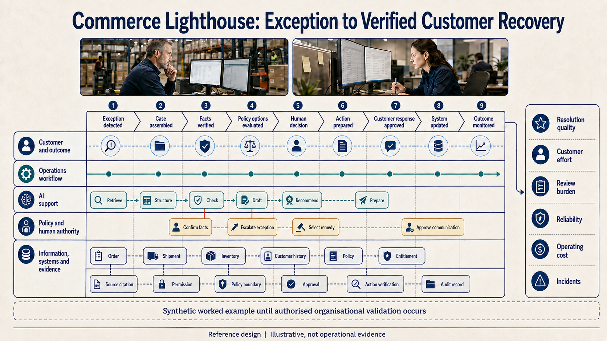
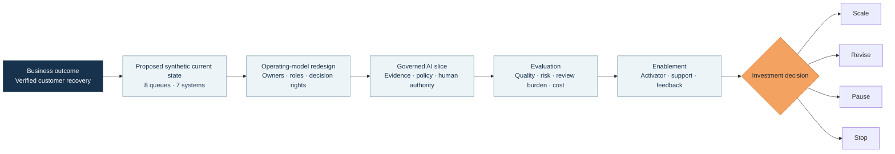

<div align="center">

# Commerce AI Transformation Lab

### From delayed fulfilment to verified customer recovery

**An evidence-led AI transformation case that connects business outcomes, workflow redesign, operating-model decisions, governed AI, evaluation, enablement, and an explicit investment decision.**

[](https://github.com/rrodenas3/commerce-ai-transformation-lab/actions/workflows/public-safety.yml)


[Executive brief](#executive-brief) · [Transformation system](#the-transformation-system) · [Evidence](#current-evidence) · [Capability proof](#capabilities-demonstrated) · [Company playbook](docs/company-playbook/README.md) · [Visual atlas](docs/company-playbook/VISUAL_ATLAS.md) · [Roadmap](#stage-gated-roadmap) · [Run locally](#run-the-evidence)

</div>

> [!IMPORTANT]
> This is a public, synthetic transformation laboratory. It demonstrates transformation method, decision quality, governance design, and executable evidence. It does not claim production deployment, organisational adoption, AI performance, customer impact, or realised financial value.

[](docs/company-playbook/VISUAL_ATLAS.md#v11-commerce-lighthouse-exception-to-recovery)

*The synthetic lighthouse in one view: AI prepares bounded work, accountable people retain consequential authority, and action is not counted as value until recovery is independently verified. See the [Visual Atlas](docs/company-playbook/VISUAL_ATLAS.md) for the full twelve-decision narrative and evidence boundaries.*

## Executive brief

| | |
| --- | --- |
| **Mandate** | Redesign a fragmented commerce exception workflow around verified customer recovery, not faster message generation. |
| **Business problem** | Delayed and partial orders require evidence and decisions across commerce, fulfilment, carrier, inventory, CRM, finance, and policy systems. Repeated handoffs and unverified actions can delay recovery and weaken customer trust. |
| **North-star outcome** | Increase the proportion of eligible exceptions that reach a correct, policy-compliant, independently verified recovery within the target time. |
| **Lighthouse workflow** | Delayed or partial fulfilment, from the first reliable signal to verified recovery and evidence-bound customer communication. |
| **Operating principle** | People retain authority over financial, customer-facing, irreversible, high-risk, and policy-changing decisions. |
| **Current gate** | Stage 1 practice: V2 is preserved blank and invalidated after the project intentionally switched to a 32-case AI-assisted multi-persona exercise. A future clean human baseline requires a newly identified pack; the persona dataset cannot substitute for it. |
| **Final decision** | Scale, revise, pause, or stop based on outcome quality, risk, review burden, adoption friction, reliability, and operating cost. |

The lab is deliberately built as a transformation programme rather than an autonomous-agent showcase. Code and agents are useful only when they improve a governed workflow and generate evidence strong enough to support an investment decision.

## Why this case matters

Commerce exceptions expose the real difficulty of enterprise AI transformation. The challenge is not producing fluent text. It is coordinating evidence, authority, action, verification, and learning across a value stream.

This case therefore connects six layers that are often treated separately:

1. **Business value:** one outcome and a defensible decision denominator.
2. **Workflow:** queues, handoffs, failure hypotheses, and authoritative sources.
3. **Operating model:** ownership, decision rights, support, escalation, and feedback.
4. **Governed AI:** bounded assistance, controlled abstention, approval, and stop conditions.
5. **Evaluation:** manual, deterministic, and future AI-assisted comparison.
6. **Enablement:** first-use evidence, local Activators, review burden, and adoption friction.

## The transformation system



The governing question is:

> Can an AI-assisted workflow improve verified recovery without weakening human authority over consequential decisions?

## Current evidence

| Evidence | Observed result | Executive interpretation |
| --- | ---: | --- |
| Synthetic discovery cases | **24** across 8 families | Broad boundary coverage for design and contract calibration, not a real incident distribution. |
| Oracle-eligible recovery cases | **19** | A frozen denominator separates recovery cases from controls and no-new-action cases. |
| Transparent rules coverage | **14/24, 58.3%** | Rules make a non-abstaining recommendation only where the policy is sufficiently determinate. |
| Controlled abstention | **10/24, 41.7%** | Conflicting, stale, risky, ambiguous, or unresolved-action cases stop safely. |
| Critical control violations | **0** | Observed on the author-designed public calibration set only. |
| Unsupported customer-message facts | **0** | Output is restricted to evidence the frozen oracle permits. |
| Consequential actions executed | **0** | No adapter execution is claimed at this maturity. |
| Verified customer recoveries | **0** | Recommendation quality is not confused with an achieved outcome. |
| AI-assisted persona cases | **32** across 8 outcome categories | Complete adversarial practice coverage; simulated lenses are not human reviewers. |
| Simulated operating lenses | **5** | Customer, operations, workflow, technical, and risk priorities are made explicit. |
| First instincts adapted after challenge | **18/32, 56.3%** | Demonstrates designed failure-to-adaptation reasoning, not observed human learning. |
| Governed final decisions checked | **32/32** against the committed oracle | Construction validation after exposure; explicitly not model accuracy or blind evaluation. |
| Automated verification | **[Executable verification](.github/workflows/public-safety.yml)** | Case generation, policy boundaries, scoring, artifact integrity, and public-safety controls are executable. |

The rules and frozen, co-designed reference oracle aligned across all 24 discovery cases. The oracle is independent of future model output, but it is not independent validation. The result is an **internal contract calibration**, not model accuracy or business value. The decision-useful signal is the disclosed coverage and abstention trade-off.

## Capabilities demonstrated

Status is part of the evidence. **Implemented** means executable in this repository; **observed** means measured only inside the disclosed synthetic boundary; **designed** means specified but not operated; **planned** means it is a future gate.

| Capability | Status | Evidence in this repository |
| --- | --- | --- |
| **Executive AI transformation** | Designed | Value-stream mandate, north-star outcome, stage gates, non-goals, and a final scale, revise, pause, or stop decision. No organisational transformation outcome is claimed. |
| **Commerce workflow redesign** | Designed | A cross-functional recovery workflow spanning order, warehouse, carrier, inventory, payments, CRM, policy, finance, and customer service. |
| **Operating model and enablement** | Designed | Workflow ownership, decision rights, local Activator responsibilities, escalation, support, feedback, and adoption gates. These have not yet been exercised by users. |
| **Governance and responsible AI** | Implemented + designed | Executable policy boundaries, abstention and evidence controls are implemented; future approval, execution, verification, and learning controls are specified. |
| **Evaluation and evidence engineering** | Implemented + synthetic-observed | Deterministic generation, transparent rules, a frozen co-designed oracle, scoring, artifact pinning, canonical-byte checks, provenance, and public-safety verification. |
| **Enterprise and solution architecture** | Designed | Source authority, policy service, dry-run adapters, idempotency, observability, postcondition verification, and human/AI allocation are specified. Runtime components are not implemented. |
| **AI-assisted adversarial practice** | Implemented + synthetic-observed | Five generated operating lenses challenge all 32 V2 cases; 18 first decisions change before a policy-derived final decision. This is not an operated workflow or human evidence. |
| **AI-assisted workflow** | Planned | The governed vertical slice remains separate from this oracle-checked practice dataset. |
| **Value realisation and adoption** | Planned | Review burden, reliability, operating cost, friction, outcome quality, and benefits sensitivity will inform the investment decision. No realised value or adoption is claimed. |

## Leadership decisions in evidence

The repository records transformation choices, not only technical outputs.

| Decision | Why it matters | Evidence |
| --- | --- | --- |
| Define success as **verified recovery** | Prevents a faster draft or recommendation from being presented as business value. | [Project charter](docs/PROJECT_CHARTER.md) |
| Select one end-to-end value stream | Creates a falsifiable lighthouse instead of a catalogue of disconnected agents. | [First vertical slice](docs/FIRST_VERTICAL_SLICE.md) |
| Preserve seven authoritative sources | Avoids inventing a convenient unified current state and exposes real coordination work. | [Stage 1 operating model](docs/STAGE1_OPERATING_MODEL.md) |
| Freeze policy before model behaviour | Makes authority boundaries testable and reduces post-hoc metric design. | [Decision log](docs/DECISION_LOG.md) |
| Treat abstention as a valid outcome | Rewards safe routing rather than forced automation coverage. | [Case and oracle system](docs/STAGE1_CASE_SYSTEM.md) |
| Separate recommendation, execution, and verification | Prevents an intended action from being counted as a completed recovery. | [Measurement plan](docs/MEASUREMENT_PLAN.md) |
| Publish negative and zero results | Keeps maturity, risk, and value claims decision-grade. | [Evidence policy](docs/EVIDENCE_POLICY.md) |
| Reclassify an exposed creator pack | Protects the validity of the future manual baseline instead of hiding a process failure. | [Decision log](docs/DECISION_LOG.md#d-015--reclassify-the-exposed-creator-pack) |
| Invalidate V2 before AI-assisted filling | Preserves 0-row human provenance while converting the cases into clearly labelled practice material. | [Decision log](docs/DECISION_LOG.md#d-022--reclassify-v2-as-ai-assisted-simulation-material) |

## Evidence and authorship boundary

Every material statement is classified as one of four evidence types:

- **Research-grounded:** supported by a cited public source.
- **Synthetic-observed:** produced by executing a disclosed synthetic case.
- **Human-reviewed:** observed during a documented independent review session.
- **Hypothetical impact:** an assumption used in a scenario or benefits model.

This separation prevents synthetic task performance from becoming a claim about adoption, retained revenue, realised savings, customer satisfaction, enterprise deployment, or production reliability.

Raul defined the mandate, scope, constraints, transformation decisions, evidence standards, acceptance judgments, and publication boundaries. AI-assisted research, drafting, coding, and review accelerated delivery. Unless a documented run states otherwise, repository output is not evidence of unaided human performance or independent validation. That provenance is a design control, not a disclaimer added after the fact.

The detailed [future workflow and decision rights](docs/FIRST_VERTICAL_SLICE.md), [evidence architecture](docs/STAGE1_CASE_SYSTEM.md), and [authorship decision](docs/DECISION_LOG.md#d-016--make-ai-assistance-and-accountable-authorship-explicit) are kept in the evidence system rather than repeated here.

## Stage-gated roadmap

| Stage | Decision gate | Status |
| --- | --- | --- |
| **0. Foundation** | Is the outcome, scope, evidence boundary, and investment question clear? | Complete |
| **1. Current state and baseline** | Is the coordination problem measured rather than assumed? | **Active: persona practice complete; a new pack is required for clean human evidence** |
| **2. Workflow and operating-model redesign** | Does every consequential decision have an owner and every AI task have a boundary? | Planned |
| **3. Governed vertical slice** | Can the minimum slice operate safely with reconstructable evidence? | Planned |
| **4. Evaluation and adaptation** | Does the workflow improve verified resolution without hiding risk or review cost? | Planned |
| **5. Enablement and independent review** | Can another person use, challenge, and recover the workflow? | Planned |
| **6. Benefits and scale decision** | Is the value-risk case strong enough to scale, or should it be revised, paused, or stopped? | Planned |

During guided practice, answer-bearing oracle content from the public discovery set was exposed before the creator run. A stronger 32-case V2 pack then implemented a hash-bound release sequence. Before any human row was completed, the project intentionally switched to AI-assisted multi-persona filling; V2 was therefore invalidated and preserved blank. The new practice dataset shows adversarial reasoning and adaptation but cannot support human-performance, independence, or AI-accuracy claims. A future clean human baseline requires a new pack identity.

See the [full delivery roadmap](docs/DELIVERY_ROADMAP.md) and the [public journey](journey/README.md).

## Executive repository tour

### Transformation and operating model

- [Project charter](docs/PROJECT_CHARTER.md): mandate, outcome, actors, scope, and exit decision.
- [Stage 1 operating model](docs/STAGE1_OPERATING_MODEL.md): fictional organisation, systems of record, roles, authority, and policy.
- [Proposed current state](docs/STAGE1_CURRENT_STATE.md): eight queues, manual work, handoffs, evidence, and failure hypotheses.
- [First vertical slice](docs/FIRST_VERTICAL_SLICE.md): bounded future workflow and human decision rights.
- [Delivery roadmap](docs/DELIVERY_ROADMAP.md): evidence gates from foundation to investment decision.

### Evidence, evaluation, and governance

- [Measurement plan](docs/MEASUREMENT_PLAN.md): north-star measure, baselines, exact-zero controls, and final decision logic.
- [Case and oracle system](docs/STAGE1_CASE_SYSTEM.md): 24-case design, data separation, calibration, and supported claims.
- [Public-discovery manual protocol](docs/STAGE1_MANUAL_BASELINE_PROTOCOL.md): the frozen historical evidence contract; it is not a valid held-out execution path after exposure.
- [Held-out evaluation protocol](docs/STAGE1_HELDOUT_EVALUATION_PROTOCOL.md): public-pack verification, human handling, record freeze, answer-file release, scoring, and invalidation rules.
- [Evidence policy](docs/EVIDENCE_POLICY.md): claim classes, maturity ladder, and publication gate.
- [Decision log](docs/DECISION_LOG.md): durable choices, alternatives, and evidence rationale.
- [Research base](docs/RESEARCH_BASE.md): transformation, governance, and commerce grounding.

### Executable evidence

- [Stage 1 data](data/README.md): discovery calibration, invalidated held-out instruments, and the complete AI-assisted multi-persona practice dataset.
- [`scripts/`](scripts): public-discovery calibration plus held-out generation, preparation, record-before-oracle release, scoring, and public-safety controls.
- [`tests/`](tests): policy boundaries, failure paths, provenance, canonical bytes, scoring integrity, and disclosure controls.
- [Security policy](SECURITY.md): synthetic-data boundary and responsible disclosure.

## Company engagement playbook

The [Company AI Transformation Playbook](docs/company-playbook/README.md) turns the lab's method into a reusable company-facing reference system. It includes:

- an [executive blueprint](docs/company-playbook/01_EXECUTIVE_BLUEPRINT.md) for outcomes, portfolio choices, operating model, board evidence, and engagement decisions;
- a connected [ontology, topology, role, architecture, and connection model](docs/company-playbook/02_SYSTEM_MODEL_ONTOLOGY_TOPOLOGY_ARCHITECTURE.md);
- a [transformation delivery manual](docs/company-playbook/03_TRANSFORMATION_DELIVERY_MANUAL.md) from first conversation to scale, revision, pause, stop, or retirement;
- an [AI enablement and adoption playbook](docs/company-playbook/04_ENABLEMENT_AND_ADOPTION_PLAYBOOK.md);
- a [use-case portfolio and workflow pattern library](docs/company-playbook/05_USE_CASE_PORTFOLIO_AND_PATTERNS.md);
- a [governance, risk, and evidence system](docs/company-playbook/06_GOVERNANCE_RISK_AND_EVIDENCE.md);
- copyable [workshops, canvases, board materials, and employee communications](docs/company-playbook/07_WORKSHOPS_CANVASES_AND_COMMUNICATION.md);
- a [framework crosswalk and source map](docs/company-playbook/08_FRAMEWORK_CROSSWALK_AND_SOURCES.md);
- a [Visual Atlas](docs/company-playbook/VISUAL_ATLAS.md) that connects twelve supplied reference plates to executive, operating-model, architecture, enablement, governance, and delivery decisions;
- the exact [V3 visual system and ChatGPT image-generation prompt pack](docs/company-playbook/09_VISUAL_SYSTEM_AND_INFOGRAPHIC_PROMPTS.md), including controlled edits and pass gates. Four additional documentary photographs remain production prompts and are not presented as completed assets.

The playbook is a research-grounded reference design. It does not upgrade this laboratory's maturity or imply client adoption, legal compliance, certification, production use, or realised value.

## Run the evidence

No third-party Python package is required.

### Verify the committed repository

```bash
python -m unittest discover -s tests -v
python scripts/verify_public_safety.py
```

### Reproduce the Stage 1 artifacts

```bash
python scripts/generate_stage1_cases.py
python scripts/stage1_deterministic_baseline.py
python scripts/generate_stage1_heldout.py --verify-public
```

The automated checks cover happy paths, authority boundaries, stale and conflicting evidence, duplicate actions, chargeback stops, action-specific postconditions, malformed records, provenance mismatches, artifact drift, private paths, risky filenames, and common secret patterns.

Passing these checks demonstrates reproducibility and policy enforcement within the disclosed boundary. It is not a security certification or production-readiness claim.

<details>
<summary><strong>Current maturity boundary</strong></summary>

The repository currently contains:

- a research-grounded transformation mandate and measurement system;
- a fictional commerce operating model and proposed current state;
- a versioned recovery policy with explicit authority boundaries;
- 24 synthetic discovery cases across eight families;
- a frozen, co-designed reference oracle independent of future model output but not independent validation;
- a transparent deterministic baseline and scorer;
- a prepared, blank, case-only creator pack reclassified as familiarisation material after oracle exposure;
- a separately generated 32-case V2 held-out pack, complete answer-free operator guide, private oracle, public commitments, and blank creator instrument, now invalidated before human handling;
- a fail-closed release command retained as a historical control design;
- a 32-case AI-assisted adversarial practice set across five simulated operating lenses, with 18 recorded adaptations and explicit non-human claim boundaries;
- reproducible artifacts, CI, and public-safety controls.

It does not yet contain a clean held-out human baseline, operated AI-assisted workflow, executed recovery, independent reviewer session, pilot, production deployment, organisational adoption, or realised business outcome.

</details>

## Transformation lead

### Raul Rausell

**AI Transformation & Operating Model Leader | Commerce, Customer Operations & Governed AI Workflows**

Raul combines executive operating experience with hands-on AI architecture and engineering as supporting capabilities:

- approximately ten years as a founder and CEO with full P&L and cross-functional operating ownership;
- founder and CEO of a company included in the *FT1000: Europe’s Fastest-Growing Companies 2024*;
- led digital transformation across e-commerce, marketplaces, ERP, WMS, CRM, data, finance, warehousing, logistics, and customer experience;
- designs governed agentic workflows across identity, permissions, policy, human approval, audit, evaluation, and bounded autonomy;
- MBA and MSc Applied AI; Microsoft Certified Agentic AI Business Solutions Architect, Azure AI Engineer Associate, and AI Transformation Leader; AWS Certified AI Practitioner.

[LinkedIn](https://www.linkedin.com/in/raul-rausell-197843340/) · [GitHub](https://github.com/rrodenas3) · [Harnexa AI](https://harnexa.ai/)

## Rights

Copyright © 2026 Raul Rausell. See [LICENSE.md](LICENSE.md) for permitted review and use.
