# Proposed current state and manual workflow

## Current-state integrity rule

This is a **proposed current-state operating model**, not an observed company process. Capabilities that belong to the future design are intentionally absent.

## Queue topology

| Queue | Owner | Entry | Exit |
| --- | --- | --- | --- |
| Q1 OMS exception list | Workflow owner | Batch or event indicates likely promise breach | Specialist accepts or records false positive |
| Q2 CRM contact inbox | Workflow owner | Customer reports delay or missing quantity | Linked to existing case or registered as new case |
| Q3 Active investigation | Recovery specialist | Case accepted | Evidence complete or clarification requested |
| Q4 Fulfilment clarification | Fulfilment coordinator | Missing or conflicting WMS/carrier evidence | Time-stamped finding or explicit uncertainty |
| Q5 Approval pending | Workflow owner or finance | Exact proposed action exceeds delegation | Approved, rejected, or amended action |
| Q6 Customer choice pending | Recovery specialist | Two policy-valid options require customer selection | Choice recorded or follow-up limit reached |
| Q7 Execution and verification pending | Recovery specialist | Approved simulated action initiated | Authoritative postcondition observed or failure escalated |
| Q8 Closed or reopened | Workflow owner | Recovery verified or controlled escalation recorded | Reopened on new conflict or synthetic dispute |

Q1 and Q2 are intentionally separate. Whether the separation causes duplicate investigation is something to measure, not assume.

## Manual flow

```mermaid
flowchart LR
    A["Q1 OMS signal or Q2 CRM contact"] --> B["Register and deduplicate"]
    B --> C["Qualify scope and promise breach"]
    C --> D["Assemble OMS, WMS, carrier, inventory, payment, CRM, policy"]
    D --> E{"Evidence complete and consistent?"}
    E -- "No" --> F["Q4 fulfilment or specialist clarification"]
    F --> D
    E -- "Yes" --> G["Form policy-valid recovery options"]
    G --> H{"Within delegated authority?"}
    H -- "No" --> I["Q5 workflow-owner or finance approval"]
    H -- "Yes" --> J["Select exact recovery"]
    I --> J
    J --> K["Perform simulated manual action"]
    K --> L["Refresh authoritative source"]
    L --> M{"Postcondition observed?"}
    M -- "No" --> N["Escalate action recovery"]
    M -- "Yes" --> O["Communicate verified facts"]
    O --> P["Close with outcome and failure codes"]
```

## Required evidence at each step

| Step | Actor | Manual work | Exit evidence |
| --- | --- | --- | --- |
| Detect | Workflow owner or specialist | Inspect source, event identity, timestamp, and promise version | Trigger and `as_of` time |
| Register and deduplicate | Specialist | Search existing cases, prior recovery, and signal ID | One canonical case and duplicate relationship |
| Qualify | Specialist | Apply scope, promise, quantity, and control-stop rules | Eligible, control, or false-positive reason |
| Assemble | Specialist | Open seven synthetic sources | Evidence checklist with source and timestamp |
| Resolve conflict | Fulfilment coordinator | Reconcile physical and digital state | Finding or explicit inability to determine |
| Form options | Specialist | Apply policy version effective at case time | Feasible and rejected options with reasons |
| Decide | Specialist, workflow owner, or finance | Exercise documented authority | Exact decision owner and approval record |
| Execute | Specialist | Enter a simulated refund or replacement | Action ID and before-state |
| Verify | Specialist in the proposed current state | Refresh authoritative record | Observed postcondition or explicit failure |
| Communicate and close | Specialist | Use verified state only | Message facts and closure code |
| Review | Workflow and policy owners | Inspect failures and overrides | Learning candidate; no automatic policy change |

The same specialist executes and verifies in this proposed current state. Independent automated verification is a future-state control; the lab evaluator independently scores the specialist's conclusion against the oracle.

## Failure hypotheses to measure

- duplicate intake between operational signals and customer contacts;
- repeated navigation across seven sources;
- missing, stale, or contradictory evidence;
- queue delay while waiting for operational clarification or approval;
- authority ambiguity near financial boundaries;
- manual rekeying between decision, action, and communication;
- action requested but not completed;
- closure before an authoritative postcondition exists;
- unsupported customer promise based on an estimate;
- repeated refund or replacement after a duplicate signal.

No failure is reported as observed until a recorded case run produces it.

## Baseline measures

| Dimension | Manual observation |
| --- | --- |
| Outcome | Correct recommendation or controlled escalation against the frozen oracle |
| Handling | Active handling seconds, source opens, policy lookups, and rework |
| Coordination | Handoffs and clarification requests |
| Authority | Correct route and dangerous under-escalation |
| Evidence | Required evidence present, missing, stale, or conflicting |
| Communication | Unsupported message facts |
| Human experience | Help requested, confidence, confusion, and notes |
| Execution | Action initiated, duplicate prevented, and postcondition observed—future case runs only |

Active handling time, actual queue time, and hypothetical modelled waiting time must remain separate.

## Not current-state capabilities

- unified automatic context assembly;
- AI cause classification or option generation;
- automatic correlation, deduplication, or priority ranking;
- machine-enforced policy and authority;
- exact-payload approval interface;
- idempotent action adapter;
- independent automated postcondition verification;
- end-to-end trace or automated learning.

Those capabilities must be designed in Stage 2 and evaluated after implementation.
