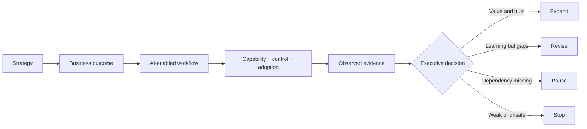
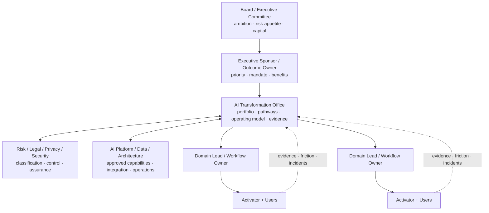
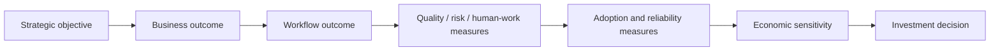

# Executive AI Transformation Blueprint

## The board-level case in one page

AI transformation is not the distribution of AI tools. It is the deliberate redesign of valuable work so that people, AI systems, data, policies, and technology produce better outcomes within explicit authority and risk boundaries.

The executive team is accountable for five decisions:

1. **Outcome:** Which strategic or operating result deserves focused change?
2. **Boundary:** Which workflow, population, geography, data, and decisions are in scope?
3. **Authority:** What may AI assist, recommend, prepare, or execute—and who remains accountable?
4. **Investment:** Which capabilities, integrations, enablement, controls, and support will be funded?
5. **Evidence:** What result would justify expansion, revision, pause, or retirement?

The recommended unit of investment is a **governed AI-enabled workflow**, not a licence, model, chatbot, or collection of prompts.

## What transformation is—and is not

| AI activity | Useful output | Why it is not yet transformation |
| --- | --- | --- |
| Buy a platform | access | no workflow, authority, adoption, or outcome has changed |
| Run prompt training | individual familiarity | recurring work and support may remain unchanged |
| Build a prototype | technical possibility | production conditions, users, controls, and value are unobserved |
| Launch a pilot | bounded organisational use | scale, sustainability, and realised value remain open |
| Operate a governed workflow | recurring capability | becomes transformation only when work, behaviour, outcomes, and management systems change |

The executive standard is therefore:

> **From access to changed work; from changed work to observed outcomes; from observed outcomes to an evidence-based investment decision.**

## The executive transformation system

### 1. Direction

- strategic themes and operating constraints;
- outcome owners and risk appetite;
- target value streams;
- explicit non-goals;
- portfolio and funding criteria.

### 2. Delivery

- current-state observation and baseline;
- workflow and operating-model redesign;
- bounded technical implementation;
- representative evaluation;
- integration, handover, and support.

### 3. Enablement

- risk- and role-based AI literacy;
- hands-on task practice;
- local workflow Activators;
- manager routines, office hours, knowledge assets, and escalation;
- feedback and adoption measurement.

### 4. Trust

- inventory and classification;
- legal, privacy, security, and impact assessment;
- human oversight and decision rights;
- testing, monitoring, incident response, and change control;
- claim and evidence discipline.

### 5. Value

- baselines and denominators;
- quality, time, cost, risk, and human-work measures;
- adoption and support burden;
- financial sensitivity and attribution limits;
- scale, revise, pause, or stop gates.

## Portfolio pathways: Enable, Guide, Co-build, Stop

Every opportunity receives the amount of transformation support its value, complexity, and risk require.

| Pathway | Use when | Typical support | Exit evidence |
| --- | --- | --- | --- |
| **Enable** | approved low-consequence work can improve through repeatable individual/team practices | role learning, approved patterns, playbooks, office hours, champions | repeated safe use and a task/workflow signal |
| **Guide** | a business team owns delivery but needs standards, risk routing, architecture, evaluation, or vendor decisions | canvases, design review, risk and architecture gates, evaluation coaching | owner-approved design and test evidence |
| **Co-build** | a high-value, cross-functional, integrated, or higher-risk workflow requires active transformation leadership | dedicated workflow team, architecture, controls, enablement, pilot, value case | pilot/operating evidence for an investment gate |
| **Stop / not AI** | value is weak, work is unstable, authority is missing, risk is unacceptable, or a simpler solution is better | documented decision and alternative | avoided cost/risk and preserved focus |

This prevents the transformation office from becoming either a central delivery bottleneck or a passive standards function.

## The board dashboard

Avoid a dashboard built around licences, prompts, agents, training attendance, or prototype count. Use a portfolio view that connects work to evidence.

| Board question | Decision-grade indicator | Warning indicator |
| --- | --- | --- |
| Are we focused? | share of investment tied to named strategic outcomes and workflow owners | hundreds of unrelated use cases |
| Is work changing? | approved workflows progressing through defined evidence gates | tool access or demos described as transformation |
| Is value visible? | outcome measures with baselines, denominators, time periods, and attribution caveats | unverified hours-saved forecasts |
| Are people able to use it? | first-use completion, repeated use, review burden, support demand, overrides, and trust observations | course completion alone |
| Is risk controlled? | inventory coverage, classification, control tests, incidents, exceptions, overdue reviews | policy publication without operating evidence |
| Are we learning? | material failures linked to design changes and regression evidence | only positive stories reach leadership |
| Can we stop? | explicit pause/retire decisions and safe decommissioning | sunk-cost continuation |

### Example portfolio row

| Workflow | Outcome owner | Current state | Evidence | Material risk | Next decision |
| --- | --- | --- | --- | --- | --- |
| Order exception recovery | COO / Customer Operations | Tested | synthetic comparison; human review pending | incorrect/duplicate customer recovery | approve independent review, revise, or stop |

## Executive decision rights

| Decision | Accountable owner | Required input |
| --- | --- | --- |
| Set AI ambition and risk appetite | Board / CEO / executive committee | strategy, obligations, risk capacity, workforce impact |
| Select outcomes and portfolio | Executive sponsor + transformation leader | value-stream evidence and dependencies |
| Approve workflow pilot | Outcome owner | charter, risk tier, architecture, evaluation and adoption plan |
| Approve consequential authority | Business/policy owner | exact action, limit, control, verification and escalation design |
| Accept residual risk | Named risk owner at the required level | measured risk, controls, uncertainty and monitoring |
| Expand population or autonomy | Outcome owner + relevant control owners | pilot/operating evidence and revised assessment |
| Change policy or canonical knowledge | Policy/content owner | adjudicated evidence, impact and version record |
| Pause or retire workflow | Outcome owner + technical owner | incident/value evidence, user impact and decommission plan |

The AI transformation leader coordinates this system but does not absorb accountability that belongs to executives, workflow owners, legal/risk owners, or technical owners.

## Operating model

### Core roles

| Role | Owns | Does not own alone |
| --- | --- | --- |
| Executive sponsor | mandate, priority, resources, senior blockers | detailed workflow or technical design |
| AI Transformation Director/Lead | portfolio, operating model, pathways, cross-functional delivery, executive evidence | every domain decision or every build |
| AI Workflow Transformation Lead | current/future work, requirements, delivery coordination, outcome measures | legal acceptance or production platform alone |
| AI Enablement & Adoption Lead | literacy, role pathways, champions, support, behaviour and adoption evidence | technical safety or business outcomes alone |
| Workflow owner / Agent Activator | recurring workflow, intended users, support, feedback, maintenance and local outcome | enterprise policy or infrastructure decisions |
| Product/platform/data/architecture | approved technical capability, integration, reliability, observability, cost | business priority or human authority alone |
| Risk/legal/privacy/security | risk interpretation, controls, assurance, incidents and required escalation | business value decision alone |
| Intended user | responsible use, review, correction, feedback and escalation | fixing structural workflow or policy defects alone |

## Outcome architecture

Every initiative needs a chain from strategic intent to observable evidence.

Example:

| Layer | Example |
| --- | --- |
| Strategic objective | improve customer trust while controlling cost-to-serve |
| Business outcome | more eligible fulfilment exceptions reach verified recovery |
| Workflow outcome | correct, authorised, verified resolution within target time |
| Quality/risk | correctness, under-escalation, unsupported message facts, duplicate action |
| Human work | handling, review, corrections, handoffs, help and confidence |
| Adoption/reliability | intended-user completion, repeat use, failures, recovery and support demand |
| Economics | cost per correctly verified resolution and sensitivity to volume/value assumptions |
| Decision | expand, revise, pause, or stop |

## Company engagement blueprint

The work can be contracted as separate decision products while preserving one method.

### Engagement A — Executive orientation and readiness

**Purpose:** establish common language, strategic outcomes, risk posture, current activity, and decision ownership.

**Outputs:**

- executive ambition and non-goals;
- initial AI activity inventory;
- outcome/value-stream map;
- operating-model gaps;
- decision on whether to begin structured discovery.

### Engagement B — Workflow and portfolio discovery

**Purpose:** identify and compare recurring work opportunities using observed current-state evidence.

**Outputs:**

- stakeholder and workflow observations;
- use-case portfolio and qualification decisions;
- current-state map and baseline contract for one lighthouse;
- dependency, risk, and readiness assessment;
- design/stop recommendation.

### Engagement C — Lighthouse design and validation

**Purpose:** design the human/AI workflow, architecture, controls, evaluation, and enablement before an operational pilot.

**Outputs:**

- future-state workflow and authority matrix;
- technical/reference architecture and connection contracts;
- representative test/evaluation pack;
- operating, support, incident, and adoption plan;
- pilot investment memorandum.

### Engagement D — Bounded pilot and scale decision

**Purpose:** operate in an authorised scope, observe users and outcomes, adapt, and make the next investment decision.

**Outputs:**

- consented/approved pilot operation;
- outcome, quality, risk, adoption, support, reliability, and cost evidence;
- failure/adaptation ledger;
- expand, revise, pause, or stop memorandum;
- production/scale requirements if expansion is approved.

### Engagement E — AI Transformation Office enablement

**Purpose:** turn repeated lighthouse learning into an enterprise capability.

**Outputs:**

- portfolio intake and pathways;
- federated role topology;
- AI inventory and risk routing;
- pattern, architecture, evaluation, and evidence library;
- role-based enablement and Activator network;
- governance cadence and board reporting.

## First executive workshop

The first session should produce decisions, not a list of fashionable possibilities.

### Inputs

- business strategy and material operating priorities;
- known AI activity, tools, vendors, and policies;
- material risk/regulatory context;
- candidate workflow owners;
- available operating and workforce evidence.

### Questions

1. Which result matters enough to change work—not merely add a tool?
2. Where is value trapped in coordination, evidence, decisions, waiting, rework, or exceptions?
3. Which decisions are consequential, regulated, irreversible, or customer/employee-facing?
4. Who owns the outcome and recurring workflow today?
5. What is the smallest coherent value stream that can be measured?
6. What must be true before a pilot is authorised?
7. What evidence would cause us to expand, revise, pause, or stop?

### Minimum decisions before leaving

- named executive sponsor and workflow owner;
- one outcome hypothesis and one candidate workflow;
- approved discovery boundary;
- required participants and sources;
- evidence and confidentiality rules;
- next gate and decision date/cadence.

## Executive anti-patterns

- announcing an enterprise AI target without workflow owners;
- measuring transformation by tool licences, prompts, or “agents built”;
- centralising every use case in one delivery team;
- delegating all AI accountability to IT or data science;
- treating training attendance as adoption;
- approving autonomous action before exact authority and verification are designed;
- applying one risk process to every use case regardless of context;
- reporting estimated time saved as realised financial value;
- hiding failures, overrides, support demand, or stopped initiatives;
- scaling a pilot before production ownership, monitoring, incident response, and change control exist.

## Executive readiness test

Do not fund a pilot until the organisation can answer “yes” or “explicitly unresolved with an owner” to each question:

- Is the outcome and denominator clear?
- Is the recurring workflow and current owner known?
- Have intended users and affected people informed the design?
- Are authoritative sources and data permissions known?
- Are human/AI task and decision boundaries explicit?
- Is the AI system inventoried and provisionally classified?
- Are prohibited behaviour and stop conditions defined?
- Are required integration, security, privacy, legal, and vendor decisions owned?
- Are representative and adversarial cases available?
- Is first-use support and ongoing ownership funded?
- Is an evidence contract frozen before evaluation?
- Can the organisation pause, reverse, recover, or retire safely?

If the answer is mostly “no,” the next investment is discovery and design—not an agent build.
