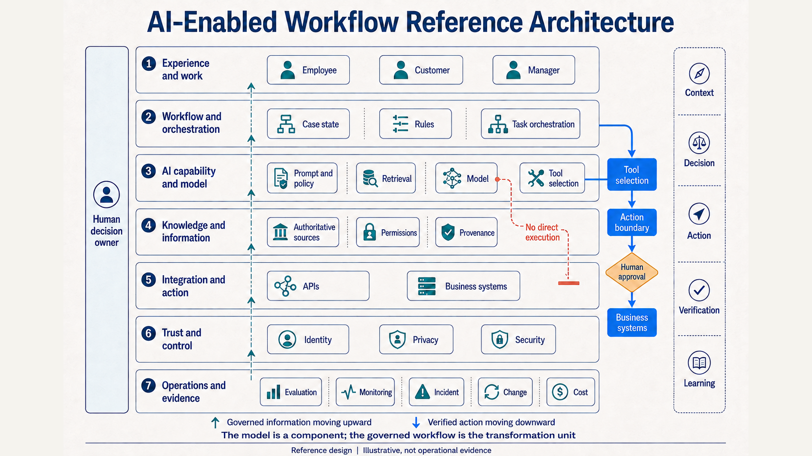
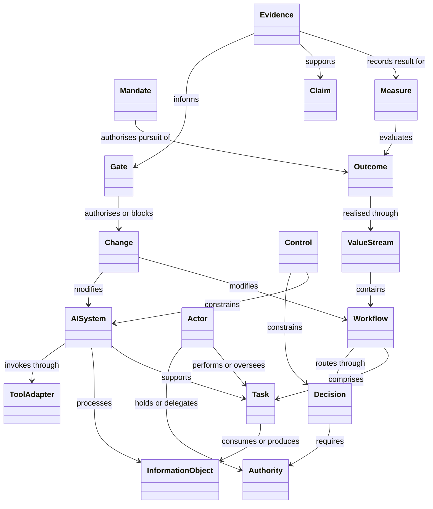
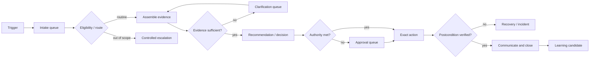
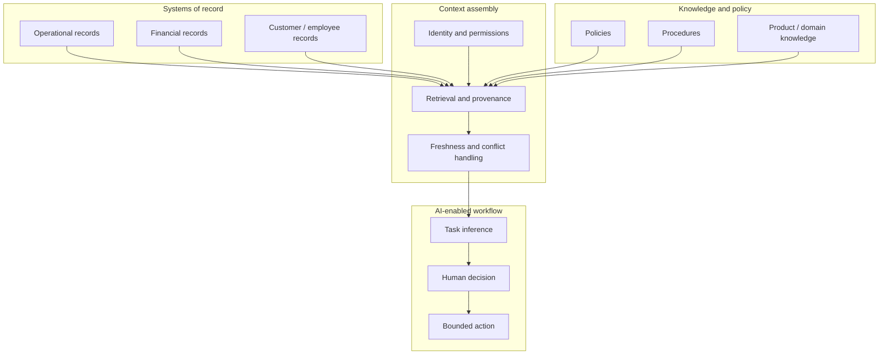
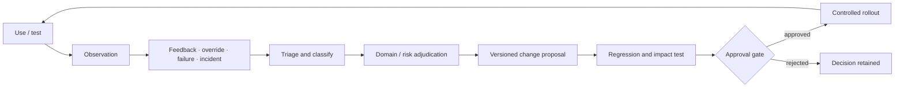
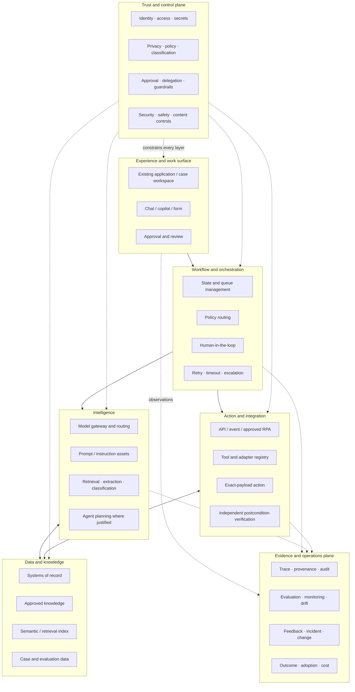

# AI Transformation System Model

## Ontology, topology, roles, architecture, and connection contracts

This document answers four different questions that are often mixed together:

- **Ontology:** What things exist in an AI transformation, and what do they mean?
- **Topology:** Where do those things sit, and how are authority, work, information, and learning distributed?
- **Architecture:** What capabilities and technical layers are required?
- **Connections:** What contracts allow people and systems to exchange context, decisions, actions, verification, and learning safely?

The shared unit is an **AI-enabled workflow**: a recurring sequence of work that combines people, information, decisions, AI behaviour, systems, controls, support, and evidence to pursue an owned outcome.

[](VISUAL_ATLAS.md#v05-ai-enabled-workflow-reference-architecture)

*Reference design. Illustrative, not operational evidence. See the [Visual Atlas](VISUAL_ATLAS.md#v05-ai-enabled-workflow-reference-architecture) for the architecture decision, capability interpretation, and evidence boundary.*

## 1. Core ontology

### 1.1 Entity model

| Entity | Definition | Required attributes |
| --- | --- | --- |
| **Mandate** | authorised reason and boundary for transformation work | sponsor, purpose, scope, resources, non-goals, expiry/review |
| **Outcome** | result the organisation seeks to improve or protect | owner, population, denominator, measure, time boundary, trade-offs |
| **Value stream** | end-to-end flow that produces value for a stakeholder | start/end, stakeholder, stages, outcome, owner |
| **Workflow** | recurring coordination of tasks, decisions, queues, events, and actions | trigger, states, actors, systems, exceptions, outcome, owner |
| **Task** | bounded unit of work in a workflow | input, method, output, performer, quality condition |
| **Decision** | selection that changes route, commitment, authority, or action | owner, options, evidence, rule/judgment, consequence, rationale |
| **Actor** | person, team, organisation, or system participating in work | role, capability, responsibility, authority, affected status |
| **Authority** | legitimate power to decide, approve, execute, change, or accept risk | owner, scope, limit, delegation, escalation, expiry |
| **Information object** | data, document, event, message, record, or knowledge item | source, owner, sensitivity, time, provenance, quality |
| **Source of truth** | system or owner authoritative for a specific fact—not necessarily every fact | fact scope, freshness, access, conflict rule, custodian |
| **Policy/rule** | approved constraint on behaviour or decisions | owner, version, effective date, applicability, exceptions |
| **AI system** | deployed or proposed system that infers outputs from inputs for stated objectives | purpose, provider/deployer, model, data, users, task, risk, version |
| **AI capability** | general behaviour used inside a workflow | retrieve, classify, extract, generate, recommend, predict, plan, act |
| **Model** | computational component used to produce an inference | provider, version, endpoint, limitations, evaluation, change terms |
| **Tool/adapter** | bounded interface that reads or changes an external system | operation, permission, schema, idempotency, error, verification |
| **Control** | measure that modifies the likelihood or impact of failure | objective, type, owner, implementation, evidence, residual risk |
| **Evaluation case** | representative condition with inputs and expected properties/outcome | source, family, oracle/rubric, risk, split, version |
| **Observation** | recorded event or result from testing or operation | source, time, actor, context, result, limitation |
| **Evidence** | observation plus provenance strong enough to support a bounded statement | class, artifact, method, owner, boundary, retention |
| **Claim** | statement presented to a decision-maker | wording, evidence links, limitations, approver, audience |
| **Measure** | defined way to quantify or characterise an outcome, quality, risk, work, adoption, cost, or reliability | definition, numerator/denominator, source, frequency, owner |
| **Gate** | decision point that authorises, conditions, or stops maturity progression | criteria, evidence, decision owner, outcome, conditions |
| **Incident** | event that causes or could cause harm, policy breach, failure, or loss of control | severity, impact, containment, owner, root cause, learning |
| **Change** | versioned modification to workflow, policy, model, data, tool, control, or scope | trigger, impact, approval, test, rollout, rollback |
| **Support route** | mechanism through which a user gets help or escalates | owner, channel, service level, knowledge, incident boundary |

### 1.2 Relationship model



### 1.3 Traceability rule

Every material AI workflow should be traceable in both directions:

```text
strategy -> mandate -> outcome -> workflow -> task/decision
         -> AI behaviour -> information/tool -> control -> evaluation
         -> observation -> evidence -> claim -> investment gate
```

Reverse traceability asks:

- Which decision authorised this claim?
- Which evidence supports it?
- Which test or operational observation produced the evidence?
- Which control, task, workflow, and outcome did the observation evaluate?
- Which mandate makes the work legitimate?

An orphan prompt, model, metric, control, or training programme that cannot connect to this chain is a candidate for removal.

## 2. Transformation topology

Topology describes distribution and connection, not hierarchy alone.

### 2.1 Authority topology

```mermaid
flowchart TB
    B["Board / governing body"]
    X["Executive committee"]
    S["Executive sponsor / outcome owner"]
    A["AI Transformation Office"]
    W["Workflow owner / Activator"]
    U["Intended users"]
    P["People affected by outcomes"]
    T["Technical and data owners"]
    G["Legal · privacy · security · risk"]

    B -->|"risk appetite · oversight"| X
    X -->|"mandate · capital"| S
    S -->|"outcome authority"| A
    A -->|"delivery pathway"| W
    W -->|"operating instructions"| U
    U -->|"decisions · corrections · feedback"| W
    P -. "impact · complaint · appeal" .-> W
    W <--> T
    W <--> G
    A <--> T
    A <--> G
    A -->|"portfolio evidence"| S
    S -->|"decision evidence"| X
```



Key principle: the transformation office connects accountabilities; it does not become the owner of every outcome, workflow, policy, risk, system, or user decision.

### 2.2 Delivery topology: federated hub and spokes

| Layer | Responsibility | Reusable assets |
| --- | --- | --- |
| Enterprise hub | portfolio, standards, approved platforms, common controls, evidence model, enablement system | intake, taxonomy, architecture patterns, risk gates, evaluation methods |
| Domain transformation lead | value-stream selection, cross-functional redesign, dependency resolution | workflow maps, outcome trees, portfolio views |
| Workflow owner / Activator | requirements, human decisions, local adoption, support, maintenance, outcome | workflow package, instructions, help route, review routine |
| Product/platform team | reusable services, integrations, reliability, operations | model gateway, retrieval, identity, tool registry, observability |
| Control partners | contextual legal/risk/privacy/security interpretation and assurance | classification, assessment, control patterns, incident route |

Centralise scarce platforms, common controls, and evidence standards. Federate domain knowledge, workflow ownership, user enablement, and outcome accountability.

### 2.3 Work topology

A workflow is not a line of boxes. It is a network of triggers, queues, decisions, exceptions, and states.



Map at least:

- entry channels and duplicate paths;
- queues and work-in-progress;
- decision points and authority boundaries;
- systems opened and facts reconciled;
- exceptions, retries, waiting, and failure recovery;
- action and independent verification;
- communication and closure;
- learning and change approval.

### 2.4 Information topology

One system is rarely authoritative for an entire business outcome.



For each fact define:

- the authoritative source;
- the `as_of` time and freshness rule;
- the access purpose and permission;
- the conflict rule;
- the provenance presented to the user;
- the retention and deletion rule;
- the downstream actions the fact may support.

### 2.5 Learning topology

Raw feedback must not directly modify prompts, policies, knowledge, or permissions.



The output of a model is never canonical knowledge merely because it was generated frequently or accepted once.

## 3. Role model

### 3.1 Role responsibilities and evidence

| Role | Primary object owned | Recurring decisions | Evidence of effectiveness |
| --- | --- | --- | --- |
| AI Transformation Director | enterprise portfolio and operating system | focus, pathway, resource, dependency, gate, executive narrative | portfolio outcomes, stopped work, adoption, control, reusable learning |
| AI Workflow Transformation Lead | one/more cross-functional workflows | current/future design, requirement, owner, delivery unblock, measure | shipped stages, workflow outcome, review burden, handover quality |
| AI Enablement & Adoption Lead | workforce capability and adoption system | role needs, learning/support design, champions, communication, feedback | first/repeat use, safe behaviour, support demand, workflow contribution |
| Workflow owner / Activator | recurring work operation | scope, requirement, user support, exceptions, maintenance, local result | other people can use/sustain it; issues and improvements are handled |
| AI Product/Platform Lead | reusable technical capability | roadmap, service boundary, reliability, cost, deprecation | safe consumption, uptime, latency, cost, developer/user experience |
| Enterprise/Solution Architect | system and connection design | pattern, integration, non-functional requirements, trade-offs | fit, operability, security, resilience, changeability |
| Data/Knowledge Owner | authoritative information domain | access, quality, semantic meaning, lifecycle, conflict | freshness, coverage, provenance, correction and appropriate use |
| Model/Evaluation Lead | inference and evaluation system | model choice, test design, threshold, limitation, regression | valid tests, transparent uncertainty, detected drift/failure |
| Security/Privacy/Legal/Risk | risk interpretation and assurance | classification, required control, exception, incident, residual risk | timely review, tested controls, incidents handled, obligations tracked |
| Manager | local work and people system | workload, role design, permission, coaching, escalation | productive safe use, no hidden work, issues addressed |
| Intended user | responsible execution and review | accept, correct, override, reject, escalate | decision quality, feedback, safe completion, comprehension |

### 3.2 RACI is not enough

A conventional RACI can say who is involved but not what authority they hold. Add four fields to consequential decisions:

| Field | Question |
| --- | --- |
| Decision owner | Who is accountable for the decision and its consequence? |
| Delegation boundary | What may another person or system decide, under which limit? |
| Required evidence | What must be present, current, and consistent? |
| Escalation/appeal | Who handles uncertainty, disagreement, harm, or an exception? |

## 4. Reference architecture

### 4.1 Layered architecture



### 4.2 Architectural principles

1. **Start from workflow state, not conversation state.** Consequential work needs explicit cases, owners, status, deadlines, and recovery.
2. **Separate recommendation, decision, action, and verification.** A proposed action is not an approved action; an API response is not necessarily the business postcondition.
3. **Least context and least authority.** Provide only the information and tools required for the current bounded task.
4. **Use canonical sources for facts.** A vector index, model memory, or generated summary is not automatically authoritative.
5. **Make uncertainty and conflict visible.** Missing, stale, contradictory, and out-of-scope evidence should route safely.
6. **Prefer deterministic controls around probabilistic behaviour.** Identity, access, schema validation, policy limits, approvals, idempotency, and postcondition checks should not depend solely on model judgment.
7. **Design for failure and recovery.** Timeouts, partial actions, duplicate events, vendor outage, model change, and human override are normal operating conditions.
8. **Version everything that changes behaviour.** Policy, prompts/instructions, model, knowledge snapshot, tool schema, thresholds, test sets, and workflow versions require traceability.
9. **Evaluate the system, not only the model.** Include retrieval, policy, human review, action, verification, latency, cost, and operational failure.
10. **Keep exit possible.** Vendors, models, workflows, data, and permissions need decommission and migration paths.

## 5. Connection contracts

Connections are where many enterprise AI failures become real. Each connection requires an explicit contract.

### 5.1 Context contract

| Required field | Purpose |
| --- | --- |
| subject/case identity | prevents cross-case leakage or misapplication |
| requesting actor and purpose | supports access and accountability |
| authoritative source and record ID | supports provenance and verification |
| timestamp and freshness | prevents outdated facts from silently driving action |
| sensitivity and handling label | controls exposure, retention, and downstream use |
| retrieved content plus citation | lets people inspect what informed the output |
| missing/conflicting state | allows abstention or clarification |

### 5.2 Decision contract

| Required field | Purpose |
| --- | --- |
| decision requested | avoids vague “assist me” authority |
| available options and rejected options | makes trade-offs inspectable |
| evidence and policy version | reconstructs why the route was chosen |
| decision owner and delegation | identifies legitimate authority |
| confidence/uncertainty and stop conditions | avoids forced completion |
| rationale and material limitations | supports review and later learning |

### 5.3 Action contract

| Required field | Purpose |
| --- | --- |
| exact operation and payload | approval attaches to what will execute |
| target system and permission | limits action scope |
| idempotency/deduplication key | prevents repeated consequential action |
| before-state and expected postcondition | supports recovery and verification |
| approval identity and time | proves authority |
| timeout, retry, compensation, and escalation | handles partial failure safely |

### 5.4 Verification contract

| Required field | Purpose |
| --- | --- |
| authoritative postcondition source | does not trust intention or generated text |
| independent verification method | reduces same-component self-confirmation |
| expected state and tolerance | defines success before execution |
| observation time | distinguishes pending from completed |
| failure and discrepancy route | prevents premature closure |

### 5.5 Learning contract

| Required field | Purpose |
| --- | --- |
| observation type | separates feedback, error, override, incident, and request |
| case/workflow/model/policy versions | reproduces context |
| reporter and affected group | supports follow-up and impact understanding |
| triage and adjudication owner | avoids raw feedback becoming canonical |
| proposed change and expected effect | creates a testable improvement |
| regression/impact evidence | reduces recurrence and unintended harm |
| approval, rollout, and rollback | controls change |

## 6. AI behaviour and autonomy model

Autonomy is not one switch. Describe it per task, decision, tool, action, value limit, population, and condition.

| Level | AI role | Human role | Typical use |
| --- | --- | --- | --- |
| **L0 — Human only** | none | performs and decides | prohibited/highly sensitive or no-fit work |
| **L1 — Inform** | retrieves, extracts, summarises, drafts | interprets and performs | knowledge access, meeting or case preparation |
| **L2 — Recommend** | classifies or recommends with evidence and uncertainty | decides and corrects | triage, options, exception analysis |
| **L3 — Prepare** | creates exact proposed action or change | reviews and approves exact payload | refund draft, ticket change, contract redline |
| **L4 — Bounded execute** | executes within explicit policy, permission, idempotency, and verification | sets boundary, monitors, handles exceptions | low-consequence repetitive action with strong controls |
| **L5 — Adaptive autonomy** | plans/acts across multiple steps and changes course | supervises through policy, monitoring, and intervention | exceptional; requires strong justification, testing, containment, and authority |

Increasing autonomy is a new investment and risk decision, not a reward for a successful demo.

## 7. Architecture decision record questions

For every workflow answer:

1. What is the approved outcome and scope?
2. Why is AI appropriate compared with process simplification, rules, search, analytics, or conventional automation?
3. Which workflow state is authoritative?
4. Which model/capability performs each task and why?
5. Which data and knowledge enter context, under what purpose and permission?
6. Which tools can be called, with what operation and authority?
7. What must the AI do, must not do, and must escalate?
8. Where do people decide, approve, correct, appeal, or stop?
9. How are actions made idempotent and verified?
10. What is logged, retained, redacted, and accessible to whom?
11. How will quality, safety, security, privacy, fairness where relevant, adoption, reliability, cost, and outcome be evaluated?
12. How are model, prompt, data, policy, vendor, or integration changes tested and rolled back?
13. How does the workflow degrade safely during outage or uncertainty?
14. How is it retired without losing required records or leaving uncontrolled access?

## 8. Minimum viable enterprise architecture

Do not require every enterprise platform before learning. A bounded pilot still needs:

- approved identity and user access;
- explicit workflow state and owner;
- approved data/knowledge sources with provenance;
- model access through an approved boundary;
- required/prohibited behaviour and representative tests;
- human review and escalation;
- controlled tools or dry-run actions;
- logging and evidence capture;
- incident/help route;
- version and change record;
- outcome, quality, risk, adoption, reliability, and cost measures;
- an exit or rollback route.

Anything omitted should be an explicit, owned pilot limitation—not an invisible assumption.
