# AI Transformation Delivery Manual

## From first company conversation to an evidence-based scale decision

This manual is for an AI Transformation Director/Lead, Workflow Transformation Lead, consultant, or cross-functional team. It is organised around decisions and evidence gates rather than a fixed technology methodology.

## The complete journey

```mermaid
flowchart LR
    P0["0 · Prepare"] --> P1["1 · Qualify"]
    P1 --> P2["2 · Mandate"]
    P2 --> P3["3 · Observe current work"]
    P3 --> P4["4 · Select lighthouse"]
    P4 --> P5["5 · Design future work"]
    P5 --> P6["6 · Architecture and risk"]
    P6 --> P7["7 · Freeze evaluation"]
    P7 --> P8["8 · Build and test"]
    P8 --> P9["9 · Enable and pilot"]
    P9 --> P10["10 · Operate and decide"]
    P10 --> P11["11 · Scale or retire"]
```

At every gate, the legitimate outcomes are **proceed, revise, pause, or stop**.

## 0. Prepare the engagement

### Objective

Enter the company with a clear evidence and confidentiality boundary, not a predetermined AI solution.

### Before the first meeting

- review the organisation's strategy, value proposition, operating model, public technology landscape, sector obligations, and material recent changes;
- identify hypotheses, but label them as hypotheses;
- prepare a short explanation of the method and one relevant example;
- decide which information must remain private and how notes/artifacts will be handled;
- prepare questions about outcome ownership, recurring work, authority, data, risk, users, and evidence;
- separate company work from the public portfolio unless disclosure is explicitly authorised.

### Engagement evidence boundary

Agree early:

| Topic | Decision required |
| --- | --- |
| Confidentiality | what may be recorded, stored, shared, or published |
| Data | whether discovery uses descriptions, samples, synthetic data, or approved operational records |
| People | consent and treatment of interviews, observation, feedback, and attribution |
| Tools | approved AI, recording, transcription, storage, and collaboration tools |
| Claims | who approves outcome, adoption, financial, compliance, or testimonial statements |
| Artifacts | ownership, access, retention, deletion, and handover |

### Stop conditions

- no legitimate sponsor or purpose;
- request to use sensitive data through unapproved tools;
- expectation that a prototype will be presented as realised value;
- expectation that the transformation lead will accept business, legal, or risk authority that belongs to the company;
- requirement to promise savings or headcount effects before observing the work.

## 1. Qualify the opportunity

### Objective

Determine whether structured discovery is worth funding.

### First-conversation questions

1. What outcome or operating pressure makes this important now?
2. What recurring work currently limits that outcome?
3. Who owns the outcome and workflow?
4. Who performs the work, who is affected, and who approves exceptions?
5. What has already been tried—process change, automation, analytics, copilots, agents, vendors?
6. Where do waiting, rework, searching, coordination, inconsistency, risk, or unresolved exceptions occur?
7. Which decisions or actions could affect customers, employees, money, rights, safety, privacy, or legal obligations?
8. What evidence exists today, and what is merely believed?
9. What would a useful discovery decision be?
10. What would make the organisation stop?

### Opportunity qualification gates

| Gate | Proceed signal | Caution/stop signal |
| --- | --- | --- |
| Outcome | material result with an accountable owner | “we need an AI project” |
| Workflow | recurring multi-step work with meaningful friction | rare or undefined activity |
| Observability | cases, records, users, or credible process evidence can be accessed | no way to observe or measure |
| Authority | sponsor can convene owners and control functions | no one can approve scope or decisions |
| AI fit | unstructured information, variable judgment, language, prediction, or coordination creates a plausible role | simple fixed rule or process defect is the main need |
| Risk | bounded discovery can occur safely | prohibited use, unacceptable harm, or uncontrolled data |
| Change capacity | intended users and manager can participate | technology imposed without users |

### Deliverable

A one-page opportunity note:

- outcome and workflow hypothesis;
- sponsor and owner candidates;
- boundary and material risk;
- available evidence;
- discovery activities;
- decision the discovery will enable;
- explicit non-goals.

## 2. Establish the mandate

### Objective

Create legitimate decision rights, scope, resources, and evidence expectations.

### Mandate canvas

| Field | Required answer |
| --- | --- |
| Strategic reason | Why this matters now |
| Outcome | What should improve or be protected |
| Executive sponsor | Who creates priority and removes blockers |
| Outcome/workflow owner | Who remains accountable for recurring work and result |
| Transformation lead | Who coordinates redesign, delivery, enablement, evidence, and recommendation |
| Scope | workflow start/end, people, geography, channel, systems, data, action |
| Non-goals | what will not be solved or claimed |
| Risk appetite | prohibited uses, authority limits, residual-risk owner |
| Evidence gate | what must be observed before the next investment |
| Resources | people, access, technical/control support, intended-user time |
| Review/expiry | when the mandate is revisited or ends |

### Kick-off outputs

- approved mandate;
- stakeholder topology;
- working agreements and confidentiality boundary;
- decision log;
- issue, dependency, assumption, risk, and evidence registers;
- stage-gate calendar/cadence;
- initial system/AI inventory entries.

### Exit gate

Do not begin solution design until the sponsor, workflow owner, first boundary, intended decision, and evidence rules are clear.

## 3. Observe and map current work

### Objective

Understand how work actually happens, including exceptions and unofficial coordination.

### Evidence collection methods

- contextual interviews with workflow owner, managers, operators, technical and control partners;
- observation or screen/process walkthroughs with consent;
- case reconstruction from approved records;
- queue, ticket, event, quality, incident, and support analysis;
- policy, procedure, role, SLA, vendor, and system review;
- shadowing of routine, ambiguous, and failed cases;
- survey only after enough context exists to ask useful questions.

### Map these six current-state views

1. **Value:** stakeholder, desired result, failure consequence.
2. **Work:** trigger, tasks, queues, handoffs, decisions, exceptions, action, closure.
3. **Authority:** who decides, approves, executes, changes, accepts risk, and handles appeal.
4. **Information:** sources, owners, access, freshness, conflict, rekeying, missing context.
5. **Technology:** applications, integrations, manual bridges, automation, AI already in use.
6. **Experience:** cognitive load, confidence, waiting, hidden work, workarounds, support, trust.

### Separate time correctly

| Time type | Meaning | Why separation matters |
| --- | --- | --- |
| Active handling | person/system actively works | potential productivity/change signal |
| Queue waiting | work waits for capacity or priority | may not improve through faster inference |
| Dependency waiting | work waits for evidence, approval, customer, vendor, or system | requires operating-model or integration change |
| Rework | prior work is repeated or corrected | quality and process signal |
| Total elapsed | trigger to verified closure | outcome experience |

### Failure taxonomy

- missing, stale, contradictory, or inaccessible information;
- unclear ownership or authority;
- duplicate intake or action;
- repeated navigation and rekeying;
- policy ambiguity or version conflict;
- unsupported judgment or inconsistent decision;
- queue/dependency delay;
- action requested but not completed;
- closure without verified postcondition;
- customer/employee communication not grounded in known facts;
- exception or incident with no route;
- lack of feedback, maintenance, or learning ownership.

### Baseline contract

Define before proposing improvement:

- case/work population and denominator;
- outcome and quality measures;
- risk/control measures;
- human work and coordination measures;
- data sources and limitations;
- observation period/sample;
- handling of missing and excluded cases;
- confidentiality and retention;
- what the baseline cannot support.

### Exit gate

The current state is good enough when the team can point to observed work, distinguish facts from beliefs, name owners and authoritative sources, identify material exceptions, and define a reproducible baseline plan.

## 4. Build the portfolio and select a lighthouse

### Objective

Choose a small number of valuable workflows and one first coherent slice.

### Generate opportunities from work—not features

Use prompts such as:

- Where is valuable professional attention consumed by finding or reconciling information?
- Which decisions are repeated but still require context or judgment?
- Where do drafts, classifications, or recommendations create downstream work?
- Where do exceptions cross functions or systems?
- Which actions are delayed because evidence or authority is unclear?
- Which quality failures are detected late?
- Which knowledge is difficult to find, apply, or maintain?
- Which customer/employee interactions need better context without removing human judgment?

### First gate: should this be AI?

Compare:

1. eliminate the task;
2. simplify the process/policy;
3. improve data or system integration;
4. use deterministic rules/automation;
5. use analytics/search;
6. use AI assistance;
7. combine methods.

### Lighthouse selection criteria

- material but bounded outcome;
- recurring cases and observable variation;
- named workflow owner and intended users;
- accessible authorised evidence;
- manageable first action/authority scope;
- ability to compare with a current method;
- meaningful learning reusable elsewhere;
- support and technical/control capacity;
- ability to stop safely.

### Portfolio decision

Assign each opportunity to Enable, Guide, Co-build, Backlog, or Stop. See the scoring and use-case patterns in [Use-case portfolio and patterns](05_USE_CASE_PORTFOLIO_AND_PATTERNS.md).

### Exit gate

One lighthouse has a named owner, outcome, current-state evidence, scope, users, risk hypothesis, baseline plan, and explicit reason it deserves the next investment.

## 5. Design the future workflow and operating model

### Objective

Redesign work and accountability before selecting detailed technology.

### Task allocation questions

For every task/decision ask:

- Is it necessary?
- Should it be eliminated, simplified, standardised, automated deterministically, AI-assisted, or retained by a person?
- What input and output define completion?
- Is the task factual, interpretive, creative, predictive, deliberative, or consequential?
- What uncertainty or context is material?
- Who can correct or override?
- What evidence must accompany the output?
- What happens when the system does not know?

### Human decision retention

People normally retain decisions that are:

- high consequence, irreversible, or externally binding;
- materially financial or outside delegated policy;
- safety-, legal-, privacy-, rights-, employment-, or reputation-sensitive;
- based on incomplete, contradictory, or novel evidence;
- policy-changing or precedent-setting;
- an acceptance of residual risk;
- an appeal, complaint, or contested judgment.

This does not mean “human in the loop” is sufficient. The person needs time, information, competence, authority, interface support, and a meaningful ability to disagree.

### Future-state deliverables

- outcome and workflow map;
- human/AI allocation and autonomy level per task;
- decision and authority matrix;
- source-of-truth and information map;
- required/prohibited behaviour;
- queue, exception, retry, escalation, and recovery design;
- operating rhythm and review cadence;
- role changes, capacity implications, and support model;
- assumptions and unresolved decisions.

### Exit gate

Every consequential decision has an accountable owner; every AI task has inputs, outputs, evidence, authority, uncertainty, and failure boundaries; every recurring workflow has an owner and support/change route.

## 6. Define architecture, governance, and risk

### Objective

Translate the socio-technical design into approved system and control decisions.

### Required work

- inventory and classify the AI system/use;
- determine provider/deployer and affected-person context;
- complete proportionate impact, privacy, security, legal, data, and vendor assessments;
- select approved models, tools, data, integration, identity, logging, and hosting patterns;
- define context, decision, action, verification, and learning contracts;
- document misuse, out-of-scope use, and foreseeable failure;
- define controls, residual risks, incident route, and change triggers;
- define disclosure/transparency and human-oversight requirements where applicable;
- define decommission and vendor-exit conditions.

Use [the system model](02_SYSTEM_MODEL_ONTOLOGY_TOPOLOGY_ARCHITECTURE.md) and [governance, risk, and evidence](06_GOVERNANCE_RISK_AND_EVIDENCE.md).

### Exit gate

The company has an approved bounded design or an explicit list of blocking decisions. Unknowns are owned; they are not hidden inside a prototype.

## 7. Freeze the evaluation contract

### Objective

Decide what success and failure mean before observing the evaluated output.

### Evaluation contract

| Field | Decision |
| --- | --- |
| Question | what decision the evaluation must inform |
| Variants | manual/current, deterministic, AI-assisted, alternative design |
| Cases | routine, variable, missing, conflicting, adversarial, high-consequence, out-of-scope |
| Split | discovery/development, validation, held-out/pilot/operation |
| Oracle/rubric | expected result, properties, authority, evidence, prohibited outcome |
| Measures | outcome, quality, risk, human work, reliability, latency, cost, adoption |
| Exact-zero controls | failures that invalidate or stop the release |
| Thresholds | proceed/revise/pause/stop criteria |
| Review | independent/domain/intended-user involvement |
| Versions | workflow, policy, model, prompt, data, tool, test, environment |
| Publication | claim wording and limitations |

### Evidence contamination controls

- separate development cases from held-out evaluation;
- record exposure to answer keys/oracles;
- freeze denominator and assigned cases;
- do not remove hard failures after seeing them;
- version corrections and begin a new cycle;
- distinguish creator-run, human-reviewed, pilot, and operational evidence;
- document AI assistance in research, drafting, coding, or review where relevant.

### Exit gate

Success thresholds, stop conditions, case ownership, evidence methods, and claim boundaries are recorded before the evaluated run.

## 8. Build and test the bounded vertical slice

### Objective

Build the minimum coherent workflow that can answer the investment question.

### Build order

1. workflow state and input validation;
2. identity, access, and approved sources;
3. deterministic controls and policy limits;
4. context assembly with provenance;
5. narrow AI behaviour;
6. human review/decision experience;
7. dry-run or bounded action adapter;
8. idempotency and postcondition verification;
9. trace, cost, latency, and outcome evidence;
10. failure, timeout, retry, recovery, and escalation.

### Test families

- expected routine work;
- realistic variation;
- missing/stale/conflicting information;
- authority boundaries and one-unit/one-cent edge cases;
- duplicate/retried events and actions;
- model/tool/vendor outage or malformed output;
- prompt injection, data disclosure, improper tool use, and excessive agency;
- misleading communication or unsupported facts;
- human correction, override, rejection, and help;
- postcondition failure and recovery;
- out-of-scope, prohibited, and harmful conditions.

### Exit gate

The vertical slice passes the preregistered control and quality bar inside the test boundary. Passing does not establish adoption or business value.

## 9. Prepare people and run the bounded pilot

### Objective

Learn whether intended users can use and sustain the workflow in approved work.

### Pilot contract

- authorised sponsor, workflow owner, users, scope, cases, data, systems, and actions;
- intended outcome and current comparison;
- user information, role expectations, and transparency;
- access, training, first-use support, help, escalation, incident, and appeal;
- monitoring, observation, feedback, and privacy boundary;
- daily/weekly operating review and decision owner;
- stop, rollback, and recovery triggers;
- end-of-pilot evidence and claim approval.

### First-use observation

Record:

- completion and time;
- comprehension and confidence;
- help and support route used;
- corrections, overrides, rejections, and abstentions;
- workarounds or use outside scope;
- trust concerns and affected-person feedback;
- system, integration, policy, or knowledge failures;
- changed workload, coordination, and hidden work;
- the design change each material observation triggers.

### Exit gate

The pilot produces bounded organisational observations with intact safety and evidence controls. Pilot activity is not automatically adoption; adoption requires repeated, appropriate use integrated into recurring work.

## 10. Operate, measure, and decide

### Objective

Manage the workflow as a living operating capability.

### Operating cadence

| Cadence | Participants | Questions |
| --- | --- | --- |
| Per case/event | user, workflow/system | correct, authorised, verified, escalated? |
| Daily/weekly early operation | owner, Activator, technical/support | failures, help, overrides, incidents, backlog, drift? |
| Periodic workflow review | outcome, workflow, enablement, technical, risk owners | value, risk, adoption, reliability, support, changes? |
| Portfolio review | sponsor, transformation office, finance/control partners | continue, expand, revise, pause, retire? |
| Board/executive review | accountable executives | strategic outcome, material risk, investment, workforce, incidents? |

### Value evidence

Do not convert hours “saved” into cash automatically. Determine whether capacity was:

- absorbed by additional demand;
- used for higher-value work;
- lost to review/rework/support;
- realised through avoided spend or staffing decision;
- reflected in revenue, service, quality, risk, or cycle outcome;
- merely a scenario assumption.

### Decision memorandum

Every gate memo should include:

1. decision requested;
2. outcome and workflow boundary;
3. evidence and limitations;
4. quality, risk, human work, adoption, reliability, cost, and outcome;
5. failures, incidents, overrides, support demand, and unresolved dependencies;
6. alternatives;
7. recommendation: expand, revise, pause, or stop;
8. conditions, owners, and next evidence gate.

## 11. Scale, institutionalise, or retire

### Expand only when

- the outcome remains material;
- operating evidence meets the agreed bar;
- intended users can use and sustain the workflow;
- controls work under representative conditions;
- production ownership, support, monitoring, incident, and change management are funded;
- new populations, geographies, data, decisions, or autonomy are reassessed;
- vendor and architecture dependencies are acceptable;
- benefits and residual risks are approved by the right owners.

### Institutionalise reusable learning

- workflow and use-case patterns;
- approved architecture and connection contracts;
- policy and control patterns;
- test/evaluation libraries;
- role-based learning and support assets;
- vendor and model performance evidence;
- failure, incident, and change patterns;
- portfolio decision precedents.

### Retire safely

- stop new intake/action;
- communicate to users and affected functions;
- preserve required records and evidence;
- revoke identities, permissions, tokens, tools, and integrations;
- remove or archive data/indices according to policy;
- handle in-flight work and customer/employee commitments;
- restore the approved fallback;
- close vendor obligations;
- document why the workflow ended and what remains reusable.

## Field rules for the transformation leader

1. Never confuse access, activity, output, adoption, outcome, and value.
2. Never invent a current state in a workshop without validating it with people who perform the work.
3. Never let a score hide a prohibited or high-consequence use.
4. Never let a human-review box substitute for meaningful authority and ability to disagree.
5. Never approve “the agent” when the exact tools, actions, values, populations, and conditions are undefined.
6. Never count an intended or requested action as a verified outcome.
7. Never change success criteria after seeing results without versioning a new cycle.
8. Never train people on a workflow whose owner, support, and limits are unclear.
9. Never publish a client claim without evidence, limitations, and approval.
10. Keep stop, rollback, recovery, and retirement as normal design outcomes.
