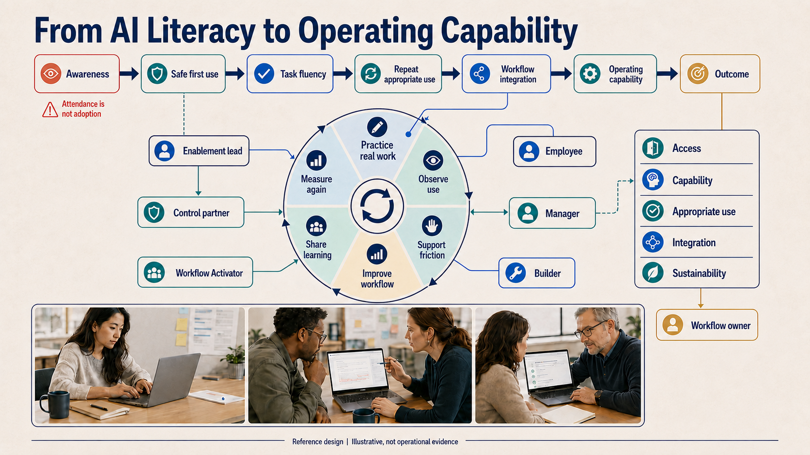
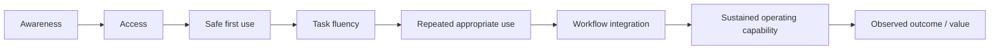
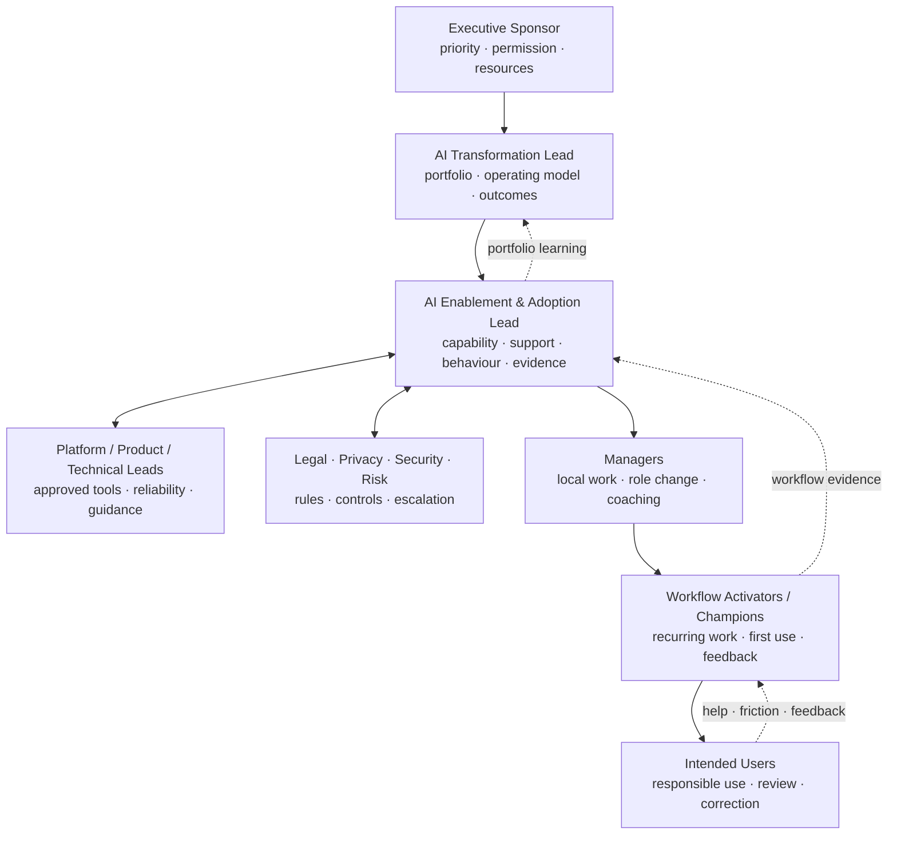
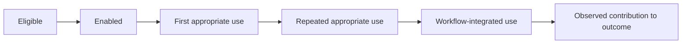

# AI Enablement and Adoption Playbook

## Build capability around real work, not generic enthusiasm

AI enablement gives people the knowledge, approved tools, practice, support, and permission needed to use AI appropriately. Adoption occurs when an approved AI-enabled way of working becomes repeated, competent, supported, and outcome-relevant inside a real workflow.

*Reference design. Illustrative, not operational evidence. See the [Visual Atlas](VISUAL_ATLAS.md#v10-enablement-to-adoption-capability-flywheel) for the adoption decision, capability interpretation, and evidence boundary.*

These states must remain separate:

Training can contribute to any state, but training attendance proves none of the later states.

## 1. Regulatory and governance context

The European Commission's current Article 4 Q&A says providers and deployers of AI systems must take measures supporting AI literacy for staff and others operating or using AI on their behalf. The approach should consider the person's technical knowledge, experience, education/training, the use context, and the people affected. The Commission also says no specific individual literacy level is mandated and that simply asking staff to read instructions may be ineffective. [European Commission — AI literacy Q&A](https://digital-strategy.ec.europa.eu/en/faqs/ai-literacy-questions-answers)

Practical implications:

- inventory the AI systems people actually develop, operate, or use;
- differentiate provider, deployer, user, owner, reviewer, and affected-person contexts;
- tailor learning to role, system, task, consequence, and risk;
- connect learning to approved behaviour, human oversight, escalation, and support;
- maintain evidence of the measures taken and how they relate to the context;
- involve legal counsel for organisation-specific interpretation.

This playbook is not a legal opinion or compliance checklist.

## 2. The enablement operating model

### AI Enablement & Adoption Lead

Owns:

- audience and role capability model;
- learning pathways and assets;
- AI champions/Activator network;
- in-flow support, office hours, community, and knowledge base;
- communication and manager enablement;
- first-use and adoption observation;
- enablement metrics and feedback into workflow/portfolio decisions.

Does not own alone:

- enterprise AI risk acceptance;
- technical platform safety and reliability;
- business workflow outcome;
- employment or role-restructuring decisions;
- legal interpretation;
- every team's workflow design.

### Workflow Activator

OpenAI's current Agent Activator guidance describes a role accountable for how an AI-enabled recurring workflow works for other people—including requirements, human decisions, access, reliability, rollout, support, measurement, maintenance, and ongoing outcome. It distinguishes participation in learning from demonstrated application. [OpenAI Academy — Agent Activator](https://academy.openai.com/en/public/clubs/champions-ecqup/resources/getting-started-as-an-ai-activator-2026-06-08)

In this playbook, an Activator:

- knows and helps redesign a recurring workflow;
- coordinates business, technical, information, and control decisions;
- packages the approved way of working for others;
- supports first use and routes help/incidents;
- observes corrections, friction, and outcomes;
- maintains the workflow with its owner;
- cannot approve beyond delegated authority.

## 3. Audience and capability ontology

### 3.1 Capability levels

| Level | Capability | Evidence |
| --- | --- | --- |
| **A0 — Informed** | recognises AI use, purpose, limitations, responsibility, prohibited/sensitive use, and help route | scenario-based understanding or acknowledgement appropriate to context |
| **A1 — Safe user** | uses approved systems, protects information, checks outputs, discloses/escalates appropriately | safe completion of representative tasks |
| **A2 — Task practitioner** | applies AI to a defined task, structures context, evaluates quality, corrects and records material issues | repeated task evidence and review quality |
| **A3 — Workflow Activator** | designs/packages a recurring workflow for others, coordinates controls/support, measures and improves it | another person can use the workflow; feedback changes design |
| **A4 — Builder/integrator** | builds/configures models, retrieval, tools, connections, tests, monitoring, and operations | validated technical and system evidence |
| **A5 — Governor/assurer** | classifies, assesses, tests, audits, advises, accepts/escalates risk within authority | documented decisions, assessments, control and incident evidence |

Levels are contextual, not a universal employee ranking. A person may be A3 in one workflow and A1 in another.

### 3.2 Role pathways

| Audience | Minimum pathway | Role-specific practice |
| --- | --- | --- |
| Board/executive | A0 + decision literacy | ambition, accountability, risk appetite, evidence, investment gates |
| People manager | A1 + manager pathway | workload/role redesign, permission, coaching, fair evaluation, concerns |
| General employee using approved AI | A1 | information handling, verification, disclosure, escalation, task scenarios |
| Domain professional | A2 | task quality, uncertainty, professional judgment, records and exceptions |
| Workflow owner / champion | A3 | current/future workflow, requirements, authority, support, measurement, change |
| Builder/data/architect | A4 | secure development, evaluation, integration, observability, lifecycle |
| Legal/privacy/security/risk/audit | A5 plus relevant technical context | classification, assessment, evidence, control testing, incidents, assurance |
| Procurement/vendor manager | A1/A5 hybrid | due diligence, data/model terms, service evidence, change, exit |

## 4. Curriculum architecture

### 4.1 Common foundation

Every relevant audience should understand, at a level appropriate to context:

1. what AI systems are used or proposed in the organisation;
2. what each system is intended and not intended to do;
3. why outputs can be incomplete, wrong, biased, insecure, stale, or inappropriate;
4. information classification and approved-tool rules;
5. verification, professional judgment, human oversight, and accountability;
6. prohibited/high-risk uses and when to stop;
7. transparency/disclosure where required;
8. help, feedback, incident, complaint, and appeal routes;
9. how the organisation measures value and harm;
10. that use is monitored/governed according to policy, with appropriate employee transparency.

### 4.2 Task practice

Generic prompting is insufficient. Practice should use representative work:

- routine complete case;
- missing information;
- contradictory information;
- sensitive or prohibited information;
- misleading but fluent output;
- uncertain recommendation;
- action beyond authority;
- prompt-injection or unsafe request;
- correction, override, escalation, and incident;
- changed model/tool/policy.

### 4.3 Manager pathway

Managers need to:

- decide when AI use is appropriate and approved;
- redesign workload rather than silently add AI-review work;
- make human authority and performance expectations clear;
- avoid rewarding unsafe speed or hidden automation;
- surface role changes, capability gaps, accessibility needs, and workload effects;
- support disagreement, escalation, and speaking up;
- review adoption, quality, incidents, and team outcome together;
- explain what is known and unknown about workforce impact.

### 4.4 Activator pathway

1. choose a valuable recurring workflow;
2. observe and map current work;
3. define outcome, boundary, users, owner, and authority;
4. allocate human/AI tasks;
5. define requirements, approved sources, tools, controls, and tests;
6. package instructions, examples, access, support, and change process;
7. support first use where work occurs;
8. capture help, correction, override, friction, incidents, and outcomes;
9. recommend expand, revise, pause, or stop;
10. maintain or retire the workflow with accountable owners.

### 4.5 Builder and control pathways

Cover role-specific subjects such as:

- model/data/tool supply chain;
- retrieval and provenance;
- secure tool use and excessive agency;
- privacy/security engineering;
- evaluation, uncertainty, human factors, fairness where relevant;
- logging, monitoring, incidents, change, and decommissioning;
- architecture and connection contracts;
- applicable regulation, standards, policy, and assurance methods.

## 5. Learning experience design

Use a blend:

| Format | Best use | Weak use |
| --- | --- | --- |
| Executive working session | decisions, accountability, portfolio and risk | generic inspiration keynote only |
| Short foundation module | common vocabulary and policy | proving task competence |
| In-flow clinic | real task/workflow practice | replacing a designed workflow |
| Scenario simulation | verification, risk, escalation, authority | memorising rules without context |
| Office hours | help, pattern sharing, early friction | permanent substitute for ownership |
| Champion community | peer learning and local adaptation | uncontrolled distribution of tools/prompts |
| Workflow lab | design, build, test, package, operate | idea generation without owners |
| Manager huddle | workload, role, behaviour and local evidence | technical implementation detail |
| Knowledge base | single governed source, reusable assets, change | dumping unowned content |
| Incident/failure review | organisational learning and controls | blame or success-only storytelling |

### Learning asset contract

Every asset should state:

- intended audience and prerequisite;
- relevant AI system/workflow and version;
- approved purpose and limits;
- information/tool rules;
- required human checks and authority;
- realistic examples and failure scenarios;
- help, incident, complaint, and escalation route;
- owner, review date, and change trigger;
- evidence expected from completion/use.

## 6. Adoption system

### 6.1 Adoption is multi-dimensional

| Dimension | Question | Example evidence |
| --- | --- | --- |
| Reach | did intended people receive access and support? | eligible vs enabled population |
| Activation | could they complete first appropriate use? | first-use completion and help |
| Appropriateness | are they using it for approved work? | sampled use categories and exceptions |
| Repetition | does use recur when the workflow occurs? | repeat workflow completion, not logins alone |
| Quality | are outputs reviewed/corrected effectively? | error, correction, override, escalation |
| Integration | is it embedded in real work and systems? | workflow state, handoff, record, completion |
| Sustainability | can it operate without creator dependence? | support burden, owner maintenance, knowledge freshness |
| Trust | do users understand when to rely, verify, or reject? | qualitative observation, calibrated use, concerns |
| Outcome | does it contribute to the owned result? | workflow/business measure with limitations |
| Safety | are controls and incidents functioning? | violations, near misses, response, recovery |

### 6.2 Adoption funnel

Always report denominator and exclusions. “80% adoption” is meaningless without defining eligible population, appropriate behaviour, period, and evidence source.

### 6.3 Adoption friction taxonomy

- no clear benefit in the user's work;
- access, identity, permission, or device friction;
- poor source quality or missing integration;
- unreliable output or excessive review burden;
- unclear scope, policy, or professional accountability;
- fear, role uncertainty, surveillance concern, or trust deficit;
- manager behaviour inconsistent with the stated change;
- workflow located outside normal work;
- inadequate accessibility or language support;
- missing help, slow escalation, or repeated incidents;
- creator dependence and stale instructions;
- benefits captured by the organisation while workload/risk shifts to users.

Treat friction as system evidence, not user resistance by default.

## 7. Activator/champion network

### Selection criteria

Choose people who:

- understand a recurring workflow and its exceptions;
- are trusted by peers and willing to surface failure;
- can coordinate rather than simply promote tools;
- have manager support, time, access, and defined authority;
- can work with technical and control partners;
- are willing to measure and maintain, not only create.

Do not select only the most enthusiastic AI users. Include sceptical domain experts and people affected by the change.

### Network operating rhythm

| Rhythm | Purpose |
| --- | --- |
| Intake/qualification | decide which workflow deserves effort |
| Design clinic | pressure-test outcome, workflow, authority, data and risk |
| Build/test review | inspect representative failures and control evidence |
| Office hours | resolve intended-user questions and collect friction |
| Pattern demo | share a reusable, bounded workflow—not a generic trick |
| Incident/failure review | convert observed issues into controlled changes |
| Portfolio review | continue, expand, revise, pause, retire |

### Activator workflow package

- outcome and intended users;
- workflow start/end and scope;
- approved AI behaviour and limits;
- sources, tools, permissions, and prerequisites;
- exact user steps and examples;
- human decisions and review gates;
- exceptions and escalation;
- support, incident, complaint, and appeal;
- measures and evidence log;
- owner, version, review, maintenance, and retirement.

## 8. Communications system

### Core employee message

Every launch communication should answer:

1. What work is changing and why?
2. What does the AI system do and not do?
3. Who remains accountable for decisions?
4. What information may be used?
5. How should output be checked?
6. When must a person stop or escalate?
7. What is recorded or monitored and why?
8. How can people get help, raise concern, contest an outcome, or report an incident?
9. How will the organisation evaluate effects on quality, workload, roles, and outcomes?
10. What will happen next and who owns the workflow?

### Communication principles

- do not promise that AI will not affect roles if the organisation has not made that decision;
- do not frame legitimate concern as resistance;
- do not imply an experimental system is reliable or mandatory beyond its approved scope;
- explain human oversight in concrete decisions, not slogans;
- communicate failures and changes, not only launches;
- make support and appeal routes visible at the point of work.

## 9. Enablement evidence dashboard

| Layer | Measures | Interpretation boundary |
| --- | --- | --- |
| Provision | eligible, access granted, asset completion | reach, not competence |
| Understanding | scenario responses, confidence plus observed checks | knowledge within assessed context |
| First use | completion, help, confusion, errors, escalation | usability and initial capability |
| Repeated use | appropriate workflow cases completed over time | recurring behaviour, not value alone |
| Quality/authority | corrections, overrides, unsafe acceptance, under-escalation | judgment and system design |
| Support | tickets, office-hour demand, time to resolve, recurring themes | operating burden and learning |
| Workflow | cycle, quality, rework, handoff, outcome | contribution requires comparison and limitations |
| Workforce | workload, role clarity, trust, accessibility, unintended effects | qualitative and quantitative evidence; protect confidentiality |

## 10. Enablement stage gates

| Gate | Evidence required |
| --- | --- |
| Ready to teach | approved workflow/system, audience, limits, role decisions, support and asset owner |
| Ready for first use | access, scenario practice, instructions, help, incident and fallback |
| Ready for repeated use | early failures resolved, support capacity, owner cadence, monitoring |
| Ready to expand | intended-user evidence, outcome contribution, controls, sustainable support, revised assessment |
| Ready to retire | communication, fallback, access revocation, knowledge/record handling, learning captured |

## 11. Enablement anti-patterns

- one generic course for every role and system;
- prompt libraries without workflow, data, authority, or quality context;
- champions with enthusiasm but no time, mandate, or maintenance responsibility;
- training before the workflow and support route are stable enough to teach;
- adoption measured by licences, logins, messages, or attendance alone;
- gamifying usage regardless of appropriateness or risk;
- managers rewarding speed while policy requires careful review;
- hiding review burden and new human work;
- treating feedback as a satisfaction score rather than change evidence;
- declaring adoption after a demo or one coached session.
