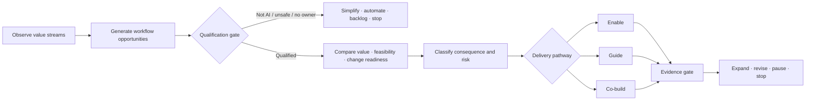

# AI Use-Case Portfolio and Workflow Pattern Library

## Choose work worth changing

A use case is not “use an LLM for customer service.” It is a bounded proposition:

> For these people and cases, use these approved information sources and AI behaviours inside this recurring workflow, under these human decisions and controls, to improve this owned outcome, measured this way.

## 1. Use-case ontology

| Object | Question |
| --- | --- |
| Stakeholder | Who receives value or may experience harm? |
| Outcome | What result should improve or be protected? |
| Workflow | Which recurring work creates the result? |
| Trigger/case | What starts one instance? |
| Task/decision | What exact work might AI support? |
| Intended user | Who uses/reviews the capability? |
| Affected person | Whose interests, rights, access, work, or experience may change? |
| Information | What sources and facts are required and authorised? |
| AI behaviour | Retrieve, extract, classify, generate, recommend, predict, plan, or act? |
| Authority | Who decides, approves, executes, changes, and accepts risk? |
| Connection | Which systems, models, knowledge, tools, and people interact? |
| Control | What prevents, detects, responds to, and recovers from failure? |
| Evidence | What observation supports the next decision? |

## 2. Portfolio process

## 3. Qualification before scoring

Do not let a high numeric score legitimise a prohibited, unowned, unobservable, or structurally weak use case.

### Pass/fail questions

- Is the intended purpose legitimate and clear?
- Is the workflow recurring and owned?
- Is the outcome material and measurable enough to learn?
- Can authorised evidence and intended users be accessed?
- Is AI plausibly better than elimination, simplification, rules, search, analytics, or conventional automation?
- Can the first scope avoid or control unacceptable consequences?
- Can people exercise meaningful review/authority?
- Can the organisation test, support, monitor, recover, and stop?
- Is the use permitted under applicable law and company policy, subject to specialist review?

If any critical answer is “no,” route to stop, redesign, or a prerequisite project.

## 4. Portfolio scoring without false precision

Use scoring to structure discussion after qualification, not to automate investment.

### Opportunity score: 1–5 with evidence note

| Dimension | Strong signal |
| --- | --- |
| Outcome value | clear strategic, service, quality, revenue, capacity, risk, or employee/customer result |
| Frequency/volume | recurring cases create meaningful cumulative effect |
| Friction/failure | observed rework, waiting, search, handoff, inconsistency, or exception cost |
| AI/task fit | language, unstructured information, variable context, prediction, or bounded planning is material |
| Measurability | baseline, cases, outcome/quality/control measures can be defined |
| Reuse | pattern or capability could safely support adjacent workflows |

### Feasibility/readiness score: 1–5 with evidence note

| Dimension | Strong signal |
| --- | --- |
| Workflow stability | current work and exceptions are understood enough to redesign |
| Owner/user readiness | accountable owner and intended users will participate |
| Information readiness | approved sources, quality, meaning, freshness, access, and provenance are manageable |
| Technical readiness | approved model/tool/integration/operations can support the slice |
| Control readiness | legal/privacy/security/risk owners and patterns are available |
| Change capacity | manager support, role time, enablement, help, and operating ownership exist |

### Consequence and complexity: classify, do not subtract

Record separately:

- effect on people, rights, safety, access, employment, finance, customers, and reputation;
- reversibility and detectability;
- decision/action authority;
- data sensitivity and reach;
- system integration and vendor dependence;
- model uncertainty and adversarial exposure;
- population, geography, duration, and scale;
- operational support and incident complexity.

A high-value, high-consequence workflow may deserve Co-build and stronger assurance. It does not become “low risk” because value is high.

## 5. Use-case canvas

| Field | Answer |
| --- | --- |
| Name | Verb + object + outcome, not technology name |
| Sponsor / outcome owner |  |
| Workflow owner / Activator |  |
| Stakeholder and intended outcome |  |
| Current workflow and observed friction |  |
| Trigger, start, end, and denominator |  |
| Intended users and affected people |  |
| Proposed AI tasks/decisions and autonomy level |  |
| Decisions/actions retained by people |  |
| Authoritative sources and required connections |  |
| Required and prohibited behaviour |  |
| Material exceptions and failure conditions |  |
| Legal/privacy/security/risk classification owner |  |
| Current comparison/baseline |  |
| Outcome, quality, risk, human-work, adoption, reliability, cost measures |  |
| First coherent slice |  |
| Enable/Guide/Co-build/Stop pathway |  |
| Next evidence gate and decision owner |  |
| Public/confidential claim boundary |  |

## 6. Reusable AI workflow patterns

### Pattern P1 — Find and ground

**Behaviour:** retrieve approved knowledge/records and answer or summarise with provenance.

**Good fit:** policies, procedures, case context, product/service knowledge, research.

**Controls:** identity/access, source scope, freshness, citations, conflict/missing-state handling, no source-of-truth mutation.

**Evidence:** retrieval relevance, citation/claim support, unanswered/abstained cases, user corrections, time/rework.

### Pattern P2 — Extract and structure

**Behaviour:** transform documents/messages into a defined schema.

**Good fit:** invoices, contracts, claims, forms, service requests, reports.

**Controls:** schema validation, field-level provenance, sensitive-data handling, low-confidence routing, no invented values.

**Evidence:** field precision/recall or rubric, correction burden, exception rate, downstream validity.

### Pattern P3 — Classify and route

**Behaviour:** assign a category, priority, owner, or workflow path.

**Good fit:** service intake, exceptions, incidents, sales/operations requests.

**Controls:** class definition, unknown/other route, confidence, affected-person/fairness review where relevant, override and audit.

**Evidence:** class/route quality, dangerous misroute, delay, override, backlog outcome.

### Pattern P4 — Draft with verified facts

**Behaviour:** prepare communication or document from approved context.

**Good fit:** customer updates, case notes, proposals, reports, policy summaries.

**Controls:** supported-fact restriction, tone/brand/policy, disclosure, human approval for consequential/external use.

**Evidence:** unsupported facts, edits, approval, time, communication outcome where observable.

### Pattern P5 — Recommend options

**Behaviour:** analyse evidence and propose alternatives, rationale, uncertainty, and escalation.

**Good fit:** exception resolution, service recovery, procurement, finance analysis, operational decisions.

**Controls:** policy and authority, complete option set, rejected reasons, provenance, no forced answer, human decision.

**Evidence:** allowed option, authority route, decision alignment, correction/override, downstream outcome.

### Pattern P6 — Prepare an exact action

**Behaviour:** create a structured payload or change for human approval.

**Good fit:** refund/replacement, ticket update, CRM action, configuration or contract change.

**Controls:** exact-payload approval, before-state, value/permission limits, idempotency, separation of recommendation/action.

**Evidence:** payload validity, approval changes, duplicate prevention, failed action recovery.

### Pattern P7 — Bounded execute and verify

**Behaviour:** perform an approved low-consequence action and independently verify the postcondition.

**Good fit:** tightly bounded, reversible, observable operations.

**Controls:** least privilege, operation allow-list, idempotency, timeout/retry, postcondition, monitoring, rollback, incident.

**Evidence:** exact execution, postcondition, duplicate/failure rate, recovery, outcome.

### Pattern P8 — Monitor and detect

**Behaviour:** identify change, anomaly, risk, drift, or emerging exception.

**Good fit:** operations, quality, security, finance, service, supply chain.

**Controls:** baseline, threshold, false-positive/negative treatment, human investigation, no unsupported causal claim.

**Evidence:** detection quality, lead time, investigation burden, missed material events, downstream action.

### Pattern P9 — Plan and coordinate

**Behaviour:** decompose work, sequence tasks, select tools, and adapt to intermediate results.

**Good fit:** complex but bounded workflows with explicit state and safe tools.

**Controls:** plan/action separation, step/tool limits, sandbox, human gates, budget/time limits, full trace, recovery.

**Evidence:** plan validity, completed/failed steps, unsafe attempts, human intervention, cost, outcome.

This is the most agentic pattern and should not be the default starting point.

## 7. Illustrative company use-case cards

These examples are hypotheses. They are not company recommendations or benefit claims.

### U1 — Commerce fulfilment exception to verified customer recovery

| Element | Design hypothesis |
| --- | --- |
| Outcome | more eligible delayed/partial orders reach correct, authorised, verified recovery within target time |
| AI role | assemble cited context, classify uncertainty, propose policy-valid options, draft from verified facts |
| Human authority | customer judgment, material refund/replacement, low-evidence/out-of-policy decisions, policy change |
| Connections | OMS, WMS, carrier, inventory, payment, CRM, policy, dry-run/action adapter, verifier |
| Critical controls | quantity reconciliation, duplicate recovery, authority limit, exact action, postcondition, unsupported message facts |
| Evidence | verified resolution, correctness, escalation, handling/handoffs, review, action verification, adoption, cost |
| First slice | delayed/partial fulfilment with bounded synthetic/approved cases |

Worked example: [Commerce AI Transformation Lab](../../README.md).

### U2 — Customer-service case preparation and next-best safe action

| Element | Design hypothesis |
| --- | --- |
| Outcome | improve first useful response and resolution quality without weakening customer judgment |
| AI role | find account/case context, summarise history, classify intent, propose approved options, draft response |
| Human authority | commitments, concessions, complaints, vulnerability, legal/reputation-sensitive cases |
| Connections | CRM, ticketing, product/order/account records, approved knowledge, quality system |
| Risks/stops | identity mismatch, sensitive data, stale policy, unsupported promise, manipulation, vulnerable customer |
| Evidence | cited-fact accuracy, edit/override, escalation, resolution, repeat contact, quality, support burden |

### U3 — Sales account preparation and opportunity coordination

| Element | Design hypothesis |
| --- | --- |
| Outcome | improve seller preparation and coordinated follow-through on qualified accounts |
| AI role | assemble approved account/product context, summarise interactions, identify missing facts, propose next steps |
| Human authority | qualification, pricing, forecast commitment, customer communication, contract/compliance decisions |
| Connections | CRM, product/pricing, approved external research, calendar/email under policy, sales process |
| Risks/stops | inaccurate external data, sensitive inference, spam, discriminatory targeting, false forecast certainty |
| Evidence | preparation quality/time, CRM completeness, accepted/corrected next steps, stage outcome with attribution limits |

### U4 — Marketing content workflow with evidence and approval

| Element | Design hypothesis |
| --- | --- |
| Outcome | increase compliant content throughput and reuse while protecting claims, rights, and brand |
| AI role | retrieve approved facts/assets, create variants, check required elements, prepare review package |
| Human authority | strategy, public claim, regulated statement, final publication, sensitive audience decisions |
| Connections | DAM/CMS, brand/policy, product facts, rights/consent records, approval and publication system |
| Risks/stops | fabricated claims, copyright/rights, personal data, deceptive content, missing AI disclosure where required |
| Evidence | claim support, edit/rejection, rights/compliance review, cycle time, reuse, campaign outcome caveats |

### U5 — Finance close variance investigation

| Element | Design hypothesis |
| --- | --- |
| Outcome | reduce investigation friction and improve documented explanation quality during close |
| AI role | assemble approved ledgers/reports, identify material variances, propose explanations and evidence gaps |
| Human authority | accounting judgment, adjustment, sign-off, forecast and external reporting |
| Connections | ERP/ledger, planning, BI, policy, close workflow, approval record |
| Risks/stops | incorrect accounting inference, materiality error, data leakage, stale period, unsupported narrative |
| Evidence | variance detection/explanation quality, correction, handling/rework, close controls, audit trace |

### U6 — Accounts-payable invoice exception triage

| Element | Design hypothesis |
| --- | --- |
| Outcome | route invoice exceptions with better context while preventing duplicate or unauthorised payment |
| AI role | extract fields, match purchase/order/receipt context, classify exception, recommend route |
| Human authority | vendor/master changes, payment approval, fraud concern, policy exception |
| Connections | invoice capture, ERP/AP, procurement, receipt, vendor master, approval, payment status |
| Risks/stops | prompt/document injection, duplicate invoice, altered bank detail, poor match, segregation-of-duties breach |
| Evidence | extraction/match/route quality, dangerous misroute, review, duplicate prevention, resolution time |

### U7 — Procurement request and supplier evidence preparation

| Element | Design hypothesis |
| --- | --- |
| Outcome | improve completeness and cycle quality of procurement decisions |
| AI role | structure request, retrieve approved supplier/contract/policy evidence, identify missing requirements |
| Human authority | supplier selection, negotiation, risk acceptance, purchase approval, conflicts of interest |
| Connections | intake, procurement, supplier risk, contracts, finance, security/privacy review |
| Risks/stops | biased recommendation, incomplete due diligence, confidential data, conflict, unauthorised commitment |
| Evidence | request completeness, missing-risk detection, corrections, handoffs, cycle/decision quality |

### U8 — Contract intake and obligation review support

| Element | Design hypothesis |
| --- | --- |
| Outcome | focus legal attention on material terms and improve obligation visibility |
| AI role | extract clauses/obligations, compare with approved playbook, flag deviations, draft review notes |
| Human authority | legal advice, risk acceptance, negotiation, final interpretation and signature |
| Connections | contract repository, playbook, matter/intake, approval, obligation tracking |
| Risks/stops | missed clause, privileged/confidential data, jurisdiction, false legal certainty, outdated playbook |
| Evidence | extraction/flagging quality, missed material issue, correction/review time, obligation capture |

### U9 — Employee policy and service navigation

| Element | Design hypothesis |
| --- | --- |
| Outcome | help employees find applicable policy and route requests while preserving HR judgment and rights |
| AI role | retrieve cited policy, ask clarifying scope questions, explain process, prepare service request |
| Human authority | employment decisions, performance, accommodation, grievance, investigation, legal interpretation |
| Connections | policy/knowledge, HR service portal, identity and jurisdiction, case routing |
| Risks/stops | sensitive data, incorrect jurisdiction/version, employment decision inference, missing appeal/employee support |
| Evidence | citation/route quality, help and correction, resolution, accessibility, complaints/concerns |

Do not extend this pattern to automated hiring, worker management, performance scoring, or termination without specialised legal/risk analysis; these contexts may be high-risk under the EU AI Act.

### U10 — IT service intake and resolution support

| Element | Design hypothesis |
| --- | --- |
| Outcome | improve correct routing and resolution of common service issues while protecting privileged access |
| AI role | classify, retrieve known solution, gather diagnostics, prepare or execute approved low-risk remediation |
| Human authority | privileged change, security incident, material outage, access grant, exception |
| Connections | service management, CMDB, monitoring, knowledge, identity, endpoint/automation tools |
| Risks/stops | secret exposure, unsafe command, excessive permission, prompt injection in ticket, false closure |
| Evidence | route/resolution quality, escalation, verified remediation, repeat incident, support burden |

### U11 — Software delivery change preparation and review

| Element | Design hypothesis |
| --- | --- |
| Outcome | improve change quality and reviewer focus without bypassing engineering accountability |
| AI role | explain change, identify affected areas, propose tests, inspect known patterns, prepare review evidence |
| Human authority | architecture, security, merge, release, incident and rollback decisions |
| Connections | repository, issue, CI/CD, architecture/docs, test, security, observability |
| Risks/stops | vulnerable code, secret/license leakage, destructive tool use, misleading test evidence, supply chain |
| Evidence | defects found/missed, review correction, test validity, lead time, incident/change failure |

### U12 — Supply-chain exception coordination

| Element | Design hypothesis |
| --- | --- |
| Outcome | improve timely, evidence-based response to supply or logistics exceptions |
| AI role | correlate events, summarise impact, propose bounded response options, coordinate tasks |
| Human authority | supplier/customer commitments, expedite cost, allocation, safety/quality, contract decisions |
| Connections | ERP, planning, WMS/TMS, supplier/carrier, inventory, quality, customer order, finance |
| Risks/stops | stale/conflicting events, inaccurate causal inference, cascading action, safety/regulated product |
| Evidence | detection/option quality, handling/handoffs, verified action, service/inventory/cost outcome |

### U13 — Field-service or sales visit preparation

| Element | Design hypothesis |
| --- | --- |
| Outcome | improve useful visit preparation, follow-up quality, and issue visibility |
| AI role | assemble approved account/site/product context, suggest agenda, capture structured follow-up |
| Human authority | advice, commitment, pricing, safety, customer relationship and final records |
| Connections | CRM, service history, product/asset records, policy, mobile workflow |
| Risks/stops | inaccurate profile, sensitive inference, offline/stale context, unsupported commitment |
| Evidence | preparation completeness, corrections, follow-up, issue resolution, user burden |

## 8. Bad use-case formulations

Replace:

- “build an HR agent” with a bounded policy-navigation workflow and explicit employment-decision exclusions;
- “automate customer service” with a named case family, outcome, authority, sources, and verification;
- “save 30% of time” with a baseline plan and a capacity/value hypothesis;
- “use RAG over all company data” with approved sources, users, purposes, access, freshness, and claim support;
- “autonomous finance agent” with exact permitted operations, values, approvals, idempotency, and postconditions;
- “AI for everyone” with role-, system-, task-, and risk-based enablement;
- “agent platform” with the first workflow and reusable capabilities it must prove.

## 9. Portfolio evidence record

For each use case maintain:

- current maturity state;
- outcome owner and workflow owner;
- delivery pathway;
- last decision and evidence;
- material dependencies and risks;
- evaluation/pilot/production boundary;
- adoption and support status;
- realised vs hypothetical value;
- next gate, criteria, owner, and date/cadence;
- stop/retirement conditions.
