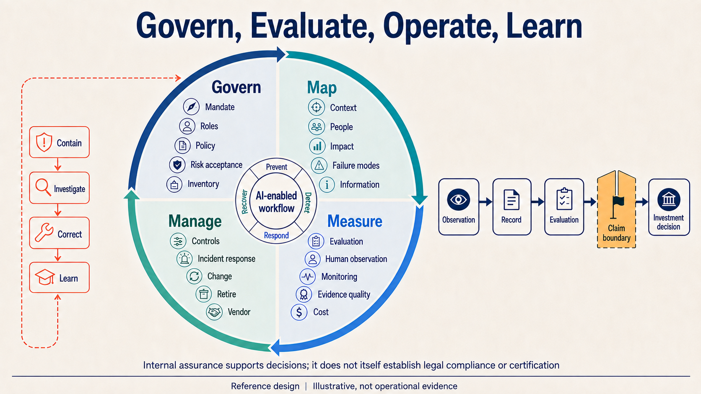
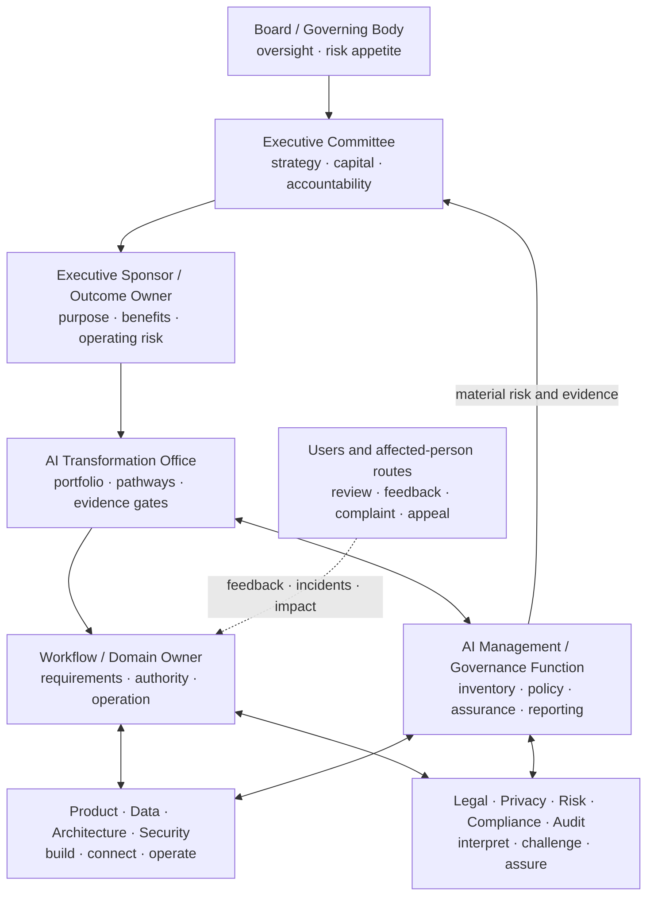
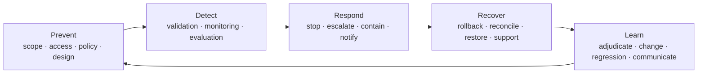
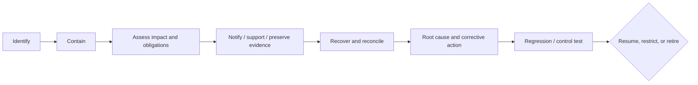

# AI Governance, Risk, and Evidence System

## Govern enough to create value—and enough to stop safely

Governance is the system through which legitimate people make informed decisions about AI purpose, value, authority, risk, evidence, operation, change, and retirement. It is not a policy document or an approval meeting added after a build.

*Supplied reference design. Illustrative, not operational evidence. An open correction must connect Manage or Incident response unambiguously to Contain. See the [Visual Atlas](VISUAL_ATLAS.md#v09-governance-control-and-evidence-loop) for the review status and authoritative prompt contract.*

## 1. Framework basis and boundary

This playbook uses external frameworks as organising references:

- The NIST AI Risk Management Framework organises activity across **Govern, Map, Measure, and Manage**, with governance cross-cutting through the lifecycle. It emphasises context, documented roles, inventory, human-AI responsibilities, testing, independent review, monitoring, and risk response. NIST states that AI RMF 1.0 is voluntary and is being revised. [NIST AI RMF Core](https://airc.nist.gov/airmf-resources/airmf/5-sec-core/) and [NIST AI Resource Center](https://airc.nist.gov/)
- ISO/IEC 42001:2023 specifies requirements for establishing, implementing, maintaining, and continually improving an AI management system. ISO describes it as a management-system approach using Plan-Do-Check-Act and balancing AI risks and opportunities. [ISO/IEC 42001](https://www.iso.org/standard/42001)
- The OECD AI classification framework uses dimensions including people/planet, economic context, data/input, model, and task/output to understand different system contexts and impacts. [OECD AI classification framework](https://oecd.ai/en/classification)
- OWASP's current Agentic Applications guidance provides a security starting point for systems that plan, act, use tools, and make decisions across workflows. [OWASP Top 10 for Agentic Applications 2026](https://genai.owasp.org/resource/owasp-top-10-for-agentic-applications-for-2026/)
- The EU AI Act uses a legal risk-based framework. The Commission's official page states that the Act became generally applicable on 2 August 2026, with exceptions and later dates for specified high-risk rules; Article 4 AI-literacy measures and prohibited-practice rules began earlier, and Article 50 transparency rules apply from August 2026. [European Commission — AI Act](https://digital-strategy.ec.europa.eu/en/policies/regulatory-framework-ai) and [Article 50 guidelines](https://digital-strategy.ec.europa.eu/en/library/guidelines-transparency-obligations-providers-and-deployers-ai-systems)

External specialists must determine applicability and obligations for a real organisation. An internal risk tier or NIST/ISO crosswalk is not an EU AI Act legal classification.

## 2. Governance topology

## 3. Minimum governance objects

An organisation needs governed records, not only principles.

| Object | Purpose | Owner |
| --- | --- | --- |
| AI policy and principles | enterprise intent, boundaries, prohibited/required behaviour | executive/governance owner |
| AI system/use inventory | know what exists, where, why, who, and at what risk | AI management/governance |
| Use-case/workflow record | connect purpose, outcome, people, data, tasks, decisions and systems | workflow owner |
| Classification/impact assessment | determine consequence, affected people, legal/risk/control needs | relevant risk/legal owners |
| Architecture and data decision | approve model, connection, permissions, non-functional and vendor design | architecture/data/security owners |
| Human authority matrix | define decision, approval, execution, change, appeal and risk acceptance | business/policy owners |
| Evaluation contract and results | establish quality, risk, limitations and next gate | evaluation + domain owner |
| Model/tool/vendor record | track provider, version, terms, service, changes and exit | product/procurement/technical owner |
| Operational record | trace use, decision, action, verification, monitoring and cost | technical/workflow owner |
| Incident and exception record | manage harm, loss of control, failure and learning | incident/risk owner |
| Change and release record | control policy, model, data, prompt, tool, scope and autonomy changes | change owner |
| Evidence/claim register | stop unsupported internal/external statements | outcome/comms/evidence owner |
| Decommission record | remove access and preserve required records safely | workflow/technical/governance owners |

## 4. AI inventory schema

Maintain one inventory entry per materially distinct system/use context.

### Identity and ownership

- system/use name and ID;
- provider, developer, deployer, operator, and business owner;
- technical, data/knowledge, model, risk, and support owners;
- lifecycle state, version, environment, geography, business unit;
- review date and change triggers.

### Purpose and context

- intended purpose and benefit;
- workflow, tasks, decisions, actions, and autonomy levels;
- intended users and affected people/groups;
- prohibited and foreseeable misuse;
- population, volume, frequency, and channels;
- decision/action consequences and reversibility.

### Technology and supply chain

- model/provider/version and routing;
- data/knowledge sources, provenance, sensitivity, and retention;
- prompts/instructions/policies and versions;
- tools, adapters, permissions, infrastructure, and integrations;
- sub-processors, external services, open-source components;
- logging, monitoring, evaluation, incident, and decommission design.

### Legal/risk/control

- applicable legal/sector assessments and legal-role analysis;
- EU AI Act classification/status where determined by authorised counsel;
- privacy/data-protection assessment;
- security/threat assessment;
- human-rights/fairness/accessibility/workforce/impact considerations as relevant;
- internal assurance tier;
- controls, residual risk, approval, limitations, and exceptions.

### Evidence and operation

- evaluation cases, measures, thresholds, and last result;
- operational outcome, quality, risk, adoption, reliability, incident, cost;
- unresolved risks and overdue actions;
- approved claim wording and public boundary.

## 5. Internal assurance tiers

Use an internal assurance tier to allocate governance effort. Do not label it as an EU legal classification.

| Tier | Typical context | Minimum governance |
| --- | --- | --- |
| **T0 — Prohibited / unacceptable internally** | unlawful, policy-prohibited, unacceptable harm, no legitimate purpose | block, record rationale, monitor circumvention |
| **T1 — Low consequence** | bounded informational/task assistance with no sensitive/action consequence | inventory, approved use, literacy, data rules, basic tests, owner |
| **T2 — Material workflow support** | recommendations/drafts influence recurring work or external communication | workflow/impact map, representative evaluation, human review, monitoring, support/change |
| **T3 — Consequential or integrated** | sensitive data, material financial/customer/employee decision, system action, cross-functional integration | multidisciplinary assessment, strong authority, exact controls, independent review, pilot gate, incident/recovery |
| **T4 — High-impact/high-autonomy** | rights/safety/access/employment/critical service or adaptive multi-step action | specialist legal classification, executive risk acceptance, extensive TEVV, containment, continuous oversight; may be unsuitable |

### Tier factors

- potential severity and likelihood of harm;
- people/groups affected and ability to contest;
- role in a decision or action;
- data sensitivity and inference;
- reach, scale, duration, geography, and visibility;
- reversibility, detectability, and recovery;
- model uncertainty and generalisation;
- tool permissions and autonomy;
- adversarial exposure;
- third-party dependency and change;
- control/monitoring maturity.

## 6. Risk and opportunity map

For each workflow assess both value and negative impact.

| Domain | Opportunity questions | Risk questions |
| --- | --- | --- |
| Business/outcome | what result, capacity, quality, service, revenue or resilience may improve? | what target or incentive may create harmful optimisation? |
| People/workforce | what drudgery, access to expertise, or decision support may improve? | workload shift, deskilling, unfair evaluation, surveillance, role ambiguity, exclusion? |
| Customer/affected person | faster/better service, accessibility, consistency? | deception, denial, manipulation, inability to contest, vulnerable-person impact? |
| Data/knowledge | better context and reuse? | privacy, confidentiality, IP, poor quality, stale/conflicting source, inferred sensitivity? |
| Model/output | useful language, classification, prediction, planning? | confabulation, bias, opacity, instability, overreliance, model change? |
| Security/agentic | automated detection/action? | prompt injection, tool abuse, secret leakage, excessive agency, memory poisoning? |
| Operations | speed, reliability, standardisation? | duplicate/partial action, outage, drift, support burden, hidden dependency? |
| Legal/regulatory | better records, control, accessibility? | prohibited/high-risk use, transparency, human oversight, records, sector rules? |
| Financial/vendor | leverage and variable cost? | lock-in, cost volatility, service change, concentration, exit cost? |

## 7. Control architecture

Controls should form a chain, not a list.

### Preventive controls

- legitimate purpose and scope;
- inventory and classification;
- approved systems, models, data, tools, and vendors;
- identity, least privilege, segmentation, secrets;
- required/prohibited behaviour;
- deterministic policy/authority/value limits;
- privacy/data minimisation and retention;
- human decision gates;
- exact-payload approval;
- secure architecture and tool allow-list;
- representative predeployment testing;
- role-based literacy and instructions.

### Detective controls

- input/output/schema validation;
- provenance, citation, freshness, and conflict indicators;
- trace and audit records;
- quality/safety/security/privacy/fairness evaluation where relevant;
- anomaly, drift, misuse, cost, latency, and reliability monitoring;
- duplicate/action/postcondition checks;
- human correction, override, complaint, and support signals;
- independent/domain review.

### Responsive controls

- abstain, block, or degrade safely;
- route to a capable authorised person;
- stop tool/action or revoke access;
- contain data/model/vendor exposure;
- notify affected owners and, where required, people/authorities;
- preserve evidence;
- manage incident, complaint, and appeal.

### Recovery controls

- retry only under safe idempotent conditions;
- compensate or reverse action where possible;
- reconcile authoritative state;
- restore approved fallback/manual work;
- support affected people;
- correct records and communication;
- decommission unsafe components.

## 8. Meaningful human oversight

Human oversight is effective only when the person has:

- clear responsibility and legitimate authority;
- relevant competence and context;
- enough time and interface support;
- access to evidence, uncertainty, alternatives, and limitations;
- ability to change, reject, stop, or escalate without penalty;
- protection from automation bias and rubber-stamping incentives;
- feedback on downstream outcome;
- an appeal/second-review route for contested decisions.

Measure:

- unsafe acceptance and dangerous under-escalation;
- correction, override, rejection, and abstention;
- review time and cognitive load;
- disagreement quality and calibration;
- escalation delay and outcome;
- whether the system's presentation unfairly anchors the decision.

## 9. Evaluation and evidence architecture

### 9.1 Evaluation layers

| Layer | Examples |
| --- | --- |
| Component | retrieval relevance, extraction, classification, generation support, tool schema |
| Control | access, policy, authority, disclosure, idempotency, injection resistance, postcondition |
| Workflow | end-to-end correctness, escalation, handoff, closure, recovery |
| Human | comprehension, review, correction, trust, workload, accessibility |
| Operational | latency, reliability, incident, support, drift, cost |
| Outcome | service, quality, risk, cycle, capacity, revenue/cost with attribution caveats |

### 9.2 Case design

Include:

- routine representative cases;
- meaningful variation and edge boundaries;
- missing, stale, or conflicting information;
- underrepresented or accessibility-relevant contexts where applicable;
- high-consequence and out-of-scope conditions;
- malicious/adversarial input and tool misuse;
- duplicate, retry, partial failure, outage, and recovery;
- model/tool/policy/source change;
- user correction, override, appeal, and incident.

### 9.3 Evidence classes

| Class | May support | Must not imply |
| --- | --- | --- |
| Research-grounded | relevance, precedent, informed design hypothesis | the company reproduced source outcomes |
| Designed | approved specification/decision | tested or working behaviour |
| Synthetic-observed | measured behaviour within disclosed generated tests | real users, adoption, production, realised value |
| Human-reviewed | observed use/review of test or synthetic workflow | organisational adoption or business outcome |
| Pilot-observed | bounded authorised company use | enterprise scale or generalised value |
| Operational-observed | observed supported production use within stated period/scope | causality or universality beyond evidence |
| Hypothetical impact | scenario and sensitivity | forecast certainty, booked value, realised savings |
| Realised outcome | agreed measure observed in operation | sole AI attribution unless design supports it |

### 9.4 Claim contract

Every material internal/external claim records:

- exact wording and audience;
- evidence class and artifact links;
- scope, population, denominator, time period, version;
- method and source;
- limitations, uncertainty, confounders, and excluded cases;
- reviewer/approver;
- review/expiry trigger.

## 10. Incident system

### Incident triggers

- harmful, discriminatory, deceptive, privacy/security, or legally problematic output/use;
- unauthorised access, data exposure, secret leakage, or prompt/tool compromise;
- prohibited/out-of-scope use;
- incorrect consequential decision or action;
- duplicate, irreversible, or unverified action;
- material model/data/policy/vendor drift;
- inability to provide required transparency, oversight, complaint, or appeal;
- widespread failure, outage, support overload, or unexpected behaviour;
- employee/customer concern indicating possible harm or loss of control.

### Incident flow

### Incident record

- detection source/time and system versions;
- people, data, systems, decisions/actions affected;
- severity, likelihood, duration, reach, reversibility;
- containment and evidence preservation;
- legal/privacy/security/sector assessment and notification decisions;
- customer/employee/affected-person support and correction;
- root cause across people, process, data, model, tool, vendor, control, incentives;
- corrective action, regression evidence, approval, communication;
- residual risk and resume/restrict/retire decision.

## 11. Change management

Reassess when any of these changes materially:

- intended purpose, users, affected people, geography, scale, or workflow;
- autonomy, decision/action authority, value limit, or tool permission;
- model, provider, version, routing, system prompt/instruction, or fine-tuning;
- data/knowledge source, sensitivity, access, index, or retention;
- policy, law, regulation, contract, or organisational risk appetite;
- integration, infrastructure, monitoring, support, or owner;
- observed performance, incident, misuse, drift, cost, or user behaviour.

### Change gate

1. classify the change;
2. identify affected requirements, risks, tests, users, records, and claims;
3. update inventory/assessment/design;
4. run regression and new impact tests;
5. obtain required approvals;
6. communicate and enable affected users;
7. deploy with monitoring and rollback;
8. update evidence and close/reopen risks.

## 12. Vendor and model governance

### Due-diligence questions

- provider/deployer roles and contractual allocation;
- data use, retention, training, location, subprocessors, deletion;
- security, privacy, incident, audit, and assurance evidence;
- model/system documentation, limitations, evaluation, and prohibited use;
- version/change notice, deprecation, rollback, and reproducibility;
- service availability, latency, rate, capacity, support, and recovery;
- output ownership, IP, indemnity, and rights;
- logging/telemetry and customer access to evidence;
- tool/action security and permission model;
- portability, export, termination, and vendor/model substitution;
- cost drivers, limits, monitoring, and unexpected-spend control;
- regulatory/sector commitments and evidence.

### Model change rule

“Same product name” is not proof of same behaviour. Material model or service changes require risk-based regression and outcome review before wider use.

## 13. Governance stage gates

| Gate | Minimum evidence |
| --- | --- |
| Discovery authorised | legitimate purpose, sponsor, owner, data/people boundary |
| Design authorised | inventory, provisional classification, workflow/authority, required assessments |
| Test authorised | approved environment/data, evaluation contract, incident route |
| Pilot authorised | controls pass, users/support, monitoring, stop/rollback, residual-risk decision |
| Production authorised | operating owner, reliability/support, full required assessment, monitoring/change/incident/decommission |
| Expansion authorised | new context assessed; pilot/operating outcome, risk, adoption, cost, capacity |
| Retirement complete | access/integration removed, in-flight work handled, records retained/deleted, users informed |

## 14. Governance anti-patterns

- a committee owns everything and no workflow owner owns outcomes;
- a policy is published but AI systems are not inventoried;
- every use case follows the same heavy or light process;
- risk is represented as a single score that hides consequence;
- legal classification is delegated to a model or generic checklist;
- “human in the loop” is accepted without testing the human system;
- model accuracy is treated as end-to-end safety or value;
- a requested action is counted as completed without postcondition evidence;
- pilot exceptions become permanent undocumented production practice;
- vendor claims substitute for organisation-specific testing;
- positive metrics are reported while incidents, overrides, support, and failed cases are omitted;
- systems cannot be rolled back or retired.
