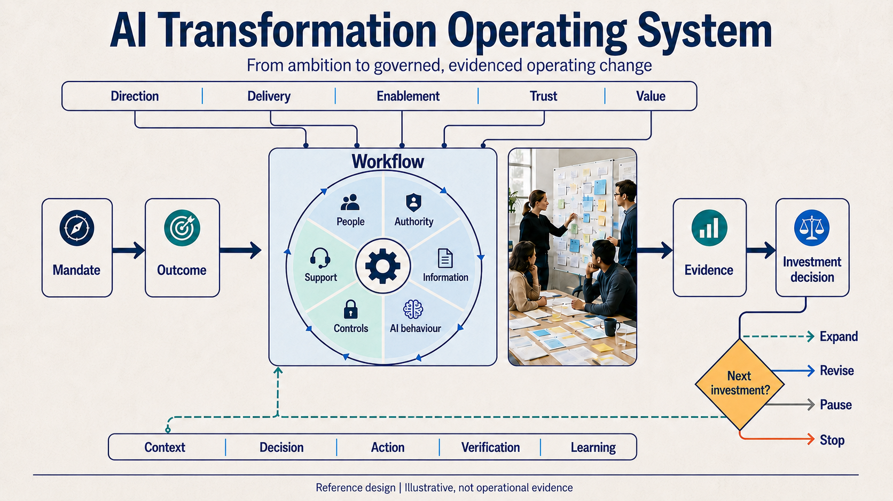
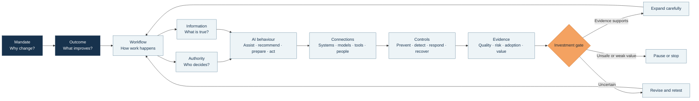
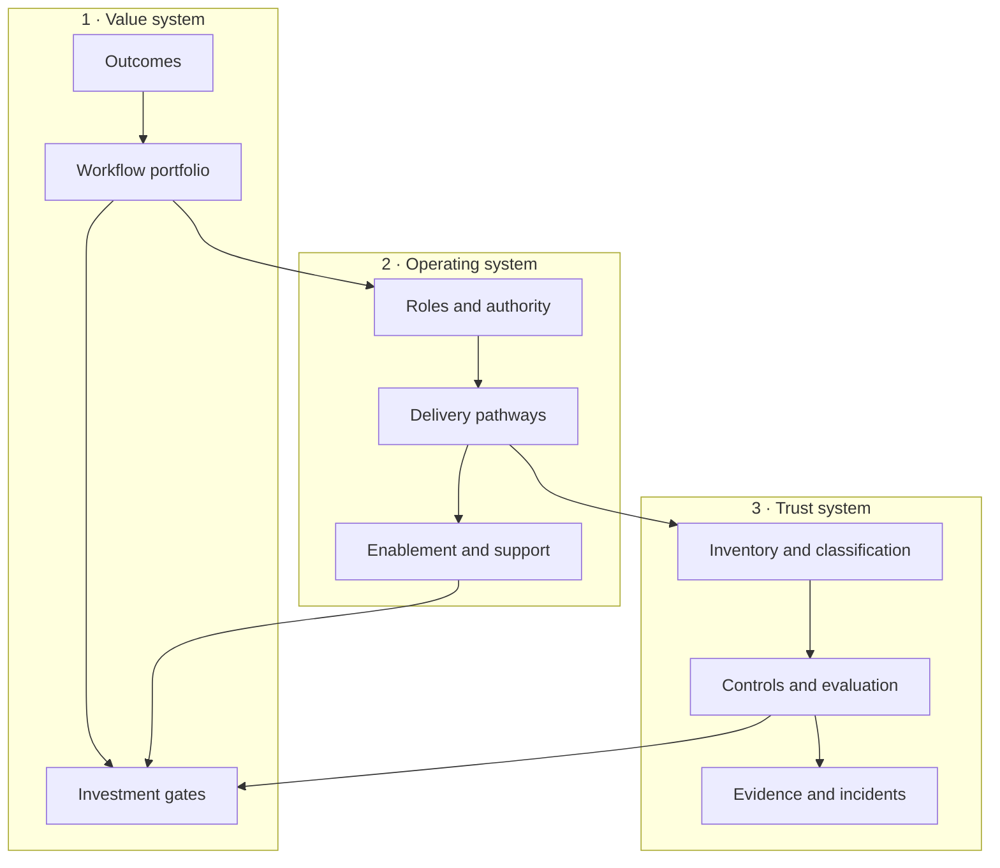

# Company AI Transformation Playbook

## A reusable system for turning AI ambition into governed operating change

This playbook is the company-facing extension of the Commerce AI Transformation Lab. It helps executives, transformation leaders, workflow owners, employees, enablement teams, technical teams, and control functions use one connected method to decide:

> Where should AI change work, who retains authority, what must be connected, how will people use it safely, and what evidence justifies the next investment?

It is intentionally broader than the lab's first commerce workflow. The lab provides a worked synthetic case. This playbook provides the reusable vocabulary, structures, decisions, and canvases needed to begin authorised work with a real organisation.

> [!IMPORTANT]
> This material is a research-grounded reference design. A company must adapt it to its sector, people, policies, risk appetite, systems, contracts, and applicable law. Using the playbook does not establish NIST conformance, ISO/IEC 42001 certification, EU AI Act compliance, security assurance, organisational adoption, or business value.

*The system in one view. The workflow is the transformation unit; direction, delivery, enablement, trust, and value connect it to a reversible investment decision. Explore all twelve decision plates in the [Visual Atlas](VISUAL_ATLAS.md).*

## Start here by audience

| Audience | Start with | Decision it supports |
| --- | --- | --- |
| Board, CEO, executive committee | [Executive blueprint](01_EXECUTIVE_BLUEPRINT.md) | Why act, where to focus, what to govern, and what evidence funds the next gate |
| Chief/Director of AI Transformation | [System model](02_SYSTEM_MODEL_ONTOLOGY_TOPOLOGY_ARCHITECTURE.md) and [delivery manual](03_TRANSFORMATION_DELIVERY_MANUAL.md) | How to create the operating model, portfolio, delivery pathways, and evidence system |
| AI Enablement & Adoption Lead | [Enablement and adoption playbook](04_ENABLEMENT_AND_ADOPTION_PLAYBOOK.md) | How to build literacy, role fluency, workflow ownership, support, and adoption evidence |
| Business or workflow owner | [Use-case portfolio](05_USE_CASE_PORTFOLIO_AND_PATTERNS.md) | Which workflow to choose, how AI may assist, and what success means |
| Product, data, architecture, security, legal, privacy, risk | [Governance, risk, and evidence](06_GOVERNANCE_RISK_AND_EVIDENCE.md) | What must be classified, controlled, tested, monitored, approved, and retained |
| Facilitator, consultant, transformation team | [Workshops, canvases, and communication](07_WORKSHOPS_CANVASES_AND_COMMUNICATION.md) | How to run the engagement and produce reusable decision artifacts |
| Reviewer, auditor, researcher | [Framework crosswalk and sources](08_FRAMEWORK_CROSSWALK_AND_SOURCES.md) | Which external frameworks informed the design and where the boundaries are |
| Designer, communicator, presentation owner | [Visual Atlas](VISUAL_ATLAS.md) and [V3 visual production pack](09_VISUAL_SYSTEM_AND_INFOGRAPHIC_PROMPTS.md) | Which decision each visual explains, what boundary applies, and how to reproduce or adapt it consistently |

## The playbook in one picture

The **AI-enabled workflow** is the central transformation unit. A model can be replaced while the workflow remains. A workflow cannot be responsibly changed unless its outcome, people, authority, information, controls, support, and evidence are understood.

## Nine connected modules

### 1. Executive blueprint

Defines the transformation thesis, executive decisions, board information model, portfolio pathways, outcome system, and engagement offer.

### 2. System model: ontology, topology, roles, and architecture

Defines the common language and shows how business, organisational, information, technical, governance, and learning structures connect.

### 3. Transformation delivery manual

Provides the end-to-end method from first conversation and mandate through discovery, baseline, design, build, evaluation, enablement, pilot, operation, and scale/stop decision.

### 4. Enablement and adoption playbook

Separates awareness from safe use, task fluency, workflow ownership, and operational capability. Includes role pathways, the Activator network, support model, communications, and evidence.

### 5. Use-case portfolio and patterns

Provides qualification gates, prioritisation logic, an autonomy ladder, reusable workflow patterns, and company use-case cards across functions.

### 6. Governance, risk, and evidence

Connects AI inventory, classification, impact, decision rights, technical controls, evaluation, incidents, change, vendors, claims, and records.

### 7. Workshops, canvases, and communication

Contains interview guides, agendas, copyable canvases, pilot artifacts, board materials, employee explanations, and decision memos.

### 8. Framework crosswalk and sources

Maps the playbook to NIST AI RMF, ISO/IEC 42001, the EU AI Act, OECD classification, OWASP guidance, and the Commerce AI Transformation Lab evidence model without implying equivalence or certification.

### 9. Visual system and infographic prompt pack

Publishes twelve supplied reference plates in a decision-led [Visual Atlas](VISUAL_ATLAS.md), then preserves their shared visual grammar, exact generation prompts, controlled edits, pass gates, and review protocol. Four independent documentary photographs remain production prompts only.

## The three systems a transformation leader must build

An AI transformation office that builds only the value system produces attractive ideas without safe delivery. One that builds only the operating system produces activity without proof. One that builds only the trust system produces controls disconnected from value. The work is to connect all three.

## Reusable maturity language

Use the following language in every engagement. It prevents a design, prototype, or training event from being described as adoption or value.

| State | Minimum evidence | Permitted statement |
| --- | --- | --- |
| **Hypothesised** | informed problem or opportunity statement | “We believe this workflow may be valuable to investigate.” |
| **Mapped** | observed/interviewed current state, owner, baseline plan | “The current workflow and assumptions are documented.” |
| **Designed** | future workflow, requirements, authority, controls | “A bounded workflow design exists.” |
| **Tested** | representative cases, recorded results, known limitations | “The solution produced these results within this test boundary.” |
| **Human-observed** | documented intended-user or reviewer sessions | “These people completed these tasks and showed this friction.” |
| **Pilot-observed** | authorised limited organisational use with measures | “The pilot produced these bounded operating observations.” |
| **Operational** | supported use, monitoring, incidents, change control | “The workflow is operating for this approved scope.” |
| **Value-realised** | agreed outcome measure, denominator, time period, attribution caveat | “The organisation observed this outcome within the stated boundary.” |

## How to use this with a company

1. Do not send the entire playbook before the first conversation.
2. Use the executive blueprint to establish the mandate and decision.
3. Select only the canvases needed for the first unfinished decision.
4. Build one shared system map with the company; do not arrive pretending to know its current state.
5. Choose one recurring, consequential, measurable workflow as the lighthouse.
6. Assign owners and authority before proposing autonomy.
7. Freeze the evaluation and evidence contract before seeing the evaluated result.
8. Support first use where work already happens.
9. report failures, overrides, review burden, incidents, and support demand alongside benefits.
10. Recommend expand, revise, pause, or stop from evidence.

## Relationship to the Commerce AI Transformation Lab

The lab's delayed/partial-fulfilment workflow is a worked synthetic example of this system:

- the [project charter](../PROJECT_CHARTER.md) demonstrates the mandate and boundary;
- the [Stage 1 operating model](../STAGE1_OPERATING_MODEL.md) demonstrates roles, sources, policy, and authority;
- the [proposed current state](../STAGE1_CURRENT_STATE.md) demonstrates queue and handoff mapping;
- the [first vertical slice](../FIRST_VERTICAL_SLICE.md) demonstrates human/AI allocation;
- the [measurement plan](../MEASUREMENT_PLAN.md) demonstrates the outcome and evidence chain;
- the [evidence policy](../EVIDENCE_POLICY.md) demonstrates claim control;
- the [delivery roadmap](../DELIVERY_ROADMAP.md) demonstrates stage-gated investment.

The lab remains at foundation maturity. This playbook does not upgrade that maturity. It makes the method reusable when a real organisation authorises discovery, validation, and operation.

## Document control

| Field | Value |
| --- | --- |
| Owner | Raul Rausell — AI Transformation & Operating Model Leader |
| Initial version | 0.1 — 10 August 2026 |
| Review trigger | material regulatory guidance, new operating evidence, pilot learning, or architecture change |
| Public boundary | frameworks, fictional examples, synthetic evidence, and consented anonymised observations only |
| Decision rule | retain content only when it supports an outcome, owner, workflow, control, evidence need, enablement need, or investment decision |
