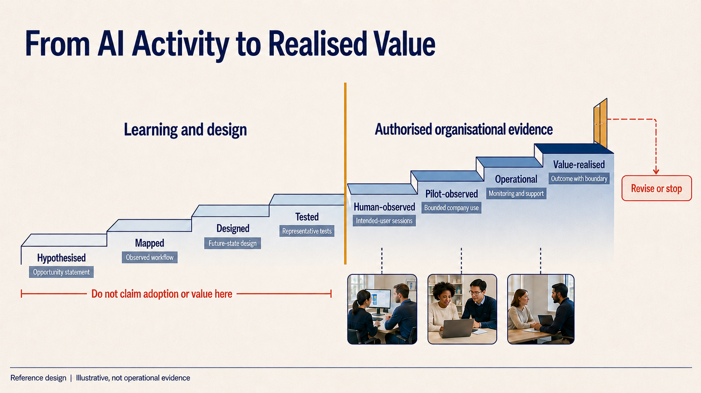
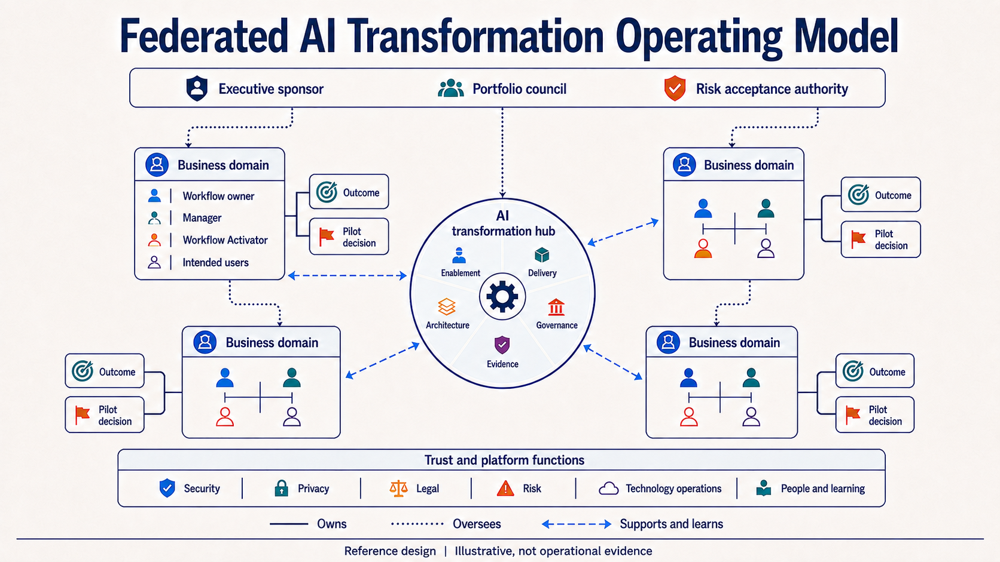
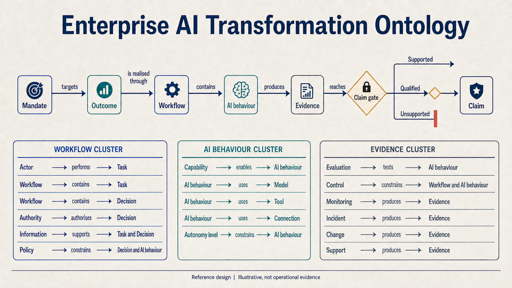
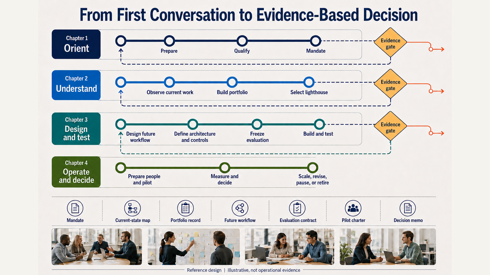
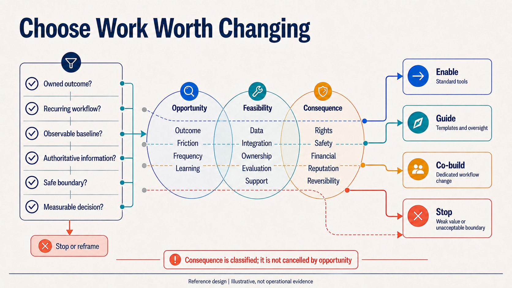
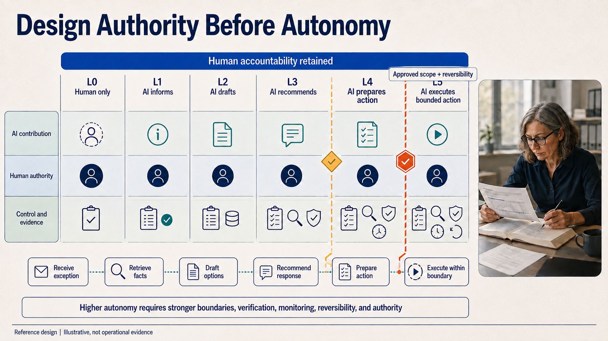
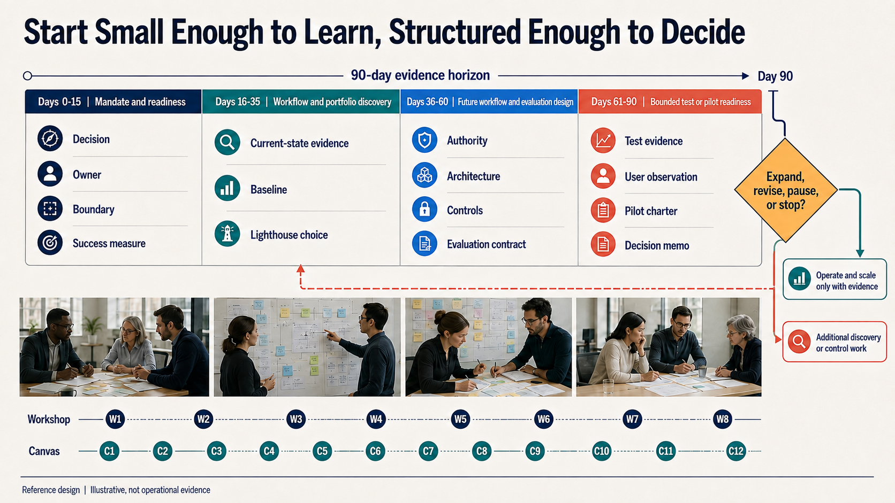

# AI Transformation Visual Atlas

## Twelve decisions that make the transformation method visible

This atlas turns the Company AI Transformation Playbook into a board-to-workflow visual narrative. Each plate makes one decision or relationship legible. Together they show how Raul Rausell approaches AI transformation as operating-model change supported by architecture, enablement, governance, evidence, and reversible investment gates.

> [!IMPORTANT]
> Every plate is a generated reference design. The people, workplaces, diagrams, and interfaces are illustrative. They do not establish client participation, deployed operation, legal compliance, certification, adoption, or realised value.

The exact production prompts, edit protocol, pass gates, and visual system are preserved in the [V3 ChatGPT image-generation prompt pack](09_VISUAL_SYSTEM_AND_INFOGRAPHIC_PROMPTS.md). File dimensions, byte counts, and SHA-256 digests are recorded in the [machine-readable asset manifest](assets/infographics/manifest.json).

## Executive reading path

| Horizon | Visuals | Leadership question |
| --- | --- | --- |
| **Frame the transformation** | V01, V02, V03 | What changes, who owns the outcome, and what evidence permits a stronger claim? |
| **Design governed work** | V04, V05, V08 | What objects, authority, information, architecture, and autonomy boundaries make the workflow governable? |
| **Choose and deliver** | V06, V07, V12 | Which work is worth changing, how does delivery advance, and what decision should the evidence support? |
| **Operate, enable, and learn** | V09, V10, V11 | How are risk, adoption, action, recovery, and learning managed in real work? |

## Capability crosswalk

| Visual | Decision made visible | Capability demonstrated | Primary playbook home |
| --- | --- | --- | --- |
| **V01** | Transformation is governed operating change, not a technology deployment. | Executive transformation system design | [Executive blueprint](01_EXECUTIVE_BLUEPRINT.md) |
| **V02** | Claims advance only when the evidence class advances. | Evidence strategy and value realisation discipline | [Governance, risk, and evidence](06_GOVERNANCE_RISK_AND_EVIDENCE.md) |
| **V03** | Domains own outcomes; the centre supplies method and reusable capability. | Federated operating model and decision rights | [System model](02_SYSTEM_MODEL_ONTOLOGY_TOPOLOGY_ARCHITECTURE.md) |
| **V04** | Claims trace through explicit objects and directional relationships. | Enterprise ontology and traceability | [System model](02_SYSTEM_MODEL_ONTOLOGY_TOPOLOGY_ARCHITECTURE.md) |
| **V05** | A model cannot directly execute against a consequential business system. | Enterprise AI architecture and controlled action | [System model](02_SYSTEM_MODEL_ONTOLOGY_TOPOLOGY_ARCHITECTURE.md) |
| **V06** | Delivery moves through evidence gates and legitimate loopbacks. | Transformation programme leadership | [Delivery manual](03_TRANSFORMATION_DELIVERY_MANUAL.md) |
| **V07** | Opportunity cannot cancel unacceptable consequence. | Use-case portfolio and investment governance | [Use-case portfolio](05_USE_CASE_PORTFOLIO_AND_PATTERNS.md) |
| **V08** | Autonomy is bounded authority, not a maturity race. | Human-AI task allocation and agentic governance | [System model](02_SYSTEM_MODEL_ONTOLOGY_TOPOLOGY_ARCHITECTURE.md) |
| **V09** | Governance, measurement, operations, and claims form one assurance system. | AI governance, monitoring, incident response, and learning | [Governance, risk, and evidence](06_GOVERNANCE_RISK_AND_EVIDENCE.md) |
| **V10** | Attendance is not adoption; capability develops through repeated real work. | AI enablement, change, and adoption leadership | [Enablement and adoption](04_ENABLEMENT_AND_ADOPTION_PLAYBOOK.md) |
| **V11** | AI prepares; accountable people approve consequential decisions and execution. | Commerce lighthouse and governed agentic workflow design | [Commerce lab](../../README.md) |
| **V12** | A 90-day engagement buys evidence for a decision, not guaranteed scale. | Executive engagement design and benefits governance | [Workshops and canvases](07_WORKSHOPS_CANVASES_AND_COMMUNICATION.md) |

## V01: AI Transformation Operating System

- **What it explains:** the workflow is the central transformation unit, governed by direction, delivery, enablement, trust, and value.
- **What it demonstrates:** Raul connects executive mandate, operating-model design, evidence, support, controls, and capital allocation in one system.
- **Boundary:** the operating system is a reusable reference design, not evidence that an organisation has adopted it.
- **Production contract:** [Visual 1 prompt and pass gate](09_VISUAL_SYSTEM_AND_INFOGRAPHIC_PROMPTS.md#visual-1-ai-transformation-operating-system).

## V02: Activity-to-Transformation Evidence Ladder

- **What it explains:** design and testing do not prove organisational adoption or value.
- **What it demonstrates:** claims are constrained by evidence class, denominators, observation boundary, and a legitimate revise-or-stop route.
- **Boundary:** the current Commerce AI Transformation Lab remains on the learning-and-design side of the organisational-evidence boundary.
- **Production contract:** [Visual 2 prompt and pass gate](09_VISUAL_SYSTEM_AND_INFOGRAPHIC_PROMPTS.md#visual-2-activity-to-transformation-evidence-ladder).

## V03: Federated AI Transformation Operating Model

- **What it explains:** business domains own outcomes and pilot decisions; a central hub enables rather than absorbs accountability.
- **What it demonstrates:** executive sponsorship, portfolio governance, federated delivery, workflow ownership, Activators, and trust functions are designed as one operating model.
- **Boundary:** roles and relationships must be adapted to the actual organisation and its legal accountabilities.
- **Production contract:** [Visual 3 prompt and pass gate](09_VISUAL_SYSTEM_AND_INFOGRAPHIC_PROMPTS.md#visual-3-federated-ai-transformation-operating-model).

## V04: Enterprise AI Transformation Ontology

- **What it explains:** transformation objects become decision-grade only when their relationships and directions are explicit.
- **What it demonstrates:** Raul can translate strategy, work, authority, information, AI behaviour, controls, and evidence into a common enterprise language.
- **Boundary:** the ontology improves traceability; it does not certify that a particular implementation is complete or compliant.
- **Production contract:** [Visual 4 prompt and pass gate](09_VISUAL_SYSTEM_AND_INFOGRAPHIC_PROMPTS.md#visual-4-enterprise-ai-transformation-ontology).

## V05: AI-Enabled Workflow Reference Architecture

- **What it explains:** context moves upward under governance, while consequential action moves downward through tool selection, an action boundary, human approval, and the business system.
- **What it demonstrates:** enterprise architecture, identity, permissions, provenance, orchestration, evaluation, operations, and human authority are treated as one workflow architecture.
- **Boundary:** this is a vendor-neutral reference architecture. Runtime components in the Commerce AI Transformation Lab are not yet implemented.
- **Production contract:** [Visual 5 prompt and pass gate](09_VISUAL_SYSTEM_AND_INFOGRAPHIC_PROMPTS.md#visual-5-ai-enabled-workflow-reference-architecture).

## V06: Transformation Delivery Journey

- **What it explains:** delivery is a 13-stage evidence journey with chapter gates, learning loops, and exit routes.
- **What it demonstrates:** Raul's process spans mandate, discovery, portfolio, design, architecture, evaluation, build, enablement, pilot, operations, and the final investment decision.
- **Boundary:** the route is stage-gated, not a promise that every engagement reaches pilot or scale.
- **Review status:** correction required. The supplied plate does not show a forward pass-through connector from each Evidence gate into the next chapter. Use the corrected prompt contract as the route authority until the plate is replaced.
- **Production contract:** [Visual 6 prompt and pass gate](09_VISUAL_SYSTEM_AND_INFOGRAPHIC_PROMPTS.md#visual-6-transformation-delivery-journey).

## V07: Use-Case Portfolio Decision Map

- **What it explains:** use cases must qualify before prioritisation, and consequence remains an independent decision axis.
- **What it demonstrates:** the portfolio can route work to standard enablement, guided use, dedicated co-build, or stop without hiding risk inside a composite score.
- **Boundary:** candidate dots and routes are illustrative. A real portfolio requires authorised discovery and accountable risk decisions.
- **Production contract:** [Visual 7 prompt and pass gate](09_VISUAL_SYSTEM_AND_INFOGRAPHIC_PROMPTS.md#visual-7-use-case-portfolio-decision-map).

## V08: Human-AI Work and Autonomy Spectrum

- **What it explains:** autonomy levels describe authority allocation, not progress toward a supposedly superior fully autonomous state.
- **What it demonstrates:** Raul separates information, drafting, recommendation, action preparation, and bounded execution, with stronger approval, monitoring, verification, and reversibility as consequence rises.
- **Boundary:** the appropriate level is selected task by task; L5 is not the default destination.
- **Production contract:** [Visual 8 prompt and pass gate](09_VISUAL_SYSTEM_AND_INFOGRAPHIC_PROMPTS.md#visual-8-human-ai-work-and-autonomy-spectrum).

## V09: Governance, Control and Evidence Loop

- **What it explains:** governance, risk mapping, evaluation, operations, incident handling, and learning are continuous and connected.
- **What it demonstrates:** claims pass through observation, records, evaluation, and an explicit boundary before they influence investment.
- **Boundary:** internal assurance supports a decision; it does not itself establish legal compliance or certification.
- **Review status:** correction required. The supplied plate does not connect Manage or Incident response unambiguously to Contain. Use the corrected prompt contract as the incident-route authority until the plate is replaced.
- **Production contract:** [Visual 9 prompt and pass gate](09_VISUAL_SYSTEM_AND_INFOGRAPHIC_PROMPTS.md#visual-9-governance-control-and-evidence-loop).

## V10: Enablement-to-Adoption Capability Flywheel

- **What it explains:** adoption requires repeated appropriate use, workflow integration, support, and sustained operating capability.
- **What it demonstrates:** Raul's enablement model connects employees, managers, Workflow Activators, builders, control partners, enablement leads, and workflow owners around real work.
- **Boundary:** access, attendance, and course completion cannot be presented as adoption or value.
- **Production contract:** [Visual 10 prompt and pass gate](09_VISUAL_SYSTEM_AND_INFOGRAPHIC_PROMPTS.md#visual-10-enablement-to-adoption-capability-flywheel).

## V11: Commerce Lighthouse, Exception to Recovery

- **What it explains:** AI retrieves, structures, checks, drafts, recommends, and prepares, while accountable people confirm facts, escalate, select remedies, and approve communication.
- **What it demonstrates:** the reusable enterprise method is applied to one end-to-end commerce value stream with systems, authority, controls, and outcome measures aligned.
- **Boundary:** this is a synthetic worked example until authorised organisational validation occurs.
- **Production contract:** [Visual 11 prompt and pass gate](09_VISUAL_SYSTEM_AND_INFOGRAPHIC_PROMPTS.md#visual-11-commerce-lighthouse-exception-to-recovery).

## V12: Company Engagement and 90-Day Decision Roadmap

- **What it explains:** a bounded engagement produces decision artifacts and evidence across mandate, discovery, design, and test or pilot readiness.
- **What it demonstrates:** executive alignment, workflow discovery, architecture, controls, evaluation, enablement, and benefits governance converge on one explicit decision.
- **Boundary:** day 90 does not guarantee a live pilot or scale. Additional discovery, revision, pause, or stop remain valid outcomes.
- **Review status:** correction required. The supplied plate shows only two visible downstream routes from a four-option decision. Use the corrected prompt contract, with distinct Expand, Revise, Pause, and Stop destinations, until the plate is replaced.
- **Production contract:** [Visual 12 prompt and pass gate](09_VISUAL_SYSTEM_AND_INFOGRAPHIC_PROMPTS.md#visual-12-company-engagement-and-90-day-decision-roadmap).

## What the series adds to the public case

The visual system makes five competitive differentiators explicit:

1. **Executive-to-technical continuity:** the same outcome and authority logic runs from board mandate to architecture and operational controls.
2. **Workflow-first transformation:** models and agents are components inside governed work, not the transformation product.
3. **Evidence-led claims:** activity, testing, human observation, operation, and realised value remain different states.
4. **Enablement as an operating system:** adoption combines capability, real-work repetition, management support, local Activators, and workflow ownership.
5. **Reversible investment:** expand, revise, pause, stop, and retire are designed outcomes rather than signs of programme failure.

## Production and accessibility record

- **Included:** twelve supplied 16:9 PNG plates at 1672 x 941 pixels.
- **Not included:** the four standalone documentary photographs and all portrait reflows described in the prompt pack.
- **Approval:** not claimed. V06, V09, and V12 have explicit open semantic corrections; the other nine were inspected without a material correction being recorded.
- **Visible boundary:** each plate includes the footer `Reference design | Illustrative, not operational evidence`.
- **Accessible interpretation:** every image above has descriptive alternative text and a text explanation of its decision, capability, and boundary.
- **Integrity:** exact file hashes, attachment-source provenance, repository-prompt provenance, and per-asset review status are recorded in the [asset manifest](assets/infographics/manifest.json).
- **Reproduction:** the exact V3 composition prompts, controlled edits, pass gates, correction prompts, and review protocol are in the [prompt pack](09_VISUAL_SYSTEM_AND_INFOGRAPHIC_PROMPTS.md).

## Reuse rule

Use these plates to explain a method, facilitate discussion, or structure authorised discovery. Do not use them as photographs of a client, proof of deployment, adoption evidence, compliance evidence, certification evidence, or a business-value result.
