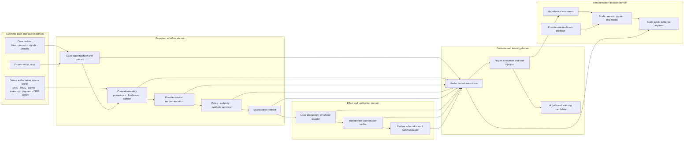
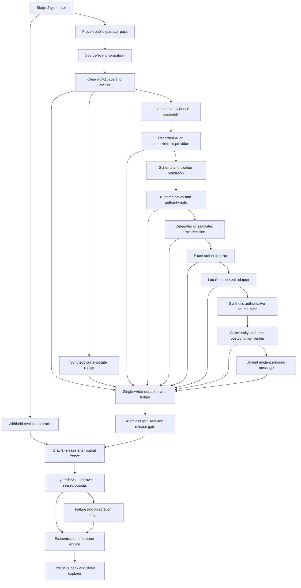
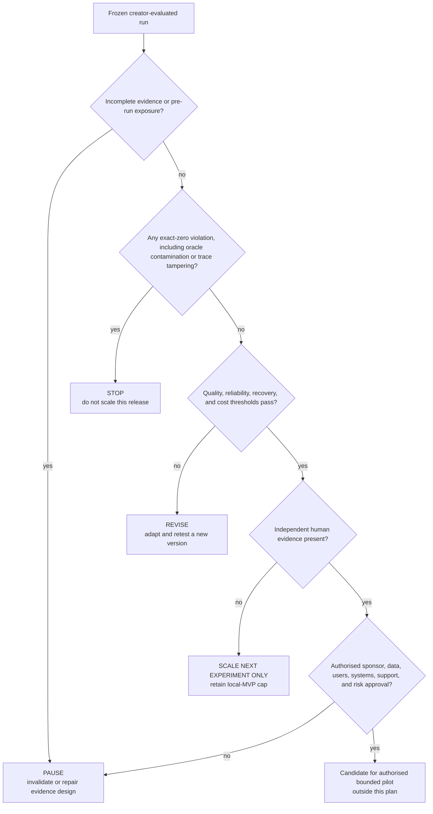

# Creator-Evaluated Commerce Transformation Local MVP - Plan

## Goal Capsule

| Field | Definition |
| --- | --- |
| Objective | Complete one end-to-end, creator-evaluated synthetic transformation case for delayed or partial fulfilment to verified customer recovery, from a reproducible current-state comparator through governed recommendation, simulated authority, controlled action, structurally separate verification, learning, economics, and a next-investment decision. |
| Product authority | Raul owns the transformation choices, evidence boundary, acceptance judgments, publication decision, and final scale, revise, pause, or stop recommendation. Synthetic actors and AI output have no organisational authority. |
| Active scope | Build a Python 3.13 standard-library application core with generated records only, a provider-neutral recommendation boundary, deterministic safety controls, synthetic approval events, local simulated adapters, tamper-evident evidence, preregistered evaluation, a compact enablement-readiness matrix, hypothetical economics, and a static evidence explorer. Docker provides canonical evaluation isolation and Playwright provides development-only browser verification. |
| Evidence claim | The release may establish working local workflow and control behaviour observed on disclosed synthetic cases. It may not establish human performance, independent validation, adoption, customer satisfaction, retained revenue, realised savings, enterprise deployment, or production reliability. |
| Maturity ceiling | `local-mvp` after all gates pass. The absence of human review blocks `independently-reviewed-local-mvp`, pilot, production, and adoption claims. |
| Stop conditions | Stop or fail closed on any unauthorised consequential action, duplicate action, false verification, data/secret disclosure, oracle contamination, evidence-chain tampering, unbound approval, unsupported customer fact, or inability to reproduce the evaluated artifact set. |
| Tail ownership | The implementation workflow owns code, tests, generated evidence, documentation, and public-safety verification. Raul owns approval of the final public release and the real next-investment decision. |
| Open blockers | None for a creator-evaluated local MVP. Human review, an authorised company bridge, live systems, live customers, and realised value are follow-up gates rather than dependencies. |

---

## Product Contract

### Summary

The project will complete the Commerce AI Transformation Lab as a truthful synthetic local MVP rather than wait for unavailable human data. It will show the full leadership loop—business outcome, workflow redesign, human/AI allocation, governed implementation, evaluation, adaptation, enablement design, economics, and an explicit next-gate decision—while preserving a hard boundary between measured synthetic behaviour and unobserved organisational outcomes.

### Problem Frame

The repository already establishes the outcome, fictional operating model, current-state hypothesis, policy, case system, deterministic calibration, held-out evidence controls, and AI-assisted adversarial practice. It does not yet operate the future workflow. Recommendation, decision, approval, action, verification, communication, learning, and value evidence remain documents or static records rather than one reconstructable system.

The attempted human-baseline path also produced an important governance result: answer exposure invalidated the first creator pack, an incomplete guide invalidated V1, and the choice to use AI across V2 invalidated V2 before human handling. Those packs must remain historical evidence. They cannot be relabelled, completed, or used to simulate independence.

Waiting for three independent reviewers would improve maturity but would block progress without changing the immediate engineering work. The appropriate transformation decision is therefore to complete a creator-evaluated synthetic path, explicitly redesign the stage gates around that constraint, and make independent review a later bridge rather than a hidden dependency.

The technical gap is wider than adding an agent. The current cases are static snapshots and the scorer measures recommendations or safe escalation, while the intended north star requires an explicit workflow state, case revision, authority decision, exact payload, simulated effect, authoritative postcondition, communication gate, and outcome denominator. The next release must prove that chain without mistaking a fluent recommendation or successful adapter response for customer recovery.

### Product Thesis

This case becomes strong evidence of AI transformation leadership when it proves five connected capabilities:

1. **Outcome discipline:** the project counts only a policy-compliant, authorised remedy confirmed by a structurally separate system verifier as a synthetic recovery outcome.
2. **Operating-model redesign:** each task has a human, AI, deterministic, or simulated-system owner, with authority and failure boundaries made explicit.
3. **Governed implementation:** probabilistic recommendations remain inside deterministic context, policy, approval, action, verification, and closure controls.
4. **Evidence-led adaptation:** failures create traceable learning candidates and regression changes without rewriting historical runs or automatically changing policy.
5. **Investment judgment:** quality, exact-zero controls, reliability, review burden proxies, enablement readiness, total operating cost, and missing evidence drive a scale, revise, pause, or stop decision.

### Key Decisions

- **Proceed without independent human data in this cycle** (session-settled: user-directed — chosen over waiting for reviewers because time is constrained). The release is creator-evaluated and caps maturity at `local-mvp`. Governs R1-R5, R31-R38.
- **Preserve invalidated V1 and V2 evidence unchanged** (session-settled: evidence-governance constraint — chosen over reusing or relabelling exposed packs). Stage 1 public discovery and persona practice remain development inputs only. Governs R6-R9, R27-R30.
- **Complete one value stream rather than build a general agent platform** (accepted D-001/D-002 — chosen over parallel use cases and a broad AI operating system). Governs R10-R26.
- **Use a synthetic process comparator rather than fabricate a manual baseline.** Structural touches, state transitions, deterministic decisions, simulated waiting assumptions, and workflow results are reported separately. Governs R8-R9, R27, R32-R35.
- **Treat recommendation, authority, action, verification, communication, and closure as separate governed objects.** A recommendation is not a decision; an approval is not an action; a receipt is not a postcondition; a verified remedy is not satisfaction or realised value. Governs R13-R26.
- **Use provider-neutral AI assistance with deterministic safety.** Recorded AI candidates can demonstrate the assisted path; deterministic fixtures reproduce tests; no model or agent owns policy, authority, execution controls, evaluation, or publication. Governs R13-R18, R29-R30.
- **Simulate role decisions without impersonating human oversight.** Approval fixtures are separate, role-bound synthetic events. They are never described as human review or organisational authority. Governs R17-R21, R31.
- **Create a new Stage 2 evaluation identity.** Public discovery and invalidated held-out packs cannot be confirmatory evidence. The new pack, thresholds, workflow version, virtual clock, provider record, and oracle boundary are frozen before the evaluated run. Governs R27-R30.
- **Define recovery at an operational milestone, not delivery.** Refund requires the exact action-linked payment outcome; reship requires replacement creation, exact reservation, and WMS acceptance. Wait and no-new-action use their own verified condition labels. Governs R25-R26, R31.
- **Use complete recorded AI evidence.** The canonical assisted denominator includes every preregistered attempt and terminal status; deterministic candidates exist only for CI and fault injection. Governs R14-R16, R29-R31.
- **Use outer-enforced isolation for canonical evaluation.** A least-privilege container, not a changed working directory, establishes the runtime access boundary. Governs R23, R29-R30.
- **Expose a golden development case early.** A draft evidence explorer follows the first complete action/verification slice; the final public explorer replaces draft data with frozen evaluation and decision evidence. Governs R31-R38.
- **Keep no-human enablement compact.** One decision-pack readiness matrix demonstrates enablement design; reusable role-package infrastructure waits for a human-review cycle. Governs R9, R36-R37.
- **Make the final decision real but bounded.** The evidence pack may recommend the laboratory's next investment gate; it cannot authorise a company pilot. Raul retains the final decision and publication authority. Governs R36-R38.

### Actors

- A1. **Raul Rausell — transformation leader and creator-evaluator** selects the value stream, approves the operating model and evidence contract, accepts or rejects implementation evidence, records adaptations, and owns the final next-gate decision.
- A2. **Synthetic workflow owner / Activator fixture** owns the fictional queue, may issue a simulated workflow-owner approval within policy, and appears only as a generated role event.
- A3. **Synthetic customer-recovery specialist fixture** receives context, considers the recommendation, exercises fictional delegated authority, requests approval, and owns the proposed customer-recovery decision inside a scenario.
- A4. **Synthetic finance approver fixture** may approve, reject, amend, expire, or revoke an exact high-exposure payload inside a scenario; it is not a human reviewer.
- A5. **Synthetic policy and risk owner fixture** owns specialist stops, policy-change authority, and residual-risk acceptance in the fictional model; risk-stop scenarios never execute a recovery action.
- A6. **Workflow runtime** validates state, assembles evidence, enforces policy, manages legal transitions, binds approvals, invokes simulated adapters, and records checkpoints.
- A7. **AI recommendation provider** returns a structured candidate with cited evidence, uncertainty, and limitations; it receives no raw adapter, policy-change, oracle, publication, or arbitrary file capability.
- A8. **Simulated action adapter** applies an allow-listed refund or replacement effect to an isolated generated source store and returns a receipt that is not treated as proof of success.
- A9. **Structurally separate system verifier** reads the authoritative simulated source state through a read-only port separate from the action adapter and decides whether the preregistered postcondition exists exactly once. This component separation is not independent human validation.
- A10. **Lab evaluator** holds the evaluation oracle and thresholds, scores the frozen workflow record, and cannot coach or change the evaluated run.
- A11. **Portfolio reader** reviews the public evidence explorer, executive case, limitations, and decision memo without receiving private artifacts or unsupported claims.

### System Model

The local MVP has five durable domains. They are product responsibilities, not a commitment to separate deployed services.



### Requirements

**Evidence, maturity, and historical integrity**

- R1. The release shall identify itself as a creator-evaluated local MVP using only synthetic records and shall never label simulated personas, approvals, handoffs, or actions as human-reviewed or organisationally observed.
- R2. Every public artifact shall state an allowed evidence class, public-safety status, supported maturity, material limitation, and claim boundary appropriate to its content.
- R3. The release shall mechanically cap maturity at `local-mvp` when independent human evidence is absent and shall reject `independently-reviewed-local-mvp`, pilot, production, adoption, realised-value, and customer-impact wording.
- R4. Raul shall remain the owner of publication, policy acceptance, evaluation acceptance, learning promotion, and the final next-gate recommendation; generated actors and AI output shall have no authority over those decisions. Final public release shall require Raul's annotated signed Git tag over the reviewed source commit and public-bundle digest; missing, stale, replayed, or wrong-identity authorisation shall block maturity advancement and publication.
- R5. A final decision may scale only the next bounded experiment. It shall not authorise a live pilot, external write, or organisational deployment.
- R6. Stage 1 discovery artifacts, invalidated V1/V2 instruments, blank worksheets, invalidation records, and multi-persona practice artifacts shall remain byte-identical unless an explicit historical correction with new evidence identity is approved.
- R7. The new implementation shall not call a Stage 1 oracle from the runtime, expose evaluator-only metadata to the recommendation provider, or present author-designed oracle agreement as independent model accuracy.
- R8. The current-state comparator shall be labelled synthetic and shall distinguish observed structural counts, deterministic task behaviour, and hypothetical handling or waiting assumptions.
- R9. Manual-review time, trust, adoption, enablement friction, customer satisfaction, retained revenue, and realised savings shall remain `not observed` rather than zero or synthetically estimated.

**Synthetic case, source, and current-state model**

- R10. A Stage 2 case shall represent one to five order lines, up to two parcels, source-specific records, customer-choice events, prior action attempts, and one frozen policy reference without real names, addresses, messages, payment instruments, or external identifiers. Every record shall conform to a neutral versioned contract defined before generation or runtime implementation.
- R11. Each source record shall carry a fictional record ID, source name, effective time, observed time, ingestion time, provenance digest, sensitivity label, and case revision; the runtime shall derive rather than trust freshness, conflict, shortfall, exposure, active chargeback, and recovery state.
- R12. The synthetic current-state replay shall traverse the documented Q1-Q8 topology, recording source opens, policy lookups, handoffs, clarification, approval, action, verification, reopen, active work, dependency wait, and total virtual elapsed time as separate fields.

**Recommendation, context, and authority**

- R13. The recommendation provider shall receive the same permitted case revision, cited source facts, freshness/conflict state, policy version, authority context, prior action state, and allowed next transitions exposed by the operator-facing application service.
- R14. The provider shall return a versioned structured candidate containing proposed action, proposed route, cited evidence, uncertainty, rejected alternatives, message-fact candidates, and material limitations. One preregistered envelope shall enforce maximum request/response bytes, nesting depth, collection cardinality, and string length before canonicalisation; it shall reject duplicate keys, invalid UTF-8, non-finite numbers, disallowed control or bidi characters, unknown fields, noncanonical identifiers, malformed values, and instruction/data ambiguity.
- R15. The canonical assisted path shall use a frozen recorded AI candidate set covering the declared assisted denominator. Before acquisition, freeze the model/provider/version, instruction digest, input digest mapping, parameters, timeout, permitted attempt IDs, and retry/terminal-status rules. Record and publish the digest, latency, token/request usage where available, measurable cost, validation result, and terminal status of every attempt—including refusal, timeout, malformed, rejected, fallback, and successful output. Deterministic candidates remain CI and injected-failure fixtures, not substitutes for canonical AI evidence.
- R16. Prompt injection, untrusted free text, model refusal, timeout, unavailable provider, inconsistent output, or excessive-agency request shall route to controlled abstention or deterministic fallback without mutating policy or source state.
- R17. The runtime shall independently derive the permitted action set, evidence sufficiency, authority route, and decision owner from frozen policy and authoritative facts; the provider may recommend but shall not grant itself authority.
- R18. Policy, authority, oracle, thresholds, evidence class, canonical knowledge, external publication, and learning promotion shall be absent from the provider's tool/action surface.
- R19. Approval-required actions shall remain blocked unless a separate synthetic approval event binds the exact case revision, ledger-head digest, policy version, operation, payload digest, approver role, decision, rationale, issue time, expiry, and unused status.
- R20. A changed payload, source revision, policy version, expired/revoked/rejected approval, wrong role, replayed approval, or recommending-provider self-approval shall invalidate the approval and leave source state unchanged.
- R21. Safety, privacy, legal, suspected-fraud, active-chargeback, unresolved action, and materially conflicting-evidence cases shall route to a specialist or recovery stop and shall never receive a simulated consequential action.

**Action, verification, communication, and trace**

- R22. The workflow shall prepare an exact versioned action contract containing immutable action ID, operation, target, eligible quantity/business key, minimum permission, idempotency key, case revision, ledger-head digest, before-state digest, expected postcondition, authority reference, timeout, retry rule, compensation posture, and escalation route. For approval-required routes, approval consumption, action reservation, and idempotency ownership shall be one compare-and-append journal transition. For delegated routes, exact delegated-decision binding replaces approval consumption inside the same atomic reservation transition.
- R23. Only allow-listed local adapters may mutate isolated synthetic source stores; the implementation shall contain no live payment, inventory, CRM, customer-message, network-write, arbitrary-shell, or unrestricted filesystem action path. Each simulated authoritative source shall be an append-only, action-ID-keyed effect journal protected by the run writer authority; a durable commit marker is the effect linearisation point, and verification/reconciliation shall ignore incomplete tails. File authority shall be enforced at open/commit time and shall reject symlinks, junctions/reparse points, hardlinks, non-regular files, ancestor swaps, and any resolved identity outside the intended run root.
- R24. The idempotency ledger shall make same-key/same-payload retry return the original canonical result, while same-key/different-payload and a second remedy for the same eligible quantity fail closed.
- R25. The verifier shall read authoritative simulated source state through a read-only port independently of adapter mutation code, workflow pass/fail fields, provider output, and adapter receipts. Refund qualifies only when an action-linked payment entry confirms the exact eligible cumulative amount and currency. Reship qualifies only when a linked replacement order exists for the exact missing quantity, inventory reservation succeeds, and WMS accepts the fulfilment work; this is an operational recovery milestone, not customer delivery. Wait qualifies only as a `VERIFIED_WAIT_CONDITION` when a recorded customer choice and current reliable carrier ETA exist. Duplicate/prior-remedy cases qualify only as `VERIFIED_NO_NEW_ACTION` when the prior postcondition covers the same quantity. Only refund and reship minima may emit `VERIFIED_REMEDY`; weaker observations use milestone-specific wording and never `verified customer recovery`.
- R26. Customer communication shall remain an unsent local artifact, use only trace-linked permitted facts, distinguish estimates from outcomes, and withhold completion language until the structurally separate system postcondition check passes.
- R27. Every transition shall append a canonical event with case revision, sequence, previous-event digest, actor kind, component and contract versions, input/output digests, time, decision or effect, and links to recommendation, approval, action, verification, and communication records. One exclusive per-run writer authority shall cover tail validation through durable append; acknowledgement occurs only after the complete event is flushed, and checkpoints remain derived caches rather than competing truth.
- R28. Replay shall detect deletion, insertion, reordering, truncation, cross-case linkage, duplicate sequence, partial write, changed pin, overwritten frozen artifact, or path-identity substitution. Recovery may quarantine only an uncommitted partial tail and must then append a recovery event; complete acknowledged events are never rewritten. Local records shall be described as tamper-evident and write-once, not absolutely immutable.

**Evaluation, adaptation, and decision evidence**

- R29. A new Stage 2 evaluation pack identity shall be generated and frozen before evaluated behaviour, with a committed denominator, case/event schedule, virtual clock, policy, workflow, adapter, provider/instruction, thresholds, exact-zero controls, split, and oracle commitment. The commitment shall bind canonical oracle bytes plus a private generated 256-bit nonce and disclose both only after output freeze, preventing practical enumeration from the public pack. Release shall follow the irreversible states `running → freeze-prepared → output-frozen → eligibility-verified → oracle-released → scored`; the output seal binds artifact inventory, byte lengths, digests, and final ledger head.
- R30. Public discovery and persona-practice cases may support development and regression only; the evaluated pack shall prevent V1/V2 reuse, oracle access before output freeze, post-result threshold changes, unequal baseline/assisted schedules, and silent case removal. Canonical provider/comparator execution shall run inside an outer-enforced least-privilege container with read-only public-input and write-only run mounts, empty allow-listed environment, no repository history/home/private mounts, denied network, denied subprocess creation, and an attestation created by the outer launcher. Escape tests shall cover absolute/parent/home/Git-object paths, environment, sockets, subprocesses, and mount identity. After an oracle is released, an adapted workflow may use that pack only for regression; a new confirmatory claim requires a new pack, denominator, schedule, thresholds, and oracle commitment.
- R31. Evaluation shall report separately: recommendation correctness, safe routing, approval outcome, execution, verified-remedy rate, unsupported communication, closure, critical controls, recovery, latency, provider cost, structural work, hypothetical economics, and preregistered structural review-burden proxies. Proxy fields shall include evidence items inspected, conflicts surfaced, missing-evidence blocks, recommendation edits implied by governed override, approval steps, and recovery transitions per eligible case; formulas, denominators, and evidence labels shall explicitly state that these are synthetic structural proxies rather than observed human review burden. Safe escalation shall not enter the recovery numerator.
- R32. Exact-zero violations shall override aggregate quality: unauthorised action, duplicate action, false verification, personal/secret disclosure, oracle contamination, or evidence-chain tampering shall force `stop` for the evaluated release.
- R33. Before development fault execution, freeze the fault inventory and a deterministic severity-ranked selection rule. Preserve every observed failure and bind the showcased adaptation to the highest-ranked unresolved failure selected by that rule. The failure/adaptation ledger shall record trigger, evidence, affected contract, decision, rejected alternative, implemented change, expected effect, regression test, result, and remaining limitation without rewriting the original run.
- R34. A correction or failure may create a versioned learning candidate, but no candidate shall change policy, canonical knowledge, the current evaluation, or later held-out cases without explicit Raul adjudication and a new version.
- R35. Economics shall use versioned assumptions, integer cents or `Decimal`, conservative/base/upside sensitivity, total operating cost, and a non-AI/process alternative. Synthetic counts and measured runtime cost shall remain separate from hypothetical volumes, labour, review, support, failure, exposure, and benefit assumptions. The decision engine shall compute the recommendation class across the full preregistered sensitivity envelope; if the class changes, economics is `inconclusive` and cannot support `scale_next_experiment`.
- R36. This no-human cycle shall generate one enablement-readiness and evidence-gap matrix inside the decision pack for workflow owner/Activator, specialist, manager, technical owner, and risk owner. It shall cover authority, first-use guidance, one material failure drill, help/incident/appeal ownership, change ownership, and explicitly `not observed` human measures. Reusable role-package infrastructure and observation instruments remain deferred until the human-review gate.
- R37. The executive pack shall be derived from frozen machine-readable summaries and shall show the decision requested, boundary, denominators, failures, exclusions, alternatives, economics, enablement gap, recommendation, conditions, and next evidence gate. Every `scale`, `revise`, `pause`, or `stop` result shall bind one concrete next action with an owner, maximum time/resource/denominator cap, evidence question, entry conditions, stop conditions, and expiry or review trigger.
- R38. The static public evidence explorer shall render a case end to end from generated public-safe data, reveal controls and limitations, remain read-only, and avoid any claim that its interaction is an operated user workflow. Its decision-first hierarchy shall show persistent maturity/claim boundary, recommendation/stop conditions, denominator/failures, complete case index, selected evidence chain, then trace/economics/assumptions drill-down. Only case selection, evidence filters, disclosures, and trace links are interactive; approvals, actions, receipts, verification, and messages are non-interactive records with adjacent plain-language evidence labels. The interaction-state contract shall cover loading, empty, parse failure, invalid/missing selection, broken link, pending, failed, excluded, verified, and successful navigation with copy, next step, and focus target. Provider-derived values shall render as inert text; URLs shall follow an explicit scheme/host allow-list; the page shall forbid inline/dynamic code execution and unintended network egress. Accessibility shall include landmark/heading order, skip link, native labels, current/expanded states, deterministic focus, captions, non-colour status cues, reduced motion, responsive layouts, and screen-reader verification.

### Key Flows

- F1. **Synthetic current-state replay:** load the new case/event schedule, derive authoritative facts, traverse Q1-Q8, record structural work and virtual time, and produce a comparator that is explicitly not human observation.
- F2. **Evidence-to-recommendation:** freeze a case revision, assemble least-context cited evidence, obtain a structured provider candidate, validate it, apply deterministic evidence/policy/authority gates, and record a recommendation or controlled stop.
- F3. **Authority-to-verified remedy:** obtain a delegated or separately simulated approval decision, bind the exact payload, execute through the local idempotent adapter, verify authoritative state through the separate read-only verifier, create an unsent communication, and close only after the outcome gate passes.
- F4. **Failure, restart, and recovery:** inject a timeout, partial action, lost receipt, verifier outage, checkpoint interruption, late evidence, or dispute; resume from durable state; reconcile before retry; and prevent duplicate or falsely verified action.
- F5. **Evaluation and adaptation:** use development evidence to record one material failure, make an evidence-driven change, and pass its regression; then freeze a new confirmatory pack and thresholds, run identical schedules through the comparator and assisted workflow, release the oracle after outputs are sealed, and preserve the original confirmatory score. Any later change on that pack is regression-only and requires a new pack for another confirmatory claim.
- F6. **Enablement and economics:** generate role-specific readiness assets and a transparent sensitivity model from the same versioned workflow and evaluation evidence, while leaving human-use and realised-value fields unobserved.
- F7. **Executive decision and public evidence:** mechanically derive the permitted recommendation class, let Raul accept or amend it, update claim/maturity records, generate the executive case and read-only explorer, and publish only after tests, public-safety checks, and source-release pins pass.

### Acceptance Examples

- AE1. Given a reliable delayed parcel, a current ETA, and a recorded customer choice to wait, the workflow recommends `WAIT_VERIFIED_ETA`, creates no refund/reship effect, and allows only estimate-qualified communication.
- AE2. Given a confirmed two-unit shortfall, reservable stock, complete fresh evidence, €25.00 exposure, and a synthetic delegated decision, the workflow prepares one exact reship payload and verifies the replacement milestone exactly once.
- AE3. Given the same facts at €25.01 exposure, execution remains blocked until a workflow-owner approval binds the exact payload; changing one payload byte invalidates approval.
- AE4. Given €100.01 exposure or an order above €500, only the synthetic finance-approver role can approve the exact action; a workflow-owner or provider-issued approval fails without mutation.
- AE5. Given conflicting WMS and carrier quantities, the workflow records `EVIDENCE_BLOCKED`, cites the conflict, creates no action, and excludes the case from verified-recovery success until a new revision resolves it.
- AE6. Given safety, privacy, legal, suspected-fraud, or active-chargeback evidence, the case enters `CONTROL_STOPPED`, routes to the appropriate specialist fixture, and never calls an action adapter regardless of value.
- AE7. Given a duplicate signal or a verified prior remedy covering the same quantity, the workflow records no new consequential action and produces supported no-new-action communication.
- AE8. Given an adapter response reporting success but no matching authoritative refund or replacement postcondition, the case remains `VERIFICATION_FAILED` or `ACTION_RECOVERY`, cannot close, and does not enter the recovery numerator.
- AE9. Given a same-key retry after a lost response, the adapter returns the original receipt and one effect; given the same key with a different payload, it rejects the request and preserves state.
- AE10. Given a crash after source mutation but before receipt persistence, replay reconciles authoritative state before any retry and records one effect plus a recovery trace.
- AE11. Given a customer-choice change or material source/policy revision after approval, the recommendation, approval, and prepared action are invalidated and the case returns to the appropriate evidence or decision state.
- AE12. Given a provider output with unknown action, unsupported evidence, prompt-injection instruction, missing citations, or malformed structure, validation fails closed and the provider cannot invoke tools or alter state.
- AE13. Given a proposed customer message containing a refund, replacement, or delivery completion fact before verification, the message gate removes or rejects the fact and records the failure.
- AE14. Given deletion, reordering, truncation, or mutation of a trace event or frozen pin, replay and evaluation fail with no partial score or updated decision memo.
- AE15. Given an escalation case, safe routing can count as safe behaviour but never as verified recovery; denominator tests conserve eligible, control-stop, pending, failed, escalated, and verified cases separately.
- AE16. Given a material failure, the system creates a learning candidate and adaptation record, but the original run, policy, oracle, and thresholds remain unchanged; only a new version and regression may adopt the change.
- AE17. Given no human sessions, the enablement dashboard shows first use, help, trust, friction, and adoption as `not observed`; the maturity calculator rejects any level above `local-mvp`.
- AE18. Given all synthetic quality and control gates pass, the decision engine may recommend scaling the next bounded experiment only; any exact-zero failure, including oracle contamination after evaluated execution begins, forces stop; incomplete evidence or detected pre-run exposure forces pause; and subthreshold quality/reliability/cost forces revise.
- AE19. Given economics assumptions are removed, unit-inconsistent, or altered without a version change, the pack fails; changing volume, labour, review, support, or provider-cost assumptions produces deterministic monotonic sensitivity results rather than a realised-value claim.
- AE20. Given the public evidence explorer, every displayed result links to a public case, trace, evaluation field, or explicit assumption, and no control enables live action, message send, policy change, or oracle access.

### Scope Boundaries

#### Included Now

- One SCC-01 delayed/partial-fulfilment value stream.
- Versioned line, parcel, source-record, customer-choice, action, approval, and policy fixtures.
- Synthetic Q1-Q8 current-state replay and structural comparator.
- Provider-neutral structured recommendation contract with deterministic test fixture and recorded AI-assisted candidate support.
- Shared application services for operator/CLI and agent-facing read/recommend/prepare operations.
- Deterministic context, evidence, policy, authority, approval, idempotency, verification, communication, and closure gates.
- Local JSON/JSONL/CSV evidence workspace with hash-chain and frozen evaluated releases.
- New creator-evaluated Stage 2 pack, fault injection, evaluation, adaptation, enablement-readiness, hypothetical economics, decision memo, executive case, and static evidence explorer.

#### Deferred to Follow-Up Work

- A clean human baseline or independent reviewer sessions using a new pack identity.
- Observed comprehension, review burden, trust, help, friction, repeated use, workflow integration, or adoption.
- Concrete MCP/Codex host integration beyond the provider-neutral application/tool contract.
- Live model API execution as a required or canonical verification path.
- An authorised external-company bridge, real intended users, real data, or real process observation.
- GitHub Pages or another hosted deployment; the static explorer must work locally first.
- Additional exception journeys, markets, carriers, currencies, warehouses, channels, or regulated goods.

#### Explicitly Excluded

- Real personal, customer, employee, supplier, former-company, recruiter, payment, or confidential data.
- Live refund, replacement, inventory, CRM, carrier, customer-message, email, or social action.
- Agent self-approval, agent-authored policy/evaluation changes, automatic learning promotion, or adaptive autonomy.
- A general AI operating system, agent swarm, multi-agent orchestration showcase, or multiple lighthouse workflows.
- Claims of production, compliance, certification, independent validation, adoption, realised ROI, customer satisfaction, retained revenue, or enterprise transformation outcome.

---

## Planning Contract

### Context and Research

**Repository reality**

- The repository is Python 3.13 and standard-library only. There is no API, database, application server, package manifest, container, or deployed UI. The executable pattern is deterministic CLI generation plus canonical JSON/JSONL/CSV artifacts.
- `scripts/stage1_case_system.py` owns synthetic case generation, derived oracle logic, validation, canonical LF output, and SHA-256 manifests. Its `build_oracle` path is evaluator-only for the new workflow.
- `scripts/stage1_deterministic_baseline.py` and `scripts/generate_stage1_multi_persona_practice.py` contain additional decision/authority implementations. Stage 2 must avoid creating another hard-coded copy while preserving frozen Stage 1 output bytes.
- `scripts/stage1_heldout.py` and `scripts/stage1_heldout_release.py` establish fail-closed pack identity, answer separation, Git anchoring, path binding, no-overwrite behaviour, and canonical-byte checks. Stage 2 reuses these patterns, not invalidated pack identities or human-run labels.
- `scripts/stage1_scoring.py` separates recommendation quality, route, evidence, unsupported facts, and exact-zero controls, but it does not score actual action or verified remedy. Stage 2 extends the measurement chain without redefining Stage 1 results.
- `policy/publication-policy.json` forbids private paths, secrets, local databases, unregistered binaries, and maturity beyond the configured release. Maturity movement and new canonical sources require atomic policy/test/source-release updates.
- `.github/workflows/public-safety.yml` runs the full `unittest` suite and public-safety verifier on Python 3.13. New implementation must remain green on Windows development and Ubuntu CI.

**Research-grounded design signals**

- McKinsey's 2026 operating-model guidance supports redesigning end-to-end work and decision coordination before selecting technology.
- OpenAI's 2026 Agent Activator guidance supports named workflow ownership across requirements, human decisions, reliability, rollout, support, measurement, maintenance, and outcome.
- NIST AI RMF and the repository governance playbook support explicit Govern/Map/Measure/Manage evidence, exact controls, human authority, incident routes, and proceed/stop gates; no certification is claimed.
- Wayfair, Danone, SAP, Oracle, Shopify, and Stripe sources support the domain pattern of assembling order context, reconciling fulfilment evidence, recommending bounded options, handling asynchronous/duplicate action, and verifying canonical state. Their outcomes do not become this lab's targets.
- The company playbook requires workflow state rather than conversation state; context, decision, action, verification, and learning contracts; role-specific enablement; total operating cost; and scale/revise/pause/stop decisions.

**External research decision**

No new web research is required for this implementation plan. The repository's source base was checked through 10–11 August 2026 and already grounds the chosen workflow, governance, enablement, commerce, and agentic-risk patterns. Implementation should browse only if a time-sensitive external API, model, legal, or deployment choice is later introduced.

### Key Technical Decisions

- **KTD1 — Add Stage 2 beside frozen Stage 1** (`session-settled: evidence-integrity constraint`). New workflow modules and artifacts use Stage 2 names and identities. Frozen Stage 1 generators, V1/V2 invalidations, worksheets, and committed output bytes remain compatibility fixtures. Governs R6-R9, R29-R30.
- **KTD2 — Freeze a neutral contract layer before generation or runtime.** Stage 2 defines canonical IDs, event and batch envelopes, schema-version rules, revision semantics, action/approval/verification records, and serialization/hash rules in a dependency-neutral module. Stage 2 V1 is strict: incompatible changes create a new schema/version rather than an implicit upcast. Generator/evaluator modules may depend on contracts and pure fact derivation; runtime modules may not import generators, evaluator projections, oracles, release code, or private-artifact paths. Governs R10-R12, R22-R30.
- **KTD3 — Keep the oracle separately implemented.** Runtime policy interpretation may share vocabulary, typed validation, and pure fact-derivation helpers, but it must not import `build_oracle`, oracle files, evaluator-only fields, or release material. Characterisation tests preserve Stage 1 while cross-implementation properties reveal policy drift. This separation is an integrity control, not independent validation. Governs R7, R17, R29-R31.
- **KTD4 — Use one provider-neutral application core with inward dependencies.** Stable command/query records and ports belong to the application core. CLI and future agent adapters depend inward; policy, recommendation, approval, source-store, ledger, verifier, and action implementations satisfy ports. The core never imports CLI, recorded fixtures, provider hosts, generators, evaluators, or concrete action adapters. U3 proves the core with fakes before U4/U5 plug in implementations without changing the contract. Governs R13-R18, R23.
- **KTD5 — Keep AI narrow and controls deterministic.** The provider proposes and explains; deterministic code validates schemas, derives evidence/authority, binds approvals, controls transitions, enforces idempotency, verifies state, gates communication, and scores evidence. Safety does not depend on model compliance. Governs R13-R26.
- **KTD6 — Use complete recorded AI candidates for the canonical assisted path and fixtures for CI.** A preregistered acquisition protocol maps every evaluated input to permitted attempts and publishes every terminal status, including failures and rejected output. Tests use deterministic candidates and injected failures. Live network model calls are optional and noncanonical until explicitly authorised. Governs R14-R16, R29-R31.
- **KTD7 — Bind authority inside the guarded action transition.** A simulated approval is a role-bound, exact-payload, revision/ledger-head-bound, policy-bound, expiring one-time record. Validation may occur earlier, but required-approval consumption—or exact delegated-decision binding—commits atomically with action reservation and idempotency ownership through the workspace transition handler. Authority cannot be inferred from a route label or minted by the recommending provider. Governs R19-R22.
- **KTD8 — Use one durable event truth with explicit commit semantics.** JSON/JSONL remains portable and public-safe, but an exclusive per-run writer authority owns tail validation through durable append and acknowledgement. Each complete acknowledged event extends the validated sequence/hash/revision; partial uncommitted tails may be quarantined during recovery, while checkpoints and JSONL/public projections are derived caches. Evaluated runs freeze under the same authority so no writer or adapter mutation remains in flight. This is described as tamper-evident rather than immutable. Governs R22-R29.
- **KTD9 — Keep effect and verification independently derivable.** Refund requires the exact action-linked cumulative amount and currency; reship requires replacement creation, exact reservation, and WMS acceptance; wait and no-new-action use distinct verified-condition labels. The verifier imports only neutral contracts and a read-only authoritative-source port, never adapter mutation or workflow verdict code. Operational milestones below delivery are never described as delivered customer outcomes. Governs R24-R26, R31.
- **KTD10 — Use a container-isolated evaluation pack and one-way release state machine.** Stage 2 pack V1 freezes before tuning and uses identical schedules for comparator and assisted variants. Provider/comparator execution occurs in an outer-enforced least-privilege container with no oracle/private/repository-history/home mount or network/subprocess capability; the outer launcher writes the attestation. Outputs seal before a separate scorer receives oracle material. Post-oracle adaptations on that pack are regression only; confirmatory evidence requires a new pack identity. The claim remains creator-evaluated and non-independent even when the sequence is enforced. Governs R29-R34.
- **KTD11 — Keep value layers separate.** Structural workflow counts and runtime/cost observations are synthetic-observed; queue-time, labour, volume, support, and benefit ranges are hypothetical; human/adoption measures remain not observed. Governs R8-R9, R31, R35-R37.
- **KTD12 — Make evidence generate narrative.** Evaluation, economics, decision memo, and explorer consume the same frozen machine-readable summaries. Documentation never becomes an independent source of denominator, outcome, or failure counts. Governs R31-R38.
- **KTD13 — Exact-zero controls precede aggregate scoring.** The decision engine evaluates contamination and critical controls before quality, reliability, cost, or readiness. Passing synthetic gates may scale only the next experiment; it cannot cross the human/pilot boundary. Governs R3-R5, R32, R37.
- **KTD14 — Centralise filesystem authority and publish from one immutable tree.** A shared file authority rejects links/reparse points, hardlinks, non-regular files, ancestor swaps, and resolved identities outside the run root at open/commit time. Public release uses a two-phase closure: seal reviewed sources with manifest self-exclusion, verify from a clean checkout of one commit, build the public bundle from that same commit, and bind maturity/publication to the commit/tree identity. Governs R23, R28-R30, R38.
- **KTD15 — Compress enablement and make the decision executable.** One generated five-role readiness/evidence-gap matrix replaces a reusable enablement subproduct in the no-human cycle. Economics may influence the recommendation only when its class is stable across the preregistered envelope, and every final class names one owner-bound, capped next action. Governs R35-R37.

### High-Level Technical Design

The diagrams below define boundaries and state semantics. They do not prescribe exact function signatures.

#### Component and evidence flow



#### Consequential action sequence

```mermaid
sequenceDiagram
    participant S as Source stores
    participant W as Workflow runtime
    participant P as Recommendation provider
    participant A as Synthetic approver fixture
    participant X as Simulated adapter
    participant V as Separate read-only verifier
    participant T as Trace ledger

    W->>S: Read case revision and authoritative records
    S-->>W: Facts plus provenance and freshness
    W->>P: Permitted context and decision contract
    P-->>W: Structured candidate with citations
    W->>W: Validate candidate and derive policy/authority
    W->>T: Append recommendation and route
    alt approval required
        W->>A: Exact payload digest, revision, policy, role
        A-->>W: Approve, reject, amend, expire, or revoke
        W->>W: Validate approval capability
    end
    W->>T: Atomically bind delegated decision or consume required approval; reserve action/idempotency
    W->>X: Allow-listed reserved action with immutable action ID
    X-->>W: Receipt or unknown/failed response
    W->>T: Append attempt and receipt state
    W->>V: Request verification using neutral action contract
    V->>S: Query authoritative state through read-only port
    S-->>V: Current source records
    V-->>W: Verified, pending, discrepant, or unavailable
    W->>T: Append verification result
    alt verified
        W->>W: Build unsent message from verified facts
        W->>T: Append communication and closure
    else not verified
        W->>T: Append recovery/escalation state; closure blocked
    end
```

#### Workflow state machine

```mermaid
stateDiagram-v2
    [*] --> RECEIVED
    RECEIVED --> DEDUPLICATED
    DEDUPLICATED --> EVIDENCE_BLOCKED: missing, stale, conflicting
    DEDUPLICATED --> CONTEXT_READY: required evidence current
    EVIDENCE_BLOCKED --> CONTEXT_READY: new case revision resolves issue
    CONTEXT_READY --> RECOMMENDATION_READY
    RECOMMENDATION_READY --> CONTROL_STOPPED: risk or prohibited condition
    RECOMMENDATION_READY --> AWAITING_CHOICE: customer choice required
    AWAITING_CHOICE --> RECOMMENDATION_READY: choice event received
    AWAITING_CHOICE --> CONTROL_STOPPED: timeout or withdrawal
    RECOMMENDATION_READY --> AWAITING_APPROVAL: authority required
    RECOMMENDATION_READY --> ACTION_PREPARED: delegated decision valid
    RECOMMENDATION_READY --> COMMUNICATION_READY: verified wait or no-new-action; zero executed actions
    AWAITING_APPROVAL --> ACTION_PREPARED: exact approval valid
    AWAITING_APPROVAL --> CONTROL_STOPPED: rejected, expired, revoked
    ACTION_PREPARED --> ACTION_RESERVED: authority binding and idempotency commit
    ACTION_RESERVED --> ACTION_PENDING
    ACTION_PENDING --> ACTION_RECOVERY: unknown, partial, failed, lost receipt
    ACTION_PENDING --> VERIFYING: adapter response recorded
    ACTION_RECOVERY --> VERIFYING: reconciliation before any retry
    VERIFYING --> VERIFICATION_FAILED: postcondition absent or discrepant
    VERIFICATION_FAILED --> ACTION_RECOVERY
    VERIFYING --> VERIFIED_REMEDY: authoritative postcondition passes
    VERIFIED_REMEDY --> COMMUNICATION_READY
    COMMUNICATION_READY --> CLOSED: unsent artifact validated
    CLOSED --> REOPENED: late evidence or synthetic dispute
    REOPENED --> EVIDENCE_BLOCKED
    CONTROL_STOPPED --> [*]
    CLOSED --> [*]
```



#### Evidence and investment decision precedence



### System-Wide Impact

**Data and state**

- A new `data/stage2/` tree becomes the home for generated operator packs, frozen evaluated runs, public oracle release, current-state comparator, workflow evidence, economics, and the public explorer projection.
- Private pre-release oracle material remains under the already ignored `artifacts/private/` boundary. No secret or real data path is introduced.
- The neutral contract layer and pure fact derivation sit inward of both runtime and generation. Generator, evaluator, oracle, release, and private-artifact modules are forbidden runtime dependencies.
- Source batches become visible only after their commit marker. A case revision pins an immutable source-event cut plus ledger-head digest; mixed pre/post-update reads are invalid.
- The durable event ledger is the only workflow truth. Checkpoints, JSONL summaries, metrics, and explorer files are derived projections and may be rebuilt but never treated as competing authority.
- All committed generated text uses canonical UTF-8 LF bytes and SHA-256 pins. `.gitattributes` must cover the new evidence tree.

**Interfaces and agent parity**

- The primary interface remains local CLI/application services. A narrow provider contract and future agent-tool projection share the same services; there is no parallel agent-only mutation path.
- Allowed provider operations are read context, propose a structured recovery, identify uncertainty, and draft candidate facts. Approval, adapter execution, policy/evaluation changes, and publication remain deterministic or human-owned boundaries.
- The static explorer is a read-only consumer of public projections and never imports private oracle or writable runtime state.

**Failure propagation**

- Malformed source data blocks normalisation; malformed provider data blocks recommendation; invalid approval blocks preparation; adapter uncertainty enters recovery; verifier failure blocks closure; trace or release failure blocks scoring; evidence failure blocks the decision memo.
- A failure is not converted into an empty result or dropped case. Denominator conservation and explicit terminal state are required.
- Resume derives legal next action from frozen state and authoritative sources rather than replaying conversation text.
- Before effect linearisation, cancellation records a forward-only terminal decision without source mutation. After an effect is authoritative, it is never deleted or silently rolled back; correction requires a new revision and separately authorised compensating action.

**Security, privacy, and public safety**

- No network write, credentials, personal data, unrestricted tool, or database is required.
- Prompt/provider output is untrusted data. Sensitive-text patterns, path containment, allowed-field schemas, tool registry limits, and no-oracle projections are tested.
- The shared filesystem authority rejects symlinks, hardlinks, junctions/reparse points, non-regular files, path/ancestor swaps, and identity changes at open and commit boundaries.
- Public browser values render only as inert text; URL schemes/hosts, script sources, styles, media, and network egress are explicitly constrained and tested against active-content and visual-spoofing payloads.
- Evaluated provider/comparator execution and oracle scoring use separate capability environments. A no-pre-freeze-oracle-access attestation is required for scoring and publication.
- New documentation and demo data fall under evidence metadata and public-safety scanning. Maturity changes, canonical source registration, source sealing, bundle generation, and publication bind to one clean immutable commit/tree.

**Operations and maintainability**

- Provider, policy, workflow, data, adapter, verifier, evaluation, and explorer versions appear in manifests and trigger regression when changed.
- Generated results and narrative are rebuilt from source data. Manual editing of result counts, economics outputs, or decision classification is prohibited.
- The final run includes local recovery, version/change, incident, support, fallback, and retirement instructions even though no production operation is claimed.

### Assumptions and Implementation Constraints

- Human reviewers and human-operating data are unavailable for this cycle; this is a user-directed constraint, not evidence that humans are unnecessary.
- Raul may review and approve the repository release, but that creator judgment is not converted into a human-performance dataset or independent review claim.
- Python 3.13 standard library, JSON/JSONL/CSV, static HTML/CSS/JavaScript, and Git/GitHub Actions remain the default stack; a new third-party dependency requires a recorded decision.
- The existing SCC-01 market, EUR currency, authority thresholds, seven source names, and policy version remain the baseline authority unless a versioned policy decision explicitly changes them.
- The new case generator may add line, parcel, event, and derived-state detail while remaining within one market, channel, warehouse, carrier, and at most two parcels.
- A recorded AI-assisted candidate set is sufficient to demonstrate the provider boundary; a live model API is not required for canonical CI or public verification.
- Virtual time is frozen per case. Modelled work/wait durations are assumptions, not observed human handling.
- The canonical public run uses only simulated role events and local adapters. There are no real approvals, users, customers, or external consequences.
- Git/hash anchoring provides evidence ordering and tamper detection within the repository's threat model; it is not cryptographic proof of prior ignorance or absolute immutability.
- The default reship outcome is a verified remedy milestone defined in the evaluation contract, not customer receipt or satisfaction. Wording must match the selected milestone.
- The final decision is Raul's actual decision about the laboratory's next bounded investment gate. Synthetic executive-role language may help structure the memo but cannot replace that authority.

### Risks and Mitigations

| Risk | Consequence | Mitigation |
| --- | --- | --- |
| Synthetic completeness is mistaken for transformation outcome | Portfolio overclaims adoption or business value | Enforce R1-R5 and R8-R9 in metadata, maturity calculator, wording tests, README, and decision engine. |
| Runtime policy and oracle share hidden logic | Perfect agreement is misread as independent performance | Keep separate implementations, prohibit runtime oracle imports, use cross-properties as drift detection, and disclose creator authorship. |
| Flat facts cannot represent partial fulfilment | Wrong quantity, exposure, duplicate, or postcondition | Add Stage 2 source/event schema with derived facts and adversarial validation before workflow code. |
| Synthetic approval becomes rubber-stamped authority | Agent effectively self-approves | Separate role fixture, exact payload binding, one-time consumption, wrong-role/replay tests, and explicit simulated label. |
| Adapter receipt is counted as recovery | False closure and inflated numerator | Structurally separate read-only verifier derives authoritative state; message and closure gates require the postcondition. |
| Retry creates a duplicate refund or replacement | Exact-zero failure | Idempotency ledger, reconciliation-first recovery, same-key semantics, quantity coverage, and concurrent fault tests. |
| New source or choice invalidates an in-flight action | Stale approval executes | Case-revision binding and automatic invalidation of recommendation, approval, and prepared payload. |
| Recorded AI output contains answer leakage or unsafe content | Invalid model-quality claim or unsafe action | Treat recorded run as creator-evaluated, freeze provider context, remove oracle/evaluator metadata, validate candidate, and keep controls deterministic. |
| Evaluation pack is tuned after results | Noncredible evidence | Freeze identity, schedule, thresholds, exact-zero rules, provider/instructions, and outputs before oracle release; version any adaptation. |
| Narrative drifts from evidence | README/deck shows unsupported counts | Generate executive/demo projections from machine-readable frozen summaries and test links/denominators. |
| Hypothetical economics is read as ROI | False financial claim | Version assumptions, label every output, show ranges and non-AI alternative, prohibit hours-to-cash conversion, and keep realised fields absent. |
| Static explorer becomes presentation-first theatre | UI obscures weak runtime evidence | Build it after evaluation artifacts, require trace links for every displayed claim, and keep it read-only. |
| Link or path swap escapes the synthetic store | Local action overwrites unrelated/private content or publishes an oracle | Centralise open-time file authority; reject links, non-regular identities, ancestor swaps, and out-of-root resolution; test platform-specific link types. |
| Recorded provider content executes in the browser | XSS, visual evidence spoofing, or unintended network egress | Render inert text only, allow-list URLs, disallow inline/dynamic code, apply a restrictive browser policy, and test hostile HTML/SVG/bidi/scheme payloads. |
| Public release introduces a path or secret | Public harm | Extend public-safety policy/tests, inspect diff, pin sources, and stop on any uncertainty. |
| Publication bytes diverge after review | Maturity and evidence claims bind to a different artifact | Seal source closure with manifest self-exclusion, verify from a clean immutable commit, and build/publish the bundle from that same commit/tree. |

### Open Questions

#### Resolved During Planning

- **Human data requirement:** not required for this cycle. It remains the gate for independent-review, adoption, and pilot claims.
- **Runtime host:** provider-neutral local application core now; MCP/Codex/host-specific integration later if it materially improves evidence.
- **Evidence persistence:** canonical file artifacts and hash-chained events now; no database or hosted telemetry.
- **Action surface:** local simulated allow-listed adapters only; no live integrations or external message send.
- **Approval semantics:** separately generated synthetic role events for scenario execution; never described as meaningful human oversight.
- **Decision scope:** the final memo decides the laboratory's next bounded investment gate, not a company deployment.
- **Stage 2 denominators:** 24 development/adversarial cases and 36 untouched confirmatory cases, with 12 declared families represented three times in the confirmatory pack and a coverage matrix proving every applicable acceptance example.
- **Verified reship milestone:** linked replacement order created, exact missing quantity reserved, and WMS fulfilment work accepted. Simulated delivery is excluded; wording remains operational-milestone specific.
- **Recorded AI provenance:** the canonical assisted pack records every preregistered attempt and terminal status. Unavailable token/cost fields are `not available`, never inferred.
- **Evaluation isolation:** the canonical run uses an outer-launched, least-privilege, networkless container. A plain local subprocess is development-only and cannot satisfy the release gate.
- **Browser verification:** Playwright is authorised as a development-only dependency for accessibility, responsive, interaction, CSP, and zero-egress verification; the Python application core remains standard-library only.
- **Explorer hierarchy:** persistent evidence boundary and decision first, then denominator/failures, case index, selected evidence chain, and raw trace/economics/assumptions drill-down.
- **Public release authority:** Raul's annotated signed tag binds the reviewed source commit and public-bundle digest; signing material remains outside repository and logs.

---

## Implementation Units

### U1. Reconcile the programme boundary and freeze the Stage 2 contract

**Purpose:** Turn the no-human-data decision into a truthful operating and evaluation contract before runtime behaviour exists.

**Traces to:** R1-R9, R29-R32, R36-R37; F5-F7; AE15, AE17-AE19; KTD1, KTD10-KTD13.

**Files:**

- Modify `docs/DECISION_LOG.md` with a new accepted decision recording the creator-evaluated path, rejected waiting/relabel alternatives, and maturity consequence.
- Modify `docs/EVIDENCE_POLICY.md` only where required to make creator-evaluated and simulated-role wording unambiguous without adding a new unsupported evidence class.
- Create `data/stage2/evaluation-contract.json` with preregistered metrics, denominators, exact-zero controls, decision precedence, virtual-time definitions, maturity cap, and claim template.
- Create `scripts/stage2_contracts.py` as the neutral machine-readable contract and serialization layer shared by generation, runtime ports, persistence, and evaluation without containing oracle logic.
- Modify `.gitattributes` for canonical LF handling under `data/stage2/**` and new frozen protocols.
- Create `tests/test_stage2_contracts.py`.

**Approach:**

- Add decision D-023 or the next available stable ID; do not renumber existing decisions.
- State that Stage 1 human evidence remains incomplete but no longer blocks the creator-evaluated engineering track.
- Define `verified_remedy` separately from `safe_route`, `adapter_receipt`, `customer_delivery`, `satisfaction`, and `realised_value`.
- Fix the Stage 2 denominators at 24 development/adversarial cases and 36 confirmatory cases across 12 declared families, with acceptance-example coverage recorded before generation.
- Fix reship success at replacement creation plus exact reservation plus WMS acceptance and reject delivery/customer-outcome wording for that milestone.
- Freeze metric formulas and decision precedence before generating the evaluated Stage 2 pack.
- Version all schemas and define compatibility as explicit accept/reject rules; unknown fields, vocabulary, schema versions, and precision changes fail closed rather than being silently coerced.
- Treat the target case count as an implementation detail but require explicit family and AE coverage in the contract.

**Test scenarios:**

- Contract validation rejects a missing denominator, metric formula, evidence label, maturity cap, exact-zero control, decision precedence, virtual-clock rule, or unsupported `pilot`/`production` outcome.
- Safe escalation cannot be configured as a verified recovery.
- Human/adoption fields accept `not_observed` but reject fabricated zero-valued observations.
- Any exact-zero failure, including oracle contamination after evaluated execution begins or trace tampering, maps to `stop`; incomplete evidence or detected pre-run exposure maps to `pause`; quality/reliability/cost failure maps to `revise`; a fully passing no-human run maps only to `scale_next_experiment`.
- Documentation metadata passes the existing public-safety parser.
- Neutral contracts round-trip to canonical bytes, reject evaluator-only fields, and remain importable without generation, oracle, provider, adapter, or workspace modules.

**Verification outcome:** The repository explains exactly what can be completed without humans, what remains deferred, and how the final decision will be computed before results exist.

**Dependencies:** None.

### U2. Build the Stage 2 source/event model and synthetic current-state comparator

**Purpose:** Establish realistic-enough synthetic inputs, derived facts, and a reproducible before-state comparator without pretending to observe human work.

**Traces to:** R6-R12, R29-R31; F1, F5; AE1-AE7, AE11, AE15; KTD1-KTD3, KTD10-KTD11.

**Files:**

- Create `scripts/stage2_facts.py` for pure runtime fact derivation and projections over the neutral U1 contracts.
- Create `scripts/stage2_case_system.py` for deterministic development/evaluation generation, balance/coverage checks, oracle-side expectations, canonical I/O, and manifest creation; runtime modules shall not import it.
- Create `scripts/stage2_current_state.py` for Q1-Q8 replay, structural-work measures, virtual time, and comparator output.
- Create `scripts/generate_stage2_cases.py` as the public CLI.
- Create `data/stage2/development/` for Stage 2 development cases, public evaluator projections, manifests, and current-state results.
- Create `docs/STAGE2_CURRENT_STATE_COMPARATOR.md` documenting queue logic, assumptions, measured versus modelled fields, and limitations.
- Create `tests/test_stage2_case_system.py` and `tests/test_stage2_current_state.py`.

**Approach:**

- Model line quantities and paid values, parcel membership/status, source records, customer choices, signals, action attempts, and policy selection as versioned events.
- Derive remaining quantity, affected value, duplicate coverage, freshness, conflicts, active chargeback, and prior remedy state from records; reject caller-supplied truth labels.
- Provide a deterministic projection to the existing seven-source vocabulary without importing evaluator answers.
- Replay Q1-Q8 using a frozen virtual clock. Record source opens, policy lookups, transitions, handoffs, clarification, approval, action, verification, reopen, active work, dependency wait, and elapsed time separately.
- Keep all duration parameters inside a versioned hypothetical-assumption block; structural counts and deterministic outcomes remain synthetic-observed.
- Enforce one-way dependencies: neutral contracts -> pure fact derivation -> application ports/services; generation/oracle/evaluator code sits outside and is never imported by runtime modules.
- Commit each logical source batch with a final batch marker. A case revision pins the immutable source-event cut and ledger-head digest from which all governed objects were derived.
- Reuse canonical `read_jsonl`, `write_jsonl`, and `write_utf8_lf` helpers where their contracts fit, but avoid changing Stage 1 bytes.

**Test scenarios:**

- Generation is deterministic, balanced, public-safe, and byte-stable; manifest hashes cover every committed artifact.
- One-to-five lines and one-to-two parcels reconcile ordered, shipped, delivered, shorted, replacement, and refunded quantities without negative or over-recovered state.
- Time validation rejects naive, malformed, future, reversed, or wrong-policy timestamps and tests Europe/Paris/UTC boundaries.
- Unknown source, currency, policy, record ID, duplicated event, cross-case record, or changed provenance digest fails closed.
- Conflicts and freshness are derived from source records; toggling a redundant input label cannot override the derived state.
- Q1/Q2 duplicate intake resolves to one canonical case; unresolved clarification/approval/choice wait does not disappear from totals.
- Comparator output preserves active work, dependency wait, and total elapsed as separate fields and labels every duration assumption hypothetical.
- Architecture tests reject runtime imports of generator, oracle, evaluator, release, or private-material modules and prove pure fact projections depend only on neutral contracts.
- All 92 Stage 1 tests and committed byte-reproduction checks remain unchanged.

**Verification outcome:** A new synthetic denominator can represent the intended commerce workflow and produce a truthful structural current-state comparison without human claims.

**Dependencies:** U1.

### U3. Implement the tamper-evident case workspace and legal state transitions

**Purpose:** Create durable workflow state, checkpoints, replay, and one shared application surface before adding recommendations or actions.

**Traces to:** R13, R17-R18, R27-R28; F2-F4; AE5-AE7, AE10-AE11, AE14; KTD4, KTD8.

**Files:**

- Create `scripts/recovery_workspace.py` for path containment, run manifests, event append, checkpoint creation, replay, freeze, and no-overwrite rules.
- Create `scripts/recovery_state.py` for states, permitted transitions, revision invalidation, terminal-state rules, and next-action derivation.
- Create `scripts/recovery_services.py` for context and transition application services shared by CLI and provider/agent adapters.
- Create `scripts/run_recovery_lab.py` with `prepare`, `inspect`, `advance`, `resume`, `freeze`, and `verify` commands using safe defaults.
- Create `tests/test_recovery_workspace.py` and `tests/test_recovery_state.py`.

**Approach:**

- Define stable inward-facing ports and DTOs in `recovery_services.py`; CLI, provider, filesystem, policy, adapter, and verifier implementations depend on those application-core contracts rather than on one another.
- Use a run directory containing manifest, case/source snapshots, append-only events, checkpoints, receipts, verification, communication, metrics, and freeze record.
- Hash each canonical event over its content plus previous digest. Store case revision and object links explicitly.
- Use a single-writer run lock, one canonical JSONL event per durable append, flush-to-disk before success acknowledgement, and a commit marker for multi-record logical transitions. On recovery, quarantine only an unacknowledged partial tail; never rewrite an acknowledged event.
- Enforce legal transitions from durable state. Conversation or CLI history is never an authority for resume.
- New material source, customer-choice, or policy events create a case revision and invalidate dependent recommendation, approval, or action objects.
- Freeze prevents overwrite and binds every evaluated artifact; development runs may remain mutable only before freeze and with explicit status.
- Expose the same permitted context, evidence gaps, policy/authority projection, and legal next transitions through the CLI and provider-facing service.
- Centralise filesystem authority checks. Resolve and revalidate every ancestor and final target around open/write/rename; reject symlinks, junctions/reparse points, hard-linked or non-regular files, and identities that change between validation and use.

**Test scenarios:**

- Every permitted state transition succeeds only from its declared predecessor; skipped approval, action, verification, message, or closure transitions fail without mutation.
- Event deletion, insertion, reorder, truncation, duplicate sequence, bad previous hash, cross-case link, partial final line, or changed manifest pin makes replay fail.
- Acknowledged events survive simulated process termination and restart; an unacknowledged partial tail is quarantined without changing the last committed ledger head.
- Two concurrent attempts to append the same transition yield one canonical event; a different transition from the stale revision is rejected.
- Multi-process append and ancestor-swap/link-race tests prove only the lock owner can commit and no write escapes the run root.
- Resume from every checkpoint produces the same final state and trace as uninterrupted execution.
- Late evidence, policy change, customer-choice change, approval expiry, and synthetic dispute invalidate downstream objects and route correctly.
- Path traversal, foreign-run access, overwrite of a frozen file, or private-oracle path request fails without echoing sensitive input.
- CLI and provider service return identical permitted context and transitions for the same revision; evaluator-only fields remain absent.

**Verification outcome:** The lab has one reconstructable workflow truth and cannot reach a successful terminal state through skipped or rewritten history.

**Dependencies:** U2.

### U4. Add the narrow AI recommendation boundary and deterministic decision controls

**Purpose:** Demonstrate genuine AI-assisted workflow integration while ensuring the model cannot own evidence, policy, authority, or state mutation.

**Traces to:** R13-R21; F2-F3; AE1-AE7, AE11-AE12; KTD3-KTD7.

**Files:**

- Create `scripts/recovery_policy.py` for evidence matrix, decision priority, authority route, allowed actions, and required/prohibited message facts over `stage2_facts` outputs.
- Create `scripts/recovery_recommender.py` for bounded provider protocol, strict duplicate-key-safe parsing, deterministic fixture, complete recorded AI candidate loader, attempt provenance, schema validation, timeout/fallback status, and no-oracle projection.
- Create `scripts/recovery_approval.py` for synthetic role decisions and exact capability binding.
- Extend `scripts/recovery_services.py` and `scripts/run_recovery_lab.py` for recommendation and decision transitions.
- Create `data/stage2/providers/recorded-ai-v1/` for the frozen acquisition contract, public-safe provider/instruction manifest, complete attempt ledger, and recorded candidate artifacts.
- Create `tests/test_recovery_policy.py`, `tests/test_recovery_recommender.py`, and `tests/test_recovery_approval.py`.

**Approach:**

- Keep runtime policy implementation separate from `build_oracle`; share only neutral schema/vocabulary helpers if independence remains intact.
- Implement provider, policy, and approval adapters against the U3 application ports; none may reach concrete workspace or action implementations directly.
- Validate the candidate before policy evaluation. Record both the provider proposal and the governed outcome so adaptation remains visible.
- The provider receives a least-context operator projection and available transition vocabulary, not evaluator titles, case family, generator metadata, or oracle material.
- Apply request/response byte, depth, collection, string, duplicate-key, numeric, Unicode/control/bidi, identifier, field, and deadline limits before canonicalisation or policy evaluation.
- Provider failure produces a controlled stop or deterministic fallback defined in the contract; fallback is reported separately from AI coverage.
- Create simulated decision events using declared role fixtures. Approval-required payloads cannot proceed until the separately generated approval capability validates. Bind it to the exact case revision and ledger-head digest; defer consumption to U5 so approval consumption, exact action reservation, and idempotency ownership form one atomic transition.
- Recorded AI candidates disclose tool assistance, authorship, non-independence, and missing token/cost metadata rather than inferring it.
- Freeze acquisition rules before recording any canonical candidate, map every confirmatory input digest to permitted attempt IDs, and preserve the hash and terminal status of every attempt so refusal or invalid output cannot be curated out of the denominator.

**Test scenarios:**

- Runtime decision priority covers risk stop, authoritative prior remedy, unresolved action, source conflict/missing/stale, duplicate signal, wait, reship, refund, and every authority boundary.
- Policy-effective time, action-specific required sources, unreliable ETA, active chargeback derived from payment, and postcondition-derived prior recovery are enforced.
- Unknown action/route/evidence/message code, malformed type, missing citation, injected instruction, excessive tool request, or unsupported fact fails closed.
- Oversized bytes, excessive nesting/cardinality/string length, duplicate keys, invalid UTF-8, non-finite numbers, forbidden control/bidi text, noncanonical IDs, ambiguous instruction/data fields, or timeout before parsing fails without partial state or sensitive echo.
- Provider timeout, refusal, unavailable record, nondeterministic duplicate output, or version change leaves source state unchanged and records the configured fallback/stop.
- Attempt-ledger completeness rejects missing, added, reordered, retried-outside-contract, or silently excluded provider attempts; deterministic fixtures cannot satisfy the canonical assisted denominator.
- Provider cannot import oracle material, mint approvals, invoke adapters, change policy/evaluation, or access a foreign case.
- Approval validates exact operation, digest, revision, ledger head, policy, role, issue/expiry, revocation, and one-time use; every single-field mutation fails.
- €25.00, €25.01, €100.01, >€500 order, repeat recovery, wrong role, rejection, amendment, expiration, revocation, and replay behave as preregistered.

**Verification outcome:** The project can show where AI contributes judgment and where deterministic controls retain system and organisational authority.

**Dependencies:** U3.

### U5. Implement simulated action, reconciliation, structurally separate verification, and communication

**Purpose:** Complete the consequential path from approved exact payload to one verified synthetic remedy and safe communication.

**Traces to:** R19-R28, R31-R32; F3-F4; AE2-AE11, AE13, AE15; KTD7-KTD9, KTD13.

**Files:**

- Create `scripts/recovery_actions.py` for exact action contracts, allow-list, payload digests, idempotency keys, before-state, expected postconditions, retry, compensation, and escalation metadata.
- Create `scripts/recovery_adapters.py` for isolated refund and reship source stores, deterministic receipts, injected failure points, and reconciliation reads.
- Create `scripts/recovery_verification.py` for structurally separate action-specific authoritative checks and verified-remedy classification.
- Create `scripts/recovery_communication.py` for fact-code validation and unsent public-safe message artifacts.
- Create `scripts/build_stage2_evidence_pack.py`, `demo/index.html`, `demo/styles.css`, `demo/app.js`, and `demo/data/evidence-pack.json` for a clearly labelled one-case development explorer using the final public projection contract.
- Extend `scripts/recovery_services.py`, `scripts/recovery_state.py`, and `scripts/run_recovery_lab.py` for action, verify, communicate, close, reopen, and recovery transitions.
- Create `tests/test_recovery_actions.py`, `tests/test_recovery_verification.py`, `tests/test_recovery_communication.py`, and the initial `tests/test_stage2_evidence_pack.py`.

**Approach:**

- Keep raw adapter functions private to the guarded orchestration. No provider or CLI command bypasses approval and state validation.
- Atomically bind the delegated decision or consume the required approval, reserve the exact action, and acquire idempotency ownership in the durable workspace before any adapter effect. Crash or concurrency may produce one reservation or a retryable pre-effect state, never two owners.
- Bind idempotency to case, eligible quantity, operation, policy, and exact payload. Reconciliation always precedes retry after an unknown outcome.
- Use forward-only action states (`reserved`, `effect_started`, `effect_unknown`, `effect_observed`, `verified`, `compensation_required`, `compensated`). Once an effect may exist, preserve the attempt and use an explicit compensating action; never delete or roll it back.
- Persist refund and reship effects in append-only action-ID-keyed journals under the same writer authority. Flush each complete effect plus commit marker before acknowledgement; quarantine an incomplete tail and derive authoritative state only from committed effects.
- Separate action receipt, authoritative source observation, verified remedy, customer communication, and closure in records and metrics.
- Give verification only a read-only authoritative-state port plus the neutral contract. It must not import adapter mutation code, trust the adapter receipt, or share mutable stores with the executor.
- Define refund verification as exact cumulative eligible refund with linked action identity. Define reship verification using the U1 preregistered milestone, exact missing quantity, and linked source records.
- Allow wait/no-new-action paths to close only with their own evidence and communication conditions; they never manufacture an executed-action count.
- Implement explicit `RECOMMENDATION_READY -> COMMUNICATION_READY` transitions for verified wait and supported no-new-action outcomes, with zero action/approval/idempotency effects.
- Generate communication from permitted structured facts and citations; do not accept free-form customer data or send the artifact.
- Project one preregistered golden development case into the draft explorer immediately after its complete trace exists. Keep a persistent draft/synthetic/non-independent banner and use the same evidence-link, label, hierarchy, and read-only interaction schema U8 will populate from frozen evidence.

**Test scenarios:**

- Same-key/same-payload retry returns one effect and canonical receipt; same-key/different-payload, different-key duplicate remedy, concurrency, over-recovery, and cross-case key all fail closed.
- Barrier-controlled double-submit and crash-between-reservation/effect tests prove one approval consumption, one idempotency owner, and at most one effect.
- Faults before mutation, after mutation before response, partial write, false success receipt, receipt persistence failure, verifier outage, and checkpoint interruption produce truthful pending/recovery states.
- Effect-journal tests cover crash before/after commit marker, torn tail, duplicate action ID, conflicting payload, replay, reconciliation, and verifier ignorance of incomplete effects.
- Refund verifier rejects wrong action ID, currency, amount, over/under-refund, stale/conflicting payment state, and a status label without source evidence.
- Reship verifier rejects wrong action ID, line, parcel, quantity, reservation, WMS milestone, stale/conflicting inventory state, and insufficient quantity.
- Adapter success without postcondition cannot become verified, communicated as complete, closed, or counted in recovery.
- Dependency tests reject verifier imports of mutating adapters and demonstrate that forged/contradictory receipts cannot change authoritative verification.
- Risk/evidence/action-recovery stops never invoke adapters; missing or invalid approval never consumes idempotency state.
- Message fact validation rejects unsupported completion, estimates presented as promises, personal/secret text, stale citations, cross-case references, and output before verification.
- Reopen after new evidence or synthetic dispute preserves the original closure record and creates a new revision rather than editing history.
- Golden-case generation links every displayed field to the trace, renders no workflow button, and visibly labels simulated actions, system verification, unsent communication, and draft development evidence.

**Verification outcome:** Consequential behaviour is bounded, exactly-once inside the simulator, verified through a separate read-only system boundary, recoverable, and communicated only from supported facts; one draft golden case makes the complete transformation chain inspectable before confirmatory evaluation.

**Dependencies:** U4.

### U6. Adapt on development evidence, then run a frozen creator-evaluated comparison

**Purpose:** Produce decision-grade synthetic evidence instead of a demo narrative: first make one visible development failure change the design, then preserve a separate untouched confirmatory comparison.

**Traces to:** R27-R34; F4-F5; AE8-AE18; KTD8-KTD10, KTD13.

**Files:**

- Create `scripts/generate_stage2_evaluation.py` for the new pack, public commitments, private oracle generation, and exposure-state validation.
- Create `scripts/stage2_evaluation_release.py` for preparation, output freeze, Git/path binding, oracle release, scoring eligibility, and invalidation.
- Create `containers/stage2-evaluation/Dockerfile` and `scripts/run_stage2_isolated.py` as the canonical outer launcher and attestation writer.
- Create `scripts/evaluate_recovery_workflow.py` for layered metrics, denominator conservation, fault results, and decision inputs.
- Create `data/stage2/evaluation/v1/`, `data/stage2/runs/<run-id>/`, and released public evaluation artifacts.
- Create `docs/STAGE2_EVALUATION_AND_ADAPTATION.md` and `journey/02-stage-2-local-mvp.md`.
- Create `data/stage2/development/failure-adaptation-ledger.jsonl` and bind each entry to the failing trace, decision, changed contract/code, and regression.
- Create `tests/test_stage2_evaluation.py` and `tests/test_stage2_evaluation_release.py`.

**Approach:**

- Freeze a 24-case development/adversarial fault inventory and deterministic severity ranking first. Exercise every scheduled fault, preserve every failure, select the highest-ranked unresolved failure, record the resistance hypothesis, make one material design adaptation, and pass the linked regression before any confirmatory pack is frozen.
- Generate a new 36-case confirmatory identity with 12 declared families represented three times and covering routine, variable, missing/stale/conflicting, authority, duplicate, retry, partial failure, provider failure/injection, unsupported communication, policy/source change, and out-of-scope cases. Do not reuse Stage 1 V1/V2 or development/persona identities.
- Freeze the confirmatory pack, event schedules, policy, workflow version, adapters, virtual clock, provider/instructions, metrics, thresholds, exact-zero rules, and oracle commitment before the evaluated run.
- Execute provider and comparator runs through the outer launcher as an unprivileged container user with read-only public-input and write-only output mounts, no repository/home/private mounts, empty allow-listed environment, network disabled, subprocess creation denied, resource bounds, and no-new-privileges. The outer launcher—not evaluated code—writes the mount/capability/image/input attestation.
- Run the comparator and assisted workflow on byte-identical cases/schedules. Seal all outputs atomically before a separate scorer process receives oracle material; score only the sealed bytes.
- Enforce irreversible release states: `running -> freeze-prepared -> output-frozen -> eligibility-verified -> oracle-released -> scored`. No earlier state may be restored and every transition binds the prior state, artifact set, and Git/tree identity.
- Report proposal quality, governed outcome, safe route, approval, execution, verification, communication, closure, recovery, structural work, runtime, provider cost, and critical controls separately.
- If the confirmatory oracle reveals a failure, preserve and report the original result. A fix may be demonstrated against the same pack only as labelled regression evidence and cannot replace the confirmatory metrics or scale recommendation; a new confirmatory claim requires a new pack identity, denominator, schedule, thresholds, and oracle commitment.
- Preserve negative and zero results in the public pack and use exact claim wording from U1.

**Test scenarios:**

- V1/V2 held-out or persona artifacts cannot be used as the Stage 2 evaluated pack; identity/path substitution and incomplete denominators fail.
- Oracle/evaluator fields are absent from provider context and run artifacts before output freeze; answer-first, transient-answer, or endpoint-only bypass attempts fail.
- A fresh-run capability audit proves oracle/scorer paths, modules, bytes, seeds, environment values, and evaluator metadata are unavailable to both comparator and provider processes until the output seal exists.
- Escape tests prove denial of absolute, parent, home, Git-object, environment, socket/DNS/network, mount-substitution, and subprocess routes; running outside the canonical container is labelled development-only and cannot satisfy release eligibility.
- Threshold, policy, workflow, provider, adapter, clock, case, or schedule changes after preparation invalidate the run rather than silently rebase it.
- Release-state rollback, state skipping, oracle release before eligibility, writer/freeze race, crash during freeze, or output mutation after seal is rejected without weakening the last durable state.
- Comparator and assisted variants receive identical case/event schedules and denominator; missing, duplicate, or reordered cases fail.
- Denominator conservation proves that controls, denied approvals, escalations, pending/failed actions, unverified remedies, verified remedies, and excluded cases sum correctly.
- Exact-zero control or trace tamper yields no passing aggregate or scale recommendation.
- Development failure ledger links to the original trace, new decision, changed contract/code, regression test, and new-version result; editing the original run is detected.
- Fault-selection tests reject an unfrozen inventory, missing observed failure, altered severity order, convenient lower-ranked selection, or adaptation without a linked regression.
- After confirmatory oracle release, an adapted result is labelled regression-only and cannot overwrite the original score, decision input, or evidence index; a confirmatory rerun requires a newly committed pack.
- Full artifact regeneration and verification are byte-stable for deterministic components; recorded provider bytes are hash-verified rather than regenerated.

**Verification outcome:** The repository contains a frozen, reconstructable, creator-evaluated comparison whose claim boundary survives adversarial scrutiny and whose failure visibly changed the design.

**Dependencies:** U5.

### U7. Build enablement readiness, transparent economics, and the next-gate decision

**Purpose:** Complete the socio-technical and value-realisation layers without inventing adoption or realised ROI.

**Traces to:** R3-R5, R31, R35-R37; F6-F7; AE15, AE17-AE19; KTD11-KTD13.

**Files:**

- Create `data/stage2/decision-pack/enablement-readiness.json` and a generated section in `docs/STAGE2_BENEFITS_AND_DECISION.md` for the five-role readiness/evidence-gap matrix.
- Create `data/stage2/economics/assumptions.json` for ranges, units, sources, owners, evidence classes, and versioning.
- Create `scripts/build_stage2_decision_pack.py` for sensitivity analysis, total operating cost, readiness status, decision precedence, machine-readable memo data, and narrative projections.
- Create `data/stage2/decision-pack/` for sensitivity tables, decision input/output, evidence index, and generated summaries.
- Create `docs/STAGE2_BENEFITS_AND_DECISION.md` for the human-readable scale/revise/pause/stop memorandum.
- Create `tests/test_stage2_decision_pack.py`.

**Approach:**

- Generate one compact matrix for fictional specialist, workflow owner/Activator, manager, technical owner, and policy/risk owner roles. Each row declares authority, first-use guidance, one shared material-failure drill, help/incident/appeal ownership, change ownership, review trigger, missing evidence, and explicitly unobserved human measures.
- Mark first-use, comprehension, help, confidence, review time, friction, trust, repeated use, adoption, and outcome contribution `not_observed`.
- Derive synthetic runtime/component cost where available and hold labour, volume, review, support, infrastructure, failure, exposure, and benefit as explicit scenario assumptions.
- Include a non-AI/process alternative and show conservative/base/upside sensitivity. Never multiply nominal saved hours into cash without a separate capacity-realisation assumption.
- Compute the recommendation across every preregistered sensitivity scenario. If its class changes anywhere in the envelope, mark economics inconclusive and prohibit economics-supported scaling.
- Apply decision precedence mechanically from U1. Generate one concrete owner-bound, capped next action for every recommendation class, including evidence question, entry/stop conditions, and expiry/review trigger; Raul accepts, amends with rationale, pauses, or rejects the public memo.

**Test scenarios:**

- Every readiness-matrix role includes authority, first-use guidance, failure drill, help/incident/appeal owner, change owner, review trigger, evidence gap, and unobserved human measures.
- No enablement output can claim first use, trust, friction, competence, adoption, or sustainability without a bound human observation artifact.
- Economics rejects missing unit, currency, evidence class, range, owner, version, or assumption source and uses exact decimal/cents arithmetic.
- Volume, labour, review, support, failure, provider cost, and capacity-realisation sensitivities are monotonic where expected; inconsistent units or negative impossible values fail.
- A recommendation-class change anywhere inside the preregistered scenario envelope makes economics inconclusive and prevents economics from supporting `scale_next_experiment`.
- Observed synthetic counts cannot be overwritten by scenario assumptions, and hypothetical impact cannot be promoted to realised value.
- Exact-zero failure, including evaluated-run oracle contamination, maps to stop; incomplete evidence or pre-run exposure maps to pause; subthreshold result maps to revise; all synthetic gates passing map to scale-next-experiment with local-MVP cap.
- Every decision-memo claim resolves to an evidence artifact, explicit assumption, or not-observed field.
- Every `scale`, `revise`, `pause`, or `stop` output includes exactly one owner, cap, evidence question, entry conditions, stop conditions, and expiry/review trigger.

**Verification outcome:** The lab demonstrates enablement leadership and value judgment as designed capabilities, with an honest explanation of what cannot be known without people or operations.

**Dependencies:** U6.

### U8. Generate the executive evidence pack, static explorer, and public local-MVP release

**Purpose:** Turn the completed system into a concise, inspectable portfolio case without letting presentation outrun evidence.

**Traces to:** R1-R7, R31-R38; F7; AE14-AE20; KTD1, KTD11-KTD13.

**Files:**

- Extend `scripts/build_stage2_evidence_pack.py` from its golden-case projection to frozen evaluation, economics, decision, claim checks, and deterministic public data generation.
- Extend `demo/index.html`, `demo/styles.css`, `demo/app.js`, and `demo/data/evidence-pack.json` from the draft development case to the final dependency-free read-only explorer.
- Create `package.json`, `package-lock.json`, `playwright.config.js`, and `tests/browser/stage2-explorer.spec.js` for development-only browser verification; no Node dependency enters the Python application core or shipped static page.
- Create `scripts/authorize_stage2_release.py` for annotated-tag signature, allowed signing identity, source commit/tree, and public-bundle digest verification.
- Create `docs/STAGE2_EXECUTIVE_CASE.md` as the concise two-page-equivalent case and demonstration script.
- Modify `README.md` with the new maturity, results, architecture, failure/adaptation, decision, limitations, and demo route.
- Modify `docs/DELIVERY_ROADMAP.md` and `docs/MEASUREMENT_PLAN.md` once from the implemented contract and frozen evidence rather than maintaining parallel pre-runtime authorities.
- Modify `journey/README.md` and `journey/01-stage-1-baseline.md` to close the contradiction around V2 and link the Stage 2 synthetic completion path.
- Modify `policy/publication-policy.json` to register new canonical sources and advance `current_maturity` only after the local-MVP gates pass.
- Regenerate `policy/public-source-release.json` after the final reviewed source commit.
- Extend `scripts/verify_public_safety.py` and `tests/test_public_safety.py` for new generated artifacts, demo data, simulated-role/action labels, maturity, and claim boundaries.
- Extend `tests/test_stage2_evidence_pack.py` and `.github/workflows/public-safety.yml` with deterministic pack, Playwright accessibility/responsive/security, and signed-release gates.

**Approach:**

- Generate the explorer from frozen public evidence only. It shows source records, context, recommendation, governed route, synthetic approval, exact payload, adapter receipt, structurally separate system verification, communication, trace, failures, metrics, economics, and decision for selected cases.
- Replace the golden development data without changing the projection contract. Order the final view as persistent maturity/claim boundary, recommendation/stop conditions, denominator/failures, full case index, selected evidence chain, then raw trace/economics/assumptions drill-down.
- Use accessible semantic HTML, keyboard operation, visible focus, sufficient contrast, reduced-motion support, tabular fallbacks, and responsive layout without adding a runtime framework or dependency to the shipped static page; Playwright remains verification-only.
- Render all evidence/provider values as inert text through one escaping/rendering boundary. Allow only preregistered local anchors and explicitly allow-listed URL schemes/hosts; reject HTML/SVG/scriptable media, bidi-control spoofing, inline handlers, dynamic code execution, and unintended network requests. Ship a restrictive CSP suitable for the static host.
- Keep all controls read-only. The explorer has no action execution, provider call, policy edit, oracle access, or message-send function.
- Limit interaction to case selection, evidence filters, disclosure controls, and trace links. Render approvals, actions, receipts, verification, and messages only as non-interactive evidence records with adjacent text labels for `not observed`, zero, not applicable, synthetic observed, hypothetical, simulated, unsent, and non-independent states.
- Implement the complete loading/empty/parse-failure/invalid-selection/no-match/broken-link/pending/failed/excluded/verified/success interaction-state table with visible explanation, safe next step, and deterministic focus destination.
- Generate result counts and decision wording from machine-readable summaries; narrative-only numbers fail verification.
- Update capability/status tables so implemented, synthetic-observed, designed, planned, and not-observed labels match actual evidence.
- Advance the repository to `local-mvp` only after runtime, evaluation, public-safety, regeneration, and decision gates pass. Otherwise retain `foundation` or `specification` and publish the actual blocker.
- Review and seal source closure from a clean immutable Git commit/tree. Generate the public bundle from that exact commit in a clean checkout, exclude the manifest from its own closure by an explicit rule, bind all generated bytes back to the source commit/tree, and reject dirty, untracked, link-like, post-review, or same-path-mutated inputs.
- Require Raul's annotated signed release tag over that source commit and bundle digest, validated against the signing identity pinned in publication policy. Keep signing keys outside the repository, CI variables, artifacts, and logs.

**Test scenarios:**

- Every explorer claim and metric resolves to a public artifact field, trace link, or labelled assumption; missing or mismatched links fail generation.
- Private oracle-before-release, private path, evaluator-only field, secret pattern, personal data, real company identity, live endpoint, or unsupported maturity/impact term is rejected.
- Explorer data is read-only and contains explicit `synthetic`, simulated approval/action, unsent message, non-independent, and no-realised-value labels.
- Static files load without network or third-party dependency; case selection, trace navigation, tables, keyboard focus, and narrow viewport remain usable.
- Playwright verifies landmark/heading order, skip link, native accessible names, current/expanded states, focus after selection and navigation errors, table captions, non-colour cues, screen-reader-oriented accessible snapshots, reduced motion, and desktop/mobile layouts.
- Hostile `<script>`, SVG/event-handler, `javascript:`/`data:`/foreign-host URL, CSS escape, bidi-control, and visual-spoofing fixtures remain visible only as harmless text or are rejected; browser tests observe zero unintended network egress.
- README, journey, decision log, roadmap, measurement plan, evidence policy, evaluation, decision memo, and demo agree on maturity, denominator, critical failures, and final recommendation.
- Public-source policy and release manifest include every new canonical path and exact reviewed bytes; same-path mutation or stale digest fails.
- Release verification rejects a dirty worktree, untracked canonical input, symlink/junction/reparse/hard-link input, source/bundle commit mismatch, post-review mutation, missing clean-checkout attestation, or a manifest that incorrectly includes itself.
- Release authorisation rejects an unsigned/non-annotated tag, wrong or unpinned signing identity, stale source tree, changed bundle digest, replayed tag, or signing material found in repository/log output.
- Full suite, public-safety verification, Stage 1 byte reproduction, Stage 2 regeneration, evaluation release verification, evidence-pack verification, and clean-diff checks all pass.

**Verification outcome:** A public reader can understand Raul's exact transformation decisions and inspect the end-to-end evidence in minutes, while the repository remains explicit that it is a creator-evaluated synthetic local MVP.

**Dependencies:** U7.

---

## Verification Contract

### Repository Gates

Run from the repository root after each active unit and before any public release:

```powershell
python -m unittest discover -s tests -v
python scripts/verify_public_safety.py
python -m compileall -q scripts tests
git diff --check
```

The final implementation should also expose deterministic commands with equivalent semantics to:

```powershell
python scripts/generate_stage2_cases.py --verify
python scripts/run_recovery_lab.py verify --run-id <public-safe-run-id>
python scripts/run_stage2_isolated.py --verify --run-id <public-safe-run-id>
python scripts/evaluate_recovery_workflow.py --verify --run-id <public-safe-run-id>
python scripts/build_stage2_decision_pack.py --verify
python scripts/build_stage2_evidence_pack.py --verify
npm ci
npm run test:browser
python scripts/authorize_stage2_release.py --verify-tag <release-tag>
```

Exact CLI spelling may be refined during implementation, but there must be one documented noninteractive verification path for generation, runtime evidence, evaluation, decision, and public projection.

### Unit Gates

| Unit | Required evidence before completion |
| --- | --- |
| U1 | Decision, roadmap, metric, maturity, and claim contracts validate before results exist. |
| U2 | Stage 2 generation/current-state artifacts reproduce byte-for-byte, runtime import boundaries pass, and Stage 1 remains unchanged. |
| U3 | State/replay/path/tamper/checkpoint tests pass, including durable single-writer commit semantics, partial-tail recovery, link/race defence, every illegal transition, and every resume point. |
| U4 | Provider/policy/approval tests pass with bounded parsing, complete recorded-attempt accounting, and no oracle, adapter, policy-change, or self-approval capability. |
| U5 | Atomic authority-binding/action-reservation, committed source-effect journals, fault-injected idempotency, reconciliation, verifier independence, direct no-action closure, communication, and golden-case explorer gates pass. |
| U6 | Ranked development adaptation, 36-case confirmatory identity, outer-container execution attestation/escape tests, irreversible output-before-oracle freeze, denominator conservation, exact-zero precedence, post-oracle regression-only enforcement, and release verification pass. |
| U7 | Five-role readiness matrix, not-observed fields, economics units/full-envelope stability, and owner-bound capped decision tests pass. |
| U8 | Final explorer interaction/accessibility/injection/egress tests, narrative consistency, public-safety, clean-commit source/bundle identity, signed authorisation, and full-regression gates pass. |

### Cross-Cutting Invariants

1. No real or ambiguous data enters the repository.
2. No runtime or provider path can read the evaluation oracle before authorised release.
3. Runtime modules depend only on neutral contracts, pure facts, and application ports—not generators, oracle/evaluator code, release code, or concrete outer adapters.
4. No acknowledged ledger event is rewritten or lost; one lock owner commits each transition and only an unacknowledged partial tail may be quarantined.
5. No provider, generated actor, or adapter can change policy, authority, evaluation, evidence class, canonical learning, publication, or the final decision.
6. No consequential action occurs without valid state, evidence, authority, exact payload, and an atomic delegated-decision-binding-or-required-approval-consumption/action-reservation/idempotency transition.
7. No adapter receipt counts as a verified remedy, and the verifier cannot import or mutate the executor.
8. No unverified remedy is communicated as complete or counted in the numerator.
9. No safe escalation counts as recovery.
10. No failure or excluded case disappears from the denominator.
11. No original run is edited after freeze; post-oracle changes on the same pack are regression-only and a confirmatory claim requires a new pack.
12. No hypothetical economics becomes realised value.
13. No simulated role or AI-assisted artifact becomes human-reviewed evidence.
14. No active browser content or unintended network request can originate from provider/evidence values.
15. No public bundle is published from bytes other than the bound clean reviewed commit/tree.
16. No canonical evaluation runs outside the outer-enforced least-privilege container, and the evaluated process cannot author its own access attestation.
17. No assisted attempt, failure, refusal, fallback, or excluded output disappears from its preregistered denominator.
18. No economics-sensitive recommendation can scale when its class changes inside the preregistered scenario envelope.
19. No maturity advancement or publication occurs without Raul's valid signed tag over the exact reviewed commit and bundle digest.
20. No no-human release exceeds `local-mvp` maturity.

### Claim-Safety Assertions

The final release may say:

- a working local MVP operates end to end on generated commerce cases;
- deterministic controls, simulated action, structurally separate postcondition verification, recovery, and trace behaviour were measured within the disclosed synthetic test boundary;
- recorded AI candidates were integrated through a bounded provider contract;
- a creator-evaluated comparison, failure/adaptation record, enablement-readiness package, hypothetical economics model, and next-gate decision exist.

The final release must not say:

- humans used, trusted, adopted, or improved with the workflow;
- the evaluation was independent, blind in a cryptographic sense, or evidence of general model accuracy;
- customers recovered, were satisfied, or generated retained revenue in the real world;
- time or money was saved or realised;
- the system is production-ready, compliant, certified, secure, scalable, or reliable beyond the tested local boundary;
- an enterprise transformation, pilot, or organisational operating model was implemented.

---

## Definition of Done

### Product Completion

- The Stage 2 contract records the no-human-data decision, maturity cap, metric definitions, exact-zero precedence, and final-decision boundary before evaluated behaviour.
- A versioned source/event case system covers line, parcel, source, choice, policy, action, approval, and virtual-time state with no real data.
- The synthetic current-state comparator executes Q1-Q8 and separates structural observations from hypothetical time assumptions.
- One shared application core supports context inspection, structured recommendation, governed decision, exact action preparation, simulated approval, local action, verification, communication, replay, and recovery.
- A complete preregistered recorded AI attempt set and deterministic CI fixtures pass the bounded provider contract without oracle or action authority; all terminal attempts remain visible.
- Refund/reship/wait/no-action/escalation paths reach only legal terminal states and all critical failures fail closed.
- Append-only committed source-effect journals and the workflow ledger survive torn writes, crash/recovery, reconciliation, and duplicate attempts without false verification.
- A material highest-ranked development failure produces a bound design adaptation and regression before a 36-case confirmatory pack is frozen; confirmatory outputs seal inside the attested outer-enforced container before release, and layered metrics conserve the denominator.
- The golden development case is inspectable after the complete vertical slice; the final five-role readiness matrix, hypothetical economics, owner-bound capped decision, executive case, and static evidence explorer are generated from the same frozen evidence.

### Evidence Completion

- Every committed generated artifact has deterministic bytes or a hash-verified recorded provenance contract.
- Every measured result names its denominator, version, evidence class, limitation, and exclusions.
- Every public count in README, journey, executive case, decision memo, or explorer is generated from or checked against the machine-readable pack.
- Failures, zero results, pending cases, exclusions, simulated roles/actions, and missing human evidence remain visible.
- Every recorded provider attempt—including refusal, timeout, rejection, and fallback—remains in its preregistered attempt ledger and reported denominator.
- Original Stage 1 artifacts and invalidations remain intact and all existing tests pass.
- Public-safety, source-release, path/link, container-escape, browser interaction/accessibility/injection/egress, release-signature, secret, metadata, maturity, and claim checks include the new surfaces.

### Transformation Leadership Completion

- The public journey shows the initial problem, proposed current state, exact decisions Raul made, rejected alternatives, human/AI task allocation, controls, implementation, failure, adaptation, results, limitations, economics, and next-gate recommendation.
- The case demonstrates outcome ownership, workflow redesign, operating-model design, enablement, governance, solution architecture, hands-on engineering, evaluation, and value-realisation judgment as one connected system.
- The final recommendation remains defensible if it is `revise`, `pause`, or `stop`; success is not defined as producing a positive deployment narrative.
- Human review and an authorised external bridge remain clearly named next gates rather than silently missing evidence.

### Release Completion

- The full test suite, architecture boundaries, durable event/effect recovery, atomic action concurrency, container isolation/escape verification, Stage 2 verification commands, compile check, public-safety verifier, source-release validation, Playwright browser checks, release-signature validation, and diff check pass on the final reviewed bytes.
- Public bundle generation runs from the same clean immutable reviewed commit/tree recorded in its manifest, with manifest self-exclusion and no dirty, untracked, or link-like canonical inputs.
- Raul's annotated signed release tag verifies against the pinned public identity and binds the exact reviewed source commit/tree plus public-bundle digest.
- The publication policy advances to `local-mvp` only if all implementation and evidence gates pass; otherwise it retains the truthful lower maturity and records the blocker.
- Raul explicitly accepts the final evidence boundary, decision memo, README wording, and public release.
- The public repository contains no live integration, secret, personal data, private machine path, unsupported business metric, or claim above the supported maturity.
